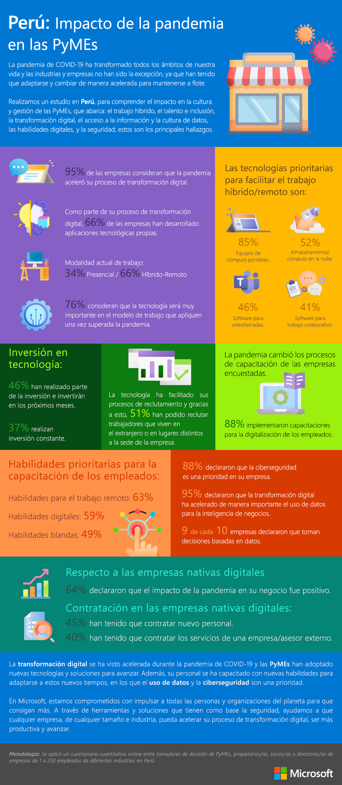

# Capítulo I: Introducción

## 1.1. Startup Profile

En esta sección describimos el perfil de nuestra Startup.

### 1.1.1. Descripción de la Startup

**Estrellados** es una empresa emergente del sector tecnológico fundada en 2025 por estudiantes de Ingeniería de Software. Nuestro enfoque principal es la creación de soluciones tecnológicas innovadoras, orientadas a resolver problemáticas reales. Contamos con un equipo de desarrolladores comprometidos con ofrecer productos que se adapten a las necesidades de nuestros usuarios.

* **Misión:**
Brindar soluciones tecnológicas innovadoras y de alta calidad que contribuyan al bienestar de las personas y optimicen su experiencia al interactuar con nuestras plataformas.
* **Visión:**
Consolidarnos como referentes en innovación tecnológica, promoviendo el desarrollo de software eficiente, sostenible y con un impacto positivo en la sociedad.

### 1.1.2. Perfiles de integrantes del equipo

<table style="text-align:center">
    <thead>
        <tr>
            <th>Integrantes</th>
            <th>Descripción</th>
            <th>Conocimientos</th>
        </tr>
    </thead>
    <body >
        <tr>
            <!-- DATOS del integrante 1-->
            <td> 
             
             María Alejandra Díaz Villacrez U202118315 
            </td>
            <!-- DESCRIPCIÓN del integrante 1-->
            <td >Soy estudiante de 7to ciclo de la carrera de Ingeniería de Software y desarrolladora fullstack especializada en tecnologías .NET. Mis intereses son aprender nuevas tecnologías y el desarrollo de videojuegos.</td>
            <!-- CONOCIMIENTOS del integrante 1-->
            <td>Poseo conocimientos en los lenguajes de programación: C++, Python, JavaScript, C#, Java, entre otros. Me gusta trabajar en equipo y soy una persona responsable, lista para ayudar a los que lo necesiten. Puedo aportar mis habilidades técnicas y blandas para mejorar la eficacia de mi equipo</td>
        </tr>
        <tr>
            <!-- DATOS del integrante 2-->
            <td>
             
             Paolo Gonzalo Párraga Gamarra u202219186
            </td>
            <!-- DESCRIPCIÓN del integrante 2-->
            <td>Soy Paolo Párraga, estudiante de ingeniería de software. Soy una persona que disfruta trabajar duro para lograr mis objetivos y nunca me rindo a pesar de los momentos difíciles. </td>
            <!-- CONOCIMIENTOS del integrante 2-->
            <td>Poseo conocimientos sobre C++, JavaScript, C#, Java, entre otros. Me gusta cumplir con las tareas asignadas así como ayudar a mic ompañeron de equipo y así mejorar el ambiente en general</td>
        </tr>
        <tr>
            <!-- DATOS del integrante 3-->
            <td>
             
             Mariana Alexandra Chambi Mendoza U202217389
            </td>
            <!-- DESCRIPCIÓN del integrante 2-->
            <td>Soy estudiante de Ingeniería de Software. Me caracterizo por ser empática, alegre, responsable y puntual, cualidades que reflejo en mi desempeño tanto académico como profesional. Busco demostrar el máximo de mis capacidades en todos los proyectos en los que participo, aportando siempre una actitud proactiva y colaborativa.</td>
            <!-- CONOCIMIENTOS del integrante 2-->
            <td>Poseo conocimientos en tecnologías orientadas al desarrollo web y móvil, como Angular, React, Vue y Flutter. Además, tengo experiencia en metodologías ágiles como Scrum y Kanban, así como en procesos de gestión de proyectos y desarrollo de software.</td>
        </tr>
        <tr>
            <!-- DATOS del integrante 3-->
            <td>
            
             Stefano Alessandro Valenzuela Vallejos - U202214695
            </td>
            <!-- DESCRIPCIÓN del integrante 2-->
            <td>Soy Alessandro Valenzuela Vallejos, estudiante de Ingeniería de Software en la Universidad Peruana de Ciencias Aplicadas (UPC). Mi formación se orienta a las áreas de Ciberseguridad, Auditoria y Arquitectura de Software, donde busco aplicar mis conocimientos para crear entornos digitales más seguros y eficientes.</td>
            <!-- CONOCIMIENTOS del integrante 2-->
            <td>Conocimientos en
                Python, C++, HTML, SQL, ACL Analytics, Web Scraping, Power BI, NumPy,       matplotlib, socket, redes TCP/IP, auditoría TI (COSO y COBIT), SOC 1
            </td>
        </tr>
        <tr>
            <!-- DATOS del integrante 5-->
            <td>
           
             Ely Rivaldo Cortez Flores - U202215313
            </td>
            <!-- DESCRIPCIÓN del integrante 3-->
            <td>Mi nombre es Ely Rivaldo Cortez Flores, tengo 19 años y actualmente curso el 7to ciclo.</td>
            <!-- CONOCIMIENTOS del integrante 3-->
            <td>Tengo experiencia en diversos lenguajes de programación, como C#, Go y JavaScript. Me considero una persona responsable y empática, especialmente al trabajar en equipo. Espero contribuir de manera efectiva para sacar adelante el proyecto.</td>
        </tr>
    </body>
</table>

## 1.2. Solution Profile

## Descripción del Producto y Modelo de Negocio

Esta sección expone los componentes principales de nuestra solución de software, destacando su propuesta de valor y el enfoque de monetización adoptado.

**Nombre del Producto**

**ReStyle**  
El nombre **ReStyle** fue elegido por su significado en español, “Remodelar”, ya que refleja de forma clara y directa el propósito del producto. Su brevedad y facilidad para recordarlo lo convierten en una marca adecuada para el mercado al que apuntamos.

**Descripción del Producto**

ReStyle es una plataforma digital orientada a optimizar la experiencia de remodelación del hogar, al actuar como un puente entre usuarios y empresas especializadas. La aplicación permite a los clientes contratar servicios de remodelación de manera directa, gestionando todo el proceso desde una sola herramienta. Incluye funcionalidades como seguimiento en tiempo real del avance de los proyectos, administración de tareas, y compra de materiales y mobiliario, contribuyendo así a una experiencia más eficiente y personalizada.

**Modelo de Monetización**

La estrategia de ingresos se basa en la venta de planes premium dirigidos a profesionales del rubro de la remodelación, quienes podrán publicar sus servicios y utilizar herramientas avanzadas de gestión dentro de la plataforma. En contraste, los clientes que contraten dichos servicios podrán utilizar ReStyle sin ningún costo adicional, lo cual facilita su adopción y fomenta una mayor demanda.

### 1.2.1. Antecedentes y Problemática

## Antecedentes

El acceso a tendencias de remodelación se ha vuelto más sencillo gracias a los avances tecnológicos, lo que ha impulsado un crecimiento sostenido en el sector de mejoramiento del hogar en el Perú. Esta tendencia también se ve reflejada en el auge de los emprendimientos, ya que cada vez más locales comerciales y espacios de trabajo requieren adecuaciones para ajustarse a nuevas demandas del mercado.

De acuerdo con el Instituto Nacional de Estadística e Informática (INEI), el número de viviendas en el país se incrementó notablemente entre los años 2007 y 2017.

> "En relación al Censo de 2007, las viviendas particulares se incrementaron en 2 millones 536 mil 707 viviendas, lo que representa una variación intercensal de 33,5% y una tasa de crecimiento promedio anual de 2,9% para el periodo 2007 – 2017" (INEI, 2017)

Este dato revela que existe un flujo constante de personas interesadas en construir o renovar sus hogares, buscando mejorar sus condiciones de vida.

Además, el informe del News Center de Microsoft Latinoamérica señala que el 94% de las pequeñas y medianas empresas (pymes) peruanas realizaron inversiones tecnológicas durante el último año.

> "En este sentido, más del 94% de las pymes invirtió en tecnologías en el último año. Entre las tecnologías que consideran prioritarias son equipos de cómputo portátiles (85%), así como almacenamiento/computación en la nube (52%), software para videollamadas (46%), y software para trabajo colaborativo (41%)" (Microsoft, 2022)

  

  <em>Fuente: Aceleración digital: más del 94% de las pymes peruanas invirtió en tecnología en el último año.</em>

Estos datos reflejan una clara tendencia hacia la transformación digital en las empresas, lo que evidencia una oportunidad para el desarrollo de soluciones tecnológicas como ReStyle.

---

## Problemáticas

### Técnica de las 5 ‘W’s y 2 ‘H’s

### **What?**

**¿Qué problemática se presenta?**  
Actualmente, no existen plataformas digitales completas que reúnan a empresas de remodelación, permitiendo el acceso sencillo a sus servicios, el seguimiento del progreso y la gestión integral de los proyectos.

**¿Cómo afecta a las personas?**  
Los usuarios deben realizar búsquedas manuales para encontrar empresas confiables. Muchas de estas carecen de un portafolio actualizado, lo que dificulta la toma de decisiones. Por su parte, las empresas de remodelación deben promocionar sus servicios sin garantías de visibilidad ante potenciales clientes.

---

### **When?**

**¿Cuándo se manifiesta el problema?**  
Surge cuando los usuarios intentan contratar servicios de remodelación y no encuentran una plataforma centralizada. En el caso de los remodeladores, cuando no cuentan con medios efectivos para llegar a su público objetivo.

**¿Cuándo se usaría la solución?**  
Cuando las personas necesitan renovar su vivienda o negocio, o cuando una empresa del rubro desea exhibir y promocionar sus servicios de forma profesional.

---

### **Where?**

**¿Desde dónde accede el cliente al producto?**  
Usualmente desde su hogar o lugar de trabajo, utilizando dispositivos conectados a internet.

**¿Hacia dónde se dirige el cliente?**  
El cliente busca renovar, mejorar o reacondicionar un espacio físico, o busca oportunidades para hacer visible su negocio en el rubro de remodelaciones.

**¿Dónde se origina el problema?**  
En las propiedades que requieren modificaciones, ya sean hogares, oficinas o locales comerciales.

---

### **Who?**

**¿Quiénes intervienen en esta problemática?**  
Usuarios interesados en contratar servicios de remodelación y empresas que desean posicionar sus servicios en el mercado digital.

---

### **Why?**

**¿Qué origina este problema?**  
Existe una escasa oferta de soluciones tecnológicas específicas para el rubro de remodelación y construcción, lo que impide una digitalización eficiente del sector.

---

### **How?**

**¿En qué contexto se usa el producto?**  
El cliente accede a la plataforma para encontrar profesionales calificados, mientras que los proveedores lo utilizan como medio de visibilidad y gestión de proyectos.

**¿Cómo prefieren acceder al servicio?**  
A través de una aplicación web accesible desde cualquier navegador, que ofrezca una experiencia simple e intuitiva.

**¿Qué motiva al usuario?**  
La necesidad de remodelar su propiedad o, en el caso de los profesionales, el deseo de atraer más clientes y mostrar sus trabajos de forma organizada y atractiva.

---

### **How Much?**

Según el estudio “Construcción 2018” elaborado por Ipsos Perú, el 34% de los limeños planeaba construir una vivienda hacia el año 2020.

  

  <em>Fuente: Estudio Construcción 2018 de Ipsos Perú en Lima.</em>

### 1.2.2. Lean UX Process

En esta sección se inicia el proceso de Lean UX, el cual marca la definición de la visión del modelo de negocio que respaldará nuestro producto de software. Gracias a esta metodología, es posible centrarse en el diseño de la solución y en la identificación de problemas a través del enfoque de Design Thinking.

#### 1.2.2.1. Lean UX Problem Statements

A continuación, se aplica la plantilla de Business Opportunity Statements (Gothelf, 2022), la cual permite que nuestro equipo comience a construir un servicio sin supuestos que limiten la creatividad y la agilidad. Este enfoque nos impulsa a pensar en nuestras acciones considerando las necesidades reales de los usuarios, lo que incrementa las posibilidades de un lanzamiento exitoso de nuestra propuesta.

- La plantilla de Business Opportunity Statement:

El estado actual de **[dominio]** se ha centrado principalmente en **[segmentos, puntos de dolor, etc.]**  

Lo que los productos/servicios existentes no logran abordar es **[esta brecha]**.  

Nuestro producto/servicio abordará esta brecha mediante **[visión / estrategia]**.  

Nuestro enfoque inicial será **[este segmento]**.  

Sabremos que tenemos éxito cuando veamos **[estos comportamientos en nuestro público objetivo]**.  

- ReStyle Lean UX Problem Statements:

El estado actual de **nuestro servicio de plataforma web para remodeladores y personas interesadas en renovar sus propiedades** se ha enfocado principalmente en **brindar una red diversa de clientes y profesionales, facilitando la creación, gestión y monitoreo en tiempo real de sus proyectos de diseño.**

Lo que los productos o servicios actuales no logran resolver es **la falta de conexión directa entre potenciales clientes y remodeladores, así como la ausencia de herramientas que los apoyen a lo largo del desarrollo del proyecto.**

Nuestro producto/servicio solucionará esta necesidad mediante **la creación e implementación de una plataforma web adaptable, utilizando soluciones tecnológicas eficientes desarrolladas por nuestro equipo de programación.**

Nuestro enfoque inicial se centrará en **atender el mercado de remodelaciones en el Perú.**

Sabremos que hemos alcanzado el éxito cuando observemos **el logro de nuestras metas en suscripciones y la expansión de nuestra base de clientes durante los primeros años de funcionamiento del servicio.**

#### 1.2.2.2. Lean UX Assumptions

- **Users**:

Personas que necesitan contratar servicios de remodelación para sus viviendas dentro del territorio peruano.

Empresas dedicadas a la remodelación que desean gestionar eficientemente sus proyectos, acceder a un marketplace de materiales y herramientas, y ampliar su cartera de clientes potenciales.

- **User Outcomes**:

**Para el contratista:**

Utilizar una plataforma digital que permita contactar con diversas empresas de remodelación en el Perú.  
 
Realizar búsquedas personalizadas mediante filtros y palabras clave para encontrar opciones adecuadas.  
 
Revisar opiniones, calificaciones y portafolios de las remodeladoras para tomar decisiones informadas.  

**Para el remodelador:**

Promocionar sus servicios y ampliar su visibilidad frente a más usuarios interesados.  

Administrar todos sus proyectos de diseño desde un único entorno digital.  

Establecer una comunicación directa y constante con sus clientes, manteniéndolos al tanto del avance del proyecto.

- **Business Assumptions**:

Consideramos que el mercado de remodelación de viviendas presenta una creciente demanda. Detectamos que muchos propietarios buscan renovar sus espacios, lo cual representa una valiosa oportunidad para nuestra plataforma.

Reconocemos que existen competidores en el rubro. No obstante, confiamos en que podemos diferenciarnos al ofrecer una plataforma digital que optimice la experiencia de remodelación para usuarios y profesionales.

Creemos que nuestros usuarios cuentan con las habilidades digitales necesarias y están dispuestos a utilizar una plataforma online para contratar servicios de remodelación. Por ello, nos enfocamos en ofrecer una experiencia accesible y sencilla.

Estamos convencidos de que los clientes valorarán la facilidad, transparencia y calidad del servicio que brindaremos mediante nuestra solución tecnológica.

- **User Assumptions**:

**¿Quiénes son los usuarios de nuestra plataforma?**  
La plataforma está dirigida a propietarios de inmuebles que desean remodelar sus espacios, así como a profesionales y empresas de remodelación que buscan ofrecer sus servicios.

**¿Cómo se incorpora nuestra solución en la vida cotidiana o laboral?**  
Nuestra plataforma se adapta a las rutinas diarias al ofrecer una herramienta centralizada y accesible para buscar, contratar y gestionar proyectos de remodelación desde cualquier dispositivo y en cualquier momento.

**¿Qué problemáticas soluciona nuestro producto?**  
Nuestro servicio busca resolver dificultades como encontrar profesionales confiables, la falta de claridad en los procesos de contratación y la gestión manual de proyectos. Además, ofrece a los remodeladores un flujo constante de clientes y herramientas eficaces para la administración de sus trabajos.

**¿Qué imagen deseamos transmitir con nuestra solución?**  
Aspiramos a proyectar una imagen de confiabilidad, transparencia, innovación y accesibilidad, posicionándonos como la opción principal en el sector de remodelación residencial.

**¿Cuál es el objetivo central de nuestra aplicación?**  
El objetivo principal de nuestra solución es simplificar la búsqueda, contratación y administración de proyectos de remodelación tanto para propietarios como para remodeladores.

**¿Qué características sobresalen en nuestra aplicación?**  
Entre las funcionalidades destacadas se incluyen: búsquedas avanzadas según ubicación y especialidad, gestión digital de proyectos con seguimiento en tiempo real, sistema de calificaciones y reseñas para asegurar la calidad del servicio, y herramientas integradas para generar cotizaciones y gestionar pagos.

#### 1.2.2.3. Lean UX Hypothesis Statements

Para la formulación de los enunciados de hipótesis, se aplicó el formato Lean UX: **[Creemos que]**, **[Esto logrará]**, y **[Sabremos que estamos en lo correcto cuando]**.

- Hipótesis 1:

**Creemos que** al optimizar el proceso para buscar y comparar remodeladores dentro de la plataforma,  
**esto logrará** incrementar de forma notable la cantidad de usuarios que vuelven a contratar, con una proyección de aumento del 20% en la tasa de recurrencia en los primeros seis meses desde la implementación.  
**Sabremos que estamos en lo correcto cuando** se evidencie un incremento del 25% en los contratos realizados por usuarios recurrentes durante el mismo período.

- Hipótesis 2:

**Creemos que** al mejorar la comunicación y ofrecer procesos más transparentes entre clientes y remodeladores durante la ejecución del proyecto,  
**esto logrará** elevar tanto la satisfacción del cliente como la fidelización de los profesionales hacia nuestra plataforma.  
**Sabremos que estamos en lo correcto cuando** se observe un incremento del 20% en la satisfacción del cliente y un 15% en la permanencia de los remodeladores en el servicio.

- Hipótesis 3:

**Creemos que** al diseñar una plataforma sencilla y accesible para todo tipo de usuarios,  
**esto logrará** atraer a más visitantes interesados en contratar remodelaciones, así como a profesionales que deseen ofrecer sus servicios.  
**Sabremos que estamos en lo correcto cuando** se perciba una curva de aprendizaje más corta, reflejada en una reducción del 30% en las consultas al soporte relacionadas con el uso de la plataforma en el mismo período.

- Hipótesis 4:

**Creemos que** al incorporar un sistema de evaluaciones y comentarios dentro de la plataforma,  
**esto logrará** representar mejor la reputación de los remodeladores y generará mayor confianza por parte de los clientes en relación con la calidad del servicio.  
**Sabremos que estamos en lo correcto cuando** se note un aumento del 30% en la contratación de los profesionales con mejores valoraciones.

- Hipótesis 5:

**Creemos que** al ofrecer planes de suscripción premium —mensuales y anuales— para los remodeladores,  
**esto logrará** establecer una fuente de ingresos recurrentes para la empresa y permitirá desarrollar herramientas más avanzadas en la plataforma.  
**Sabremos que estamos en lo correcto cuando** al menos el 30% de los visitantes del segmento remodelador se suscriban a los planes premium de ReStyle durante el primer año de lanzamiento.
  

#### 1.2.2.4. Lean UX Canvas

  

 <em> Fuente: Elaboración propia. </em> 

## 1.3. Segmentos Objetivos

La propuesta de valor de nuestra plataforma está dirigida a dos públicos principales: personas interesadas en remodelar sus viviendas y empresas dedicadas a ofrecer servicios de remodelación. Todos los usuarios, ya sean personas naturales o jurídicas, deben ser mayores de edad y residir en Perú o ser propietarios de inmuebles en el país.

De acuerdo con un estudio realizado por IPSOS, al menos un 7% de los encuestados manifestó tener planes para remodelar su vivienda y un 5% desea redecorar su hogar.
> “Este estudio tiene como objetivo conocer las características de las viviendas y los hogares limeños, así como sus planes para construir, remodelar, ampliar, decorar y redecorar en los próximos 12 meses. Para ello, se entrevistaron a 594 jefes del hogar de todos los niveles socioeconómicos de Lima Metropolitana.” (IPSOS, 2019)

 
  </img> 

  <em>Fuente: Planes para la vivienda y el mejoramiento del hogar 2019.</em>

Asimismo, según el *Informe técnico de demografía empresarial en el Perú* elaborado por el INEI, el sector construcción presenta una tasa de crecimiento empresarial del 1,8%.
> La tasa neta de crecimiento fue de 1,2% para el I Trimestre del 2018, significando un incremento de empresas. Según actividad económica los salones de belleza y las actividades de servicio de comidas y bebidas tuvieron la mayor tasa neta con el 2,5% cada una, seguido de construcción con 1,8%, y transporte y almacenamiento con 1,5%, entre las más representativas.

 
  </img> 

  <em>Fuente: Informe técnico de demografía empresarial en el Perú.</em>

