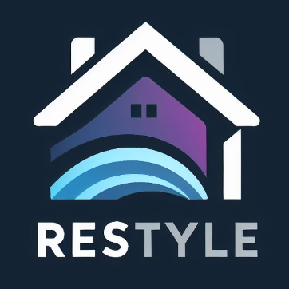
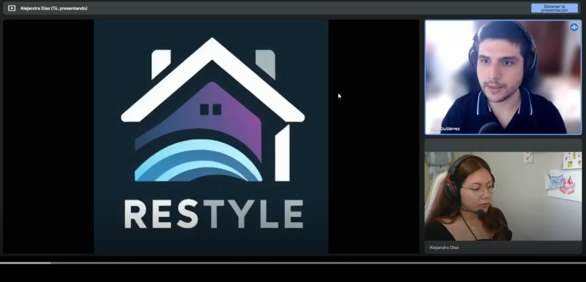
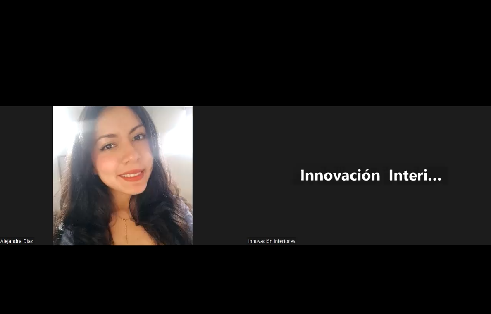
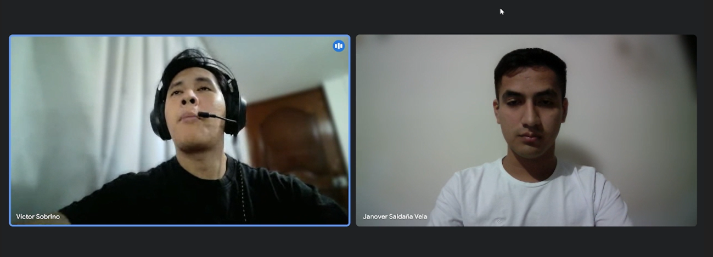
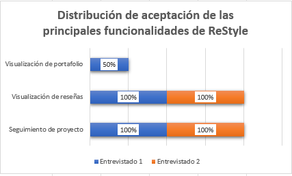
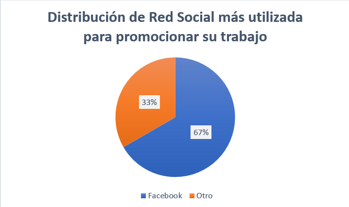

# Capítulo II: Requirements Elicitation & Analysis.
## 2.1. Competidores. 
En este apartado el equipo realizará investigaciones sobre nuestros potenciales competidores en el mercado.
### 2.1.1. Análisis competitivo.
En este apartado el equipo realizará un analisis competitivo de nuestras 3 principales competidores identificados para
posteriormente identificar y plantear estrategias que habrá que poner en marcha con respecto a nuestros competidrores.

<table>  
    <thead>
        <tr>
            <th colspan="6">Competitive Analysis Landscape</th>
        </tr>
        <tr>
            <th colspan="2">Competitive Analysis Landscape</th>
            <td colspan="5" style="text-align: justify"> Se realiza con el objetivo de reconocer y comprender mejor las fortalezas, debilidades y estrategias de nuestros principales competidores y a partir de ello identificar oportunidades y amenazas en el mercado, para desarrollar estrategias para obtener una ventaja competitiva.</td>
        </tr>
    </thead>
    <tbody style="text-align: center">
        <tr>
            <th colspan="2"></th>
            <th></th> 
            <th></th>
            <th></th>
            <th></th>
        </tr>
        <!-- Este apartado pertenece al PERFIL se fucionó dos filas -->
        <tr>
            <th rowspan="2"> <strong> Perfil </strong> </th>
            <td> Overview</td>
            <td>  </td>
            <td>  </td>
            <td>  </td>
            <td>  </td>
        </tr>
        <tr>
            <td>Ventaja competitiva ¿Que valor ofrece a los clientes?</td>
            <td> ReStyle ofrece una conexión directa con empresas de remodelación, ofrece una contratación directa y seguimiento en tiempo real del proceso en elque este seencuentra,tambien ofrece una gran variedad de profesionales capacitados especialistas en la reparación y remodelación de todas las áreas del hogar </td>
            <td> ARAM ofrece mas de 20 años de experiencia y 250,000 m² de proyectos exitosos que avalan su trabajo. Además ofrece un enfoque integral que abarca desde el diseño hasta la construcción, adaptándonos a las necesidades de cada cliente e incluye una amplia gama de servicios para diversos tipos de proyectos, incluyendo casas,edificios institucionales y condominios </td>
            <td> Remodela tu casa ofrece una gran variedad de servicios exclusivamente para la remodelación del hogar, del mismo modo tambien ofrece asesoria legal y asesorias por desperfectos en la estructura o daño de esta misma, también brinda visitas de asesoria profesional y el desarrollo de costeo.Además brinda una cartedara de proyectos variados con respecto a los diferentes espacion de tu casa.</td>
            <td> Timbrit ofrece a sus clientes comodidad, variedad de servicios, profesionales verificados, transparencia en precios y pagos, atencion al cliente lo cual puede ser su ventaja competitiva para brindar un servicio completo y confiable en el mercado de contratación de profesionales</td>
        </tr>
        <!-- ------------------------------------------------------- -->
        <!-- ----Este apartado pertenece al PERFIL DE MARKETING---- -->
        <tr>
            <th rowspan="2"> <strong> Perfil de Marketing </strong> </th>
            <td> Mercado objetivo</td>
            <td> Propietarios de casa interesados en contratar profesionales altamamente capacitados en remodelación, renovación o repararión de espacios del hogar de acuerdo a sus necesidades </td>
            <td> Propietarios de casas,personas que desean iniciar un proyecto de construccion de condominios o edificios que deseen sontratrar el servicio de remodelación o construcción de estructuras, diseño de interiores, exteriones y modelación del proyectos en 3D de su hogar o iniciar la construccion de la misma </td>
            <td> Propietarios de casas, personas que desean iniciar un proyecto de construccion de condominios o edificios que deseen sontratrar el servicio de remodelación o construcción de estructuras, diseño de interiores, exteriones y modelación del proyectos en 3D de su hogar o iniciar la construccion de la misma </td>
            <td> Propietarios de viviendas que necesiten servicios de reparacion, mantenimiento y mejoras para sus hogares, pequeñas empresas como tiendas minoristas y restaurantes, oficinas y otros negocios locales.</td>
        </tr>
        <tr>
            <td>Estrategias de Marketing</td>
            <td> Propietarios de viviendas que necesiten servicios de reparacion, mantenimiento y mejoras para sus hogares, pequeñas empresas como tiendas minoristas y restaurantes, oficinas y otros negocios locales.</td>
            <td> Posicionamiento de marca a travez de su sitio web, variedad en proyectos </td>
            <td> Posicionamiento de marca a travez de su sitio web, variedad en proyectos y asesoramiento variado </td>
            <td> Marketing de contenido, utiliza blogs y videos </td>
        </tr>
        <!-- ------------------------------------------------------- -->
        <!-- ----Este apartado pertenece al PERFIL DEL PRODUCTO----- -->
        <tr>
            <th rowspan="3"> <strong> Perfil del producto </strong> </th>
            <td>  </td>
            <td>  </td>
            <td>  </td>
            <td>  </td>
            <td>  </td>
        </tr>
        <tr>
            <td>Precio y costos</td>
            <td> Comsiones por proyecto concluido y suscripciones</td>
            <td> Los precios y costos se realizan previa visita y cotización, sin embargo tambien existen precios referenciales</td>
            <td> Los precios se fijan previa cotización del profesional y ademas existen precios referenciales dependiendo del proyecto. </td>
            <td> Timbrit utiliza un modelo de negocio basado en comisiones y tarifas por servicio </td>
        </tr>
        <tr>
            <td>Canales de distribución (Web y/o movil)</td>
            <td> Web </td>
            <td> Web/WhatsApp/empresa física </td>
            <td> Web/WhatsApp/empresa física </td>
            <td> Web/Movil </td>
        </tr>
        <!-- ------------------------------------------------------ -->
        <!-- ----Este apartado pertenece al ANÁLISIS SWOT --------- -->
        <tr>
            <th rowspan="4"> <strong> Análisis SWOT </strong> </th>
            <td>Fortalezas</td>
            <td> Conexión directa entre empresa y cliente, brinda transparencia y control sobre el avance del proyecto, enfoque en un solo rubro, reduce el tiempo y esfuerzo del cliente en la gestión del proyecto. </td>
            <td> Contar con 20 años de experiencia y proyectos ya realizados de manera exitos y 3 sedes fisicas en el Perú </td>
            <td> Dedicarse solo al rubro de remodelación y asesoria variada de hogares, contar con una cartera de proyectos variados según espacio del hogar. </td>
            <td> Cobertura para España, Colombia, Argentina, Chile y Estados Unidos. </td>
        </tr>
        <tr>
            <td>Debilidades</td>
            <td> Clientes que desconfien de contratar servicios sin conocer la empresa, la plataforma no tiene control directo sobre la calidad del proyecto, solo tiene reseñas </td>
            <td> Contratación de profesionales sin mucha experiencia, proyectos que no se concretaron, lo cual genera una mala reseña de la empresa. </td>
            <td> Falta de innovación en tecnólogia para llegar a mas clientes, contratación de personal poco capacitado, sucursales en Argentina y no el Perú. </td>
            <td> Dependencia de la reputacion de sus afiliados. </td>
        </tr>
        <tr>
            <td>Oportunidades</td>
            <td> Aumento de la demanda por servicios de remodelación del hogar, capacidad de expansión a otras ciudades y paises, mejora continua en la tecnologia y experiencia de usuario, alianzas estrátegicas con empresas de remodelación, posicionar la plataforma como la mejor opcion para la remodelación de hogar </td>
            <td> Se puede aprovechar la escases de oferta de casas en el Perú, el crecimiento poblacional, improvinzacion en la construcción de casa, contratos con respecto a remodelación y mantenienmto de escuelas del pais, oficinas, etc. </td>
            <td> Escases de oferta de casas para vivir, la sostenibilidad y preocupacupación por el medio ambiente demanda construcciones y remodelaciones sostenibles, las personas buscan personalizar sus ambientes y que estas se adapten a sus necesidades </td>
            <td> Timbrit puede aprovechar la oportunidad de seguir innovando y utilizando tecnologia de vanguardia en su plataforma, tambien puede considerar la oportunidad de diversificar su oferta de servicios para abarcar una mayor variedad de categorias y tipos de servicios para el hogar </td>
        </tr>
        <tr>
            <td>Amenazas</td>
            <td> Aparición de nuevas plataformas con mejores tecnologías, cambio en las regulaciones legales, posibles fallas en la plataforma </td>
            <td> Politicas del país, aumento de la competencia en el mismo rubro, la innovación tecnológica, falta de financiamiento </td>
            <td> Politicas del pais, creciente competencia en el rubro, innovación tecnólogica, altos costes de material, inflación, inestabilidad politica </td>
            <td> Opiniones o reseñas negativas de los clientes y software poco cambiante </td>
        </tr>
         <tr>
            <td colspan="6"></td>
        </tr>
        <!-- ---------------------------------------------------- -->   
    </tbody>
</table>

### 2.1.2. Estrategias y tácticas frente a competidores.

Luego de haber realizado el análisis de nuestra solución con respecto a soluciones ya existentes, nuestero equipo procederá a planteaer estrategias y tácnicas que debemos poner en marcha para sobresalir de las otras soluciones.

<table>
    <thead>
        <tr>
            <th colspan="3"> Matriz CAME para el desarrollo de estrategias en base al análisis FODA </th>
        </tr>
    </thead>
    <body>
        <tr>
            <th rowspan="2"> Análisis FODA cruzado</th>
            <th> Oportunidades </th>
            <th> Amenazas </th>
        </tr>
        <tr>
            <td>
            1. Mayor demanda de servicios de mejoras para el hogar: el mercado de mejoras para el hogar está en auge, lo que representa una gran oportunidad para la plataforma. 
              
            2. Capacidad de expandirse a otras ciudades y países: la plataforma puede expandirse a nuevos mercados, ampliando su alcance y base de clientes. 
             
            3. Mejora continua de la tecnología y la experiencia del usuario: La plataforma puede mejorar continuamente la tecnología y la experiencia del usuario para brindar servicios más atractivos y competitivos. 
             
            4. Alianza estratégica con empresas de decoración: La plataforma puede establecer alianzas con empresas de decoración para brindar servicios más completos y competitivos. 
             
            5. Posicionar la plataforma como la mejor opción para mejoras en el hogar: La plataforma puede desarrollar una estrategia de marketing para posicionarse como la mejor opción para mejoras en el hogar. 
             
            6. Colaborar con instituciones financieras: La plataforma puede colaborar con instituciones financieras para ofrecer opciones de financiamiento a sus clientes.
            </td>
            <td> 
            1. Aparición de nuevas plataformas con mejores tecnologías: El mercado es altamente competitivo y pueden surgir nuevas plataformas con mejores tecnologías.  
            2. Cambios en leyes y regulaciones: Los cambios en leyes y regulaciones pueden afectar el funcionamiento de la plataforma.  
            3. Posibles fallas de la plataforma: las fallas de la plataforma pueden afectar la confianza del usuario y dañar la imagen de una empresa. 
            4. Plataformas que ofrecen precios más bajos: La competencia de precios puede ser un factor importante para los clientes, especialmente en un mercado con opciones similares.  
            5. Ataques cibernéticos: La plataforma puede ser vulnerable a ataques cibernéticos que roben información o afecten su funcionamiento.  
            6. Problemas de integración con otras plataformas: La plataforma puede tener problemas para integrarse con otras plataformas, como plataformas de pago o sistemas de gestión de proyectos.
            </td>
        </tr>
        <tr>
            <th>Fortalezas</th>
            <th>Estrategia (FO) E. Ofensivas</th>
            <th>Estrategia (FA) E. Defensivas</th>
        </tr>
        <tr>
            <td>
            7. Conexión directa entre empresa y cliente: Permite una comunicación fluida y transparente, generando confianza y mejorando la experiencia del cliente.  
            8. Brinda transparencia y control sobre el avance del proyecto: El cliente puede seguir en tiempo real el progreso del proyecto, lo que reduce la incertidumbre y aumenta la satisfacción.  
            9. Enfoque en un solo rubro: Permite a la plataforma especializarse en un área específica, ofreciendo un servicio más preciso y eficiente.  
            10. Reduce el tiempo y esfuerzo del cliente en la gestión del proyecto: La plataforma automatiza tareas y simplifica el proceso, liberando tiempo y recursos para el cliente.
</td>
            <td>
            <strong>Mantener Fortalezas</strong>   
            1. Aprovechar las conexiones directas con los clientes para generar confianza y lealtad.  
            2. Utilice la transparencia y los controles del proyecto como puntos de diferencia.  
            3. Aprovechar el auge de la industria de la remodelación para expandirse a nuevos mercados. 
            4. Establecer alianzas estratégicas con empresas de decoración.  
            5. Posicionar la plataforma como la mejor opción para reformas en el hogar.  
            6. Ofrecer precios competitivos: La plataforma debe ofrecer precios competitivos que sean atractivos para los clientes potenciales.  
            </td>
            <td>
            <strong>Explotar Oportunidades</strong>   
            7. Desarrollar un sistema de control de calidad para garantizar la satisfacción del cliente.  
            8. Implementar medidas de seguridad para evitar fallas en la plataforma.  
            9. Monitorear mercados, leyes y regulaciones para adaptarse a los cambios.  
            10. Implementar programas de innovación: Las plataformas pueden implementar programas de innovación para fomentar la creatividad y el desarrollo de nuevas ideas.  
            11. Implementar una estrategia de marketing digital integral: La plataforma puede implementar una estrategia de marketing digital integral que incluya SEO, SEM, marketing en redes sociales y marketing por correo electrónico.
            </td>
        </tr>
        <tr>
            <th>Debilidad (D)</th>
            <th>Estrategia(DO) de Reorientación</th>
            <th>Estrategia(DA) de Superviciencia</th>
        </tr>
        <tr>
            <td>
            12. Clientes que desconfían de contratar servicios sin conocer la empresa: La falta de conocimiento sobre la empresa puede generar desconfianza en los clientes potenciales.  
            13. La plataforma no tiene control directo sobre la calidad del proyecto: La plataforma solo facilita la conexión entre empresa y cliente, no tiene control sobre la calidad del trabajo realizado.  
            14. Solo tiene reseñas: Las reseñas son un indicador importante, pero no siempre son confiables.  
            15. Marca poco conocida: La plataforma puede ser una marca poco conocida, lo que puede dificultar generar confianza en los clientes.
            </td>
            <td> 
            <strong>Afrontar Amenazas</strong>   
            16. Implementar estrategias de marketing para ganarse la confianza de los clientes potenciales.  
            17. Desarrollar un sistema de evaluación de la empresa para el aseguramiento de la calidad del servicio.  
            18. Proporcionar un servicio al cliente personal y eficiente.  
            19. Enfocarse en un área específica: Las plataformas pueden enfocarse en áreas específicas del mercado, como remodelación de baños o cocinas o remodelación para personas mayores.  
            20. Integrar nuevas tecnologías en la plataforma: Las plataformas pueden integrar nuevas tecnologías, como inteligencia artificial o realidad virtual, para mejorar la experiencia del usuario.
            </td>
            <td>
            <strong>Corregir debilidades</strong>   
            1. Los servicios de plataforma se diversifican y se reducen los riesgos.  
            2. Desarrollar planes de contingencia para responder a las amenazas.  
            3. Mantener una comunicación periódica con los usuarios para mantener su confianza.  
            4. Contratar personas con experiencia en la industria, brindar capacitación al equipo existente y asociarse con empresas o profesionales con experiencia en el mercado.  
            5. Diversificar proveedores y planes de contingencia para asegurar estabilidad en la modernización tecnológica y negociar contratos favorables. 6. Establecer un sistema de gestión de quejas y comentarios para mejorar el servicio al cliente y obtener retroalimentación positiva.
            </td>
        </tr>
    </body>
</table>

## 2.2. Entrevistas.

En este punto el equipo realizará entrevistas a nuestros segmentos objetivos previamente identificados con el fin de poder conocer y empatizar con las necesidades de los mismos.

### 2.2.1. Diseño de entrevistas.

**Segmento objetivo 1**

* **Preguntas demográficas:**
1. ¿Cuál es tu nombre?  
2. ¿Qué edad tienes?  
3. ¿Con qué género te identificas?  
4. ¿De qué distrito resides?  
5. ¿Cuál es tu estado civil?  
6. ¿Cuál es tu nivel educativo más alto alcanzado?  
7. ¿Cuál es tu ocupación?  

* **Preguntas sobre sus preferencias:**
1. ¿Qué tipo de contenido consumes regularmente (libros, películas, música, etc.)?  
2. ¿Qué redes sociales o plataformas digitales utilizas con mayor frecuencia?  
3. En una escala del 1 al 10, ¿qué tanto crees saber sobre el uso de aparatos tecnológicos? (celulares, laptop, computadora, etc.)

* **Preguntas sobre la solución:**
1. ¿Has intentado contratar servicios de remodelación anteriormente? ¿Cuál fue tu experiencia?  
2. ¿Qué te detiene o hace difícil encontrar un servicio de remodelación adecuado para tu hogar?  
3. ¿Cómo describirías el proceso de encontrar y contratar un servicio de remodelación de hogares?  
4. ¿Cuál es el principal problema que has encontrado al contratar servicios de remodelación?  
5. ¿Has utilizado alguna aplicación o plataforma en línea para contratar servicios de remodelación? ¿Cómo fue tu experiencia?  
6. ¿Cómo te sientes acerca de la transparencia en el proceso de contratación de servicios de remodelación?  
7. ¿Crees que tener acceso a comentarios y puntuaciones de otros usuarios ayudaría en la selección de un servicio de remodelación?  
8. ¿Qué funcionalidades esperarías encontrar en una aplicación o plataforma en línea para contratar servicios de remodelación?  
9. ¿Te gustaría tener un seguimiento en tiempo real del estado de la remodelación de tu hogar? ¿Por qué?

**Segmento objetivo 2**

* **Preguntas demográficas:**
1. ¿Cuál es tu nombre?  
2. ¿Qué edad tienes?  
3. ¿Con qué género te identificas?  
4. ¿De qué distrito resides?  
5. ¿Cuál es tu estado civil?  
6. ¿Cuál es tu nivel educativo más alto alcanzado?  
7. ¿Cuál es tu ocupación?

* **Preguntas sobre la solución:**
1. ¿Cuál es el mayor desafío que enfrenta su empresa al brindar servicios de remodelación?  
2. ¿Cómo maneja su empresa la asignación de trabajos y la gestión de proyectos de remodelación?  
3. ¿Cómo asegura su empresa la calidad del trabajo realizado por su personal?  
4. ¿Cómo se comunica su empresa con los clientes durante el proceso de remodelación?  
5. ¿Cómo maneja su empresa las quejas o problemas de los clientes durante el proceso de remodelación?  
6. ¿Qué tipo de servicios de remodelación son más solicitados por sus clientes?  
7. ¿Cómo maneja su empresa la capacitación y el desarrollo de habilidades de su personal de remodelación?  
8. ¿Qué medidas toma su empresa para asegurar la seguridad de su personal durante los trabajos de remodelación?  
9. ¿Cómo se diferencian los servicios de remodelación de su empresa de los de la competencia?  
10. ¿Qué cambios o mejoras podría hacer su empresa en su proceso de remodelación para mejorar la satisfacción del cliente?

### 2.2.2. Registro de entrevistas.

## Entrevistas a segmento objetivo 1
Entrevista a Contratistas

<table>
        <thead>
            <tr>
                <th>Entrevistado 1</th>
                <th>Diego Cantoral</th>
            </tr>
            <tr>
                <th>Entrevistador </th>
                <th>Daniel Valverde</th>
            </tr>
        </thead>
        <tbody>
            <tr>
                <td>Edad</td>
                <td>21</td>
            </tr>
            <tr>
                <td>Distrito</td>
                <td>Pueblo Libre</td>
            </tr>
            <tr>
                <td></td>
                <td><strong>Resumen:</strong> Diego es un joven estudiante, quien nos cuenta en primer lugar 
                sus preferencias personales. Instagram es la aplicación que más usa y en general le gusta escuchar
                música. Domina de forma avanzada los aparatos tecnológicos. Respecto a la temática principal nos comenta 
                una experiencia que tuvo con la empresa Promart, él necesitaba un cambio de setup para su computadora, 
                lamentablemente no resultó como él esperaba. Sobre las posibles opciones de la aplicación que se le 
                mencionaron, comentó que le parece importante contar con reseñas para verificar los trabajos previos y 
                un seguimiento de la remodelación para mantenerse informado y vaya de acuerdo a lo pedido.</td>
            </tr>
            <tr>
                <td>Timing de la entrevista</td>
                <td>0:00 min</td>
            </tr>
            <tr>
                <td>URL de la entrevista</td>
                <td><a href="https://upcedupe-my.sharepoint.com/:v:/g/personal/u202118315_upc_edu_pe/ET1QS27QI8FIp31HoL_PQVoB4ZOZMMzHz00ElPWsFPpE1Q?e=t2hWIb&nav=eyJyZWZlcnJhbEluZm8iOnsicmVmZXJyYWxBcHAiOiJTdHJlYW1XZWJBcHAiLCJyZWZlcnJhbFZpZXciOiJTaGFyZURpYWxvZy1MaW5rIiwicmVmZXJyYWxBcHBQbGF0Zm9ybSI6IldlYiIsInJlZmVycmFsTW9kZSI6InZpZXcifX0%3D">Link de entrevistas</a></td>
            </tr>
            <tr>
                <th>Entrevistado 2</th>
                <th>Jose Gutierrez</th>
            <tr>
                <th>Entrevistador </th>
                <th>Alejandra Diaz</th>
            </tr>
            <tr>
                <td>Edad</td>
                <td>26</td>
            </tr>
            <tr>
                <td>Distrito</td>
                <td>Lima</td>
            </tr>
            <tr>
            <td></td>
                <td><strong>Resumen:</strong> El entrevistado nos comenta que previamente ha contratado servicios de remodelacion, pero estas experiencias han sido de manera presencial y nunca mediante una plataforma online. Ademas, nos cuenta que este proceso ha sido dificil debido a la falta de transparencia y reseñas online que le permitan tomar una decision informada. Finalmente, explica que estaria dispuesto a utilizar una plataforma online para contratar servicios de remodelacion y que le gustaria encontrar reviews y un seguimiento en tiempo real para saber el proceso del proyecto. </td>
            </tr>
            <tr>
                <td>Timing de la entrevista</td>
                <td>11:30 min</td>
            </tr>
            <tr>
                <td>URL de la entrevista</td>
                <td><a href="https://upcedupe-my.sharepoint.com/:v:/g/personal/u202118315_upc_edu_pe/ET1QS27QI8FIp31HoL_PQVoB4ZOZMMzHz00ElPWsFPpE1Q?e=t2hWIb&nav=eyJyZWZlcnJhbEluZm8iOnsicmVmZXJyYWxBcHAiOiJTdHJlYW1XZWJBcHAiLCJyZWZlcnJhbFZpZXciOiJTaGFyZURpYWxvZy1MaW5rIiwicmVmZXJyYWxBcHBQbGF0Zm9ybSI6IldlYiIsInJlZmVycmFsTW9kZSI6InZpZXcifX0%3D">Link de entrevistas</a></td>
            </tr>
            <tr>
                <th>Entrevistado 3</th>
                <th>Pablo Mendez</th>
            <tr>
                <th>Entrevistador </th>
                <th>Stefano Valenzuela</th>
            </tr>
            <tr>
                <td>Edad</td>
                <td>23</td>
            </tr>
            <tr>
                <td>Distrito</td>
                <td>Lima</td>
            </tr>
            <tr>
            <td></td>
                <td><strong>Resumen:</strong> El entrevistado Pablo Méndez nos comentó que suele recurrir a recomendaciones de personas en redes sociales cuando necesita servicios de remodelación. Sin embargo, señaló que le gustaría contar con una aplicación más innovadora y amigable, que le brinde mayor confianza, facilidad de uso y funcionalidades como reseñas verificadas y seguimiento en tiempo real del avance del proyecto. </td>
            </tr>
            <tr>
                <td>Timing de la entrevista</td>
                <td>00:00 min</td>
            </tr>
            <tr>
                <td>URL de la entrevista</td>
                <td><a href="https://upcedupe-my.sharepoint.com/:v:/g/personal/u202118315_upc_edu_pe/ET1QS27QI8FIp31HoL_PQVoB4ZOZMMzHz00ElPWsFPpE1Q?e=t2hWIb&nav=eyJyZWZlcnJhbEluZm8iOnsicmVmZXJyYWxBcHAiOiJTdHJlYW1XZWJBcHAiLCJyZWZlcnJhbFZpZXciOiJTaGFyZURpYWxvZy1MaW5rIiwicmVmZXJyYWxBcHBQbGF0Zm9ybSI6IldlYiIsInJlZmVycmFsTW9kZSI6InZpZXcifX0%3D">Link de entrevistas</a></td>
            </tr>
        </tbody>
</table>

## Entrevista a segmento objetivo 2
Entrevista a Remodeladores

<table>
        <thead>
            <tr>
                <th>Entrevistado 1</th>
                <th>Rodrigo Porles</th>
            <tr>
                <th>Entrevistador </th>
                <th>Daniel Valverde</th>
            </tr>
        </thead>
        <tbody>
            <tr>
                <td>Edad</td>
                <td>20</td>
            </tr>
            <tr>
                <td>Distrito</td>
                <td>Santiago de Surco</td>
            </tr>
            <tr>
                <td></td>
                <td><strong>Resumen:</strong> Rodrigo es un joven practicante de la carrera de arquitectura.
                Actualmente trabaja en una empresa dedicada a la remodelación de interiores. Nos cuenta que la comunicación
                y coordinación se da mediante Whatsapp y correo electrónico. Para al aspecto de calidad de trabajo, buscan
                siempre trabajar con materiales de calidad y realizan controles en el proceso de remodelación. Se comunican 
                principalmente por Whatsapp con sus clientes debido a la fácil accesibilidad de esta aplicación. Promocionan 
                sus trabajos en la red social Facebook y esto es un diferenciador con respecto a la competencia. Por último,
                nos comenta la necesidad de una plataforma la cual les permita ampliar la llegada a más clientes y de esta
                forma crecer como empresa.</td>
            </tr>
            <tr>
                <td>Timing de la entrevista</td>
                <td>10:05min</td>
            </tr>
            <tr>
                <td>URL de la entrevista</td>
                <td><a href="https://upcedupe-my.sharepoint.com/:v:/g/personal/u202118315_upc_edu_pe/ET1QS27QI8FIp31HoL_PQVoB4ZOZMMzHz00ElPWsFPpE1Q?e=t2hWIb&nav=eyJyZWZlcnJhbEluZm8iOnsicmVmZXJyYWxBcHAiOiJTdHJlYW1XZWJBcHAiLCJyZWZlcnJhbFZpZXciOiJTaGFyZURpYWxvZy1MaW5rIiwicmVmZXJyYWxBcHBQbGF0Zm9ybSI6IldlYiIsInJlZmVycmFsTW9kZSI6InZpZXcifX0%3D">Link de entrevistas</a></td>
            </tr>
            <tr>
                <th>Entrevistado 2</th>
                <th>Olga Samanez (Innovacion Interiores)</th>
            <tr>
                <th>Entrevistador </th>
                <th>Alejandra Diaz</th>
            </tr>
            <tr>
                <td>Edad</td>
                <td>52</td>
            </tr>
            <tr>
                <td>Distrito</td>
                <td>Pueblo Libre</td>
            </tr>
            <tr>
                <td></td>
                <td><strong>Resumen:</strong>  La empresa de diseño de interiores InnovacionInteriores lleva unos pocos años en el mercado. Su creadora nos comenta que utilizan una serie de regulaciones y pasos para asegurar que la calidad de su trabajo sea la mejor cualidad de su empresa. Se comunican con sus clientes de manera online y presencial. Además, promocionan sus servicios en redes sociales. En conclusión, esta empresa está familiarizada con productos tecnológicos que le facitan alcanzar más clientes y expandir su potencial.</td>
            </tr>
            <tr>
                <td>Timing de la entrevista</td>
                <td>28:46 min</td>
            </tr>
            <tr>
                <td>URL de la entrevista</td>
                <td><a href="https://upcedupe-my.sharepoint.com/:v:/g/personal/u202118315_upc_edu_pe/ET1QS27QI8FIp31HoL_PQVoB4ZOZMMzHz00ElPWsFPpE1Q?e=t2hWIb&nav=eyJyZWZlcnJhbEluZm8iOnsicmVmZXJyYWxBcHAiOiJTdHJlYW1XZWJBcHAiLCJyZWZlcnJhbFZpZXciOiJTaGFyZURpYWxvZy1MaW5rIiwicmVmZXJyYWxBcHBQbGF0Zm9ybSI6IldlYiIsInJlZmVycmFsTW9kZSI6InZpZXcifX0%3D">Link de entrevistas</a></td>
            </tr>
            <tr>
                <th>Entrevistado 3</th>
                <th>Victor Eladio Sobrino Chunga</th>
            <tr>
                <th>Entrevistador </th>
                <th> Janover Saldaña</th>
            </tr>
            <tr>
                <td>Edad: </td>
                <td> 23</td>
            </tr>
            <tr>
                <td>Distrito</td>
                <td> Chorrillos - Lima</td>
            </tr>
            <tr>
            <td></td>
            <td><strong>Resumen: </strong> 
                La persona entrevistada mencionó que actualmente trabaja de forma independiente, el entrevistado nos comentó que al momento de brindar servicios suele tener mayor dificultad al momento de llegar a ciertos acuerdos con el cliente con respecto al diseño que está proporcionando como colores, materiales y posiciones, con respecto a la gestión de sus proyectos, el entrevistado suele agendarlo en un calendario virtual, del mismo modo el entrevistado comentó que l calidad es indispensable al momento de realizar sus proyectos es por ello que brinda información de los materiales de mayor calidad al cliente para su consideración, también mencionó que ha tenido pocas incidencias con respecto a quejas de sus clientes, en cuanto a seguridad, el cliente menciona que siempre suele trabajar con un arquitecto de su confianza y saca todos los permisos correspondientes ante las entidades públicas, la diferenciación del entrevistado con respecto a otras personas o empresas es que siempre trata de brindar diseños únicos y utilizar materiales de calidad. 
            </td>
            </tr>
            <tr>
                <td>Timing de la entrevista</td>
                <td>20:46 min</td>
            </tr>
            <tr>
                <td>URL de la entrevista</td>
                <td><a href="https://upcedupe-my.sharepoint.com/:v:/g/personal/u202118315_upc_edu_pe/ET1QS27QI8FIp31HoL_PQVoB4ZOZMMzHz00ElPWsFPpE1Q?e=t2hWIb&nav=eyJyZWZlcnJhbEluZm8iOnsicmVmZXJyYWxBcHAiOiJTdHJlYW1XZWJBcHAiLCJyZWZlcnJhbFZpZXciOiJTaGFyZURpYWxvZy1MaW5rIiwicmVmZXJyYWxBcHBQbGF0Zm9ybSI6IldlYiIsInJlZmVycmFsTW9kZSI6InZpZXcifX0%3D">Link de entrevistas</a></td>
            </tr>
</table>

### 2.2.3. Análisis de entrevistas.
Después de escuchar y comprender a los entrevistados, pudimos obtener estadísticas clave que nos serán útiles para desarrollar los requisitos. El 100% de los entrevistados tiene más de 20 años. Además, se determinó que todos en este segmento tienen al menos un nivel intermedio de habilidad en el manejo de dispositivos tecnológicos. 

A partir de las entrevistas realizadas a este segmento, se llevó a cabo una evaluación que arrojó las siguientes estadísticas:  

El 84% de los encuestados utiliza medios de comunicación virtuales como WhatsApp o Facebook para mantener contacto directo con sus clientes, mientras que el 16% prefiere hacerlo de manera presencial y así mantener una comunicación a tiempo real y presencial con el cliente. Además, el 100% coincidió en la necesidad de mejorar el proceso de atención al cliente, destacando la importancia de actualizar continuamente el estado de los trabajos de remodelación. 
## 2.3. Needfinding. 
Comprender las necesidades y requisitos de los usuarios es crucial para el éxito en el desarrollo de software. La fase de investigación de necesidades requiere un enfoque sistemático para recolectar información, identificar problemas y descubrir oportunidades que guiarán el diseño y desarrollo del software. Al analizar los comportamientos, preferencias y desafíos de los usuarios, nuestro objetivo es crear soluciones que sean tanto funcionales como intuitivas e impactantes. Los perfiles de usuario se han desarrollado teniendo en cuenta los segmentos clave, como el contratista, que busca remodelador, y el remodelador, que ofrece servicios de remodelación. 

### 2.3.1. User Personas.

### 2.3.2. User Task Matrix.

<body>
    <h2>User Task Matrix</h2>
    <table>
        <tr>
            <th rowspan="2">User Task</th>
            <th colspan="2">Usuario (Contratista) </th>
            <th colspan="2">Usuario 2 (Remodelador) </th>
        </tr>
        <tr>
            <th>Frecuencia</th>
            <th>Importancia</th>
            <th>Frecuencia</th>
            <th>Importancia</th>
        </tr>
        <tr>
            <td>Busqueda e investigacion de remodeladores en el area</td>
            <td>Alta</td>
            <td>Alta</td>
            <td>Baja</td>
            <td>Media</td>
        </tr>
        <tr>
            <td>Cotizacion de precios de proyecto de remodelacion </td>
            <td>Alta</td>
            <td>Alta</td>
            <td>Baja</td>
            <td>Media</td>
        </tr>
        <tr>
            <td>Investigar testimonios, reseñas y recomendaciones de remodeladores </td>
            <td>Alta</td>
            <td>Media</td>
            <td>Media</td>
            <td>Media</td>
        </tr>
        <tr>
            <td>Crear un portafolio para demostrar las capacidades y habilidades en el rubro</td>
            <td>Baja</td>
            <td>Baja</td>
            <td>Media</td>
            <td>Alta</td>
        </tr>
        <tr>
            <td>Poner anuncios ofreciendo servicios de remodelacion en el area</td>
            <td>Baja</td>
            <td>Baja</td>
            <td>Media</td>
            <td>Media</td>
        </tr>
        <tr>
            <td>Establecer contacto con el cliente para discutir detalles del proyecto, presupuestos y materiales</td>
            <td>Alta</td>
            <td>Alta</td>
            <td>Alta</td>
            <td>Alta</td>
        </tr>
        <tr>
            <td>Establecer un contrato para la realizacion del proyecto</td>
            <td>Baja</td>
            <td>Alta</td>
            <td>Media</td>
            <td>Alta</td>
        </tr>
        <tr>
            <td>Discutir cambios en el contrato del proyecto</td>
            <td>Alta</td>
            <td>Alta</td>
            <td>Alta</td>
            <td>Alta</td>
        </tr>
    </table>
</body>

### 2.3.3. User Journey Mapping.
**Henry Silva**

**Danilo Alves**

### 2.3.4. Empathy Mapping.
**Henry Silva**

**Danilo Alves**

### 2.3.5. As-is Scenario Mapping.
**Henry Silva**

**Danilo Alves**

## 2.4. Ubiquitous Language.

El **lenguaje ubicuo** es una parte fundamental de la estrategia de UX. Se refiere al conjunto de términos y frases que se utilizan de manera consistente en toda la aplicación para referirse a conceptos, acciones y elementos clave. El lenguaje ubicuo tiene los siguientes beneficios:

- **Mejora la usabilidad**: Los usuarios pueden comprender fácilmente la aplicación y navegar por ella sin confusiones.
  
- **Aumenta la accesibilidad**: El uso de un lenguaje claro y conciso facilita el uso de la aplicación para personas con diferentes niveles de alfabetización y habilidades cognitivas.
  
- **Refuerza la marca**: Un lenguaje único y consistente ayuda a crear una identidad de marca fuerte y memorable.
  
- **Promueve la colaboración**: Facilita la comunicación entre los equipos de diseño, desarrollo y marketing.

**Glosario:**
- **Contractor (contratista)**: Cliente del remodelador. Se comunica con el remodelador a través de mensajes directos y contribuye a ReStyle mediante comisiones por los negocios concretados con los remodeladores.

- **Remodeler (remodelador)**: Profesional que ofrece servicios de remodelación de ambientes a los contratistas. Paga una suscripción mensual, y puede crear su portafolio y proyectos para mostrar sus habilidades.

- **Portfolio (portafolio)**: Conjunto de trabajos presentados por remodeladores o compañías de remodelación, compuesto por proyectos y otros contenidos multimedia (como imágenes y videos).

- **Project (proyecto)**: Trabajo específico ofrecido por un remodelador o compañía, representado mediante una serie de imágenes y una descripción detallada.

- **Quote pricing (cotización)**: Proceso por el cual el contratista consulta precios de proyectos o trabajos específicos con el remodelador, sin que esto implique un compromiso contractual.

- **Contract revision (revisión de contrato)**: Fase en la que el remodelador y el contratista analizan y proponen cambios al contrato, detallando acuerdos, condiciones y responsabilidades del proyecto.

- **Project revision (revisión de proyecto)**: Contacto posterior a la finalización del trabajo, relacionado con mantenimiento, modificaciones futuras o adiciones al proyecto original.

- **Review (reseña)**: Comentario que un contratista deja en el perfil del remodelador o empresa, evaluando aspectos como la calidad del trabajo, el trato, los precios, entre otros.

- **Subscription (suscripción)**: Proceso mediante el cual los remodeladores o compañías se registran en ReStyle para ofrecer sus servicios, pagando una tarifa mensual.

