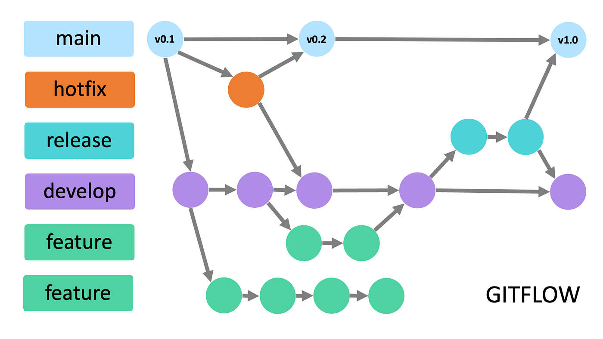
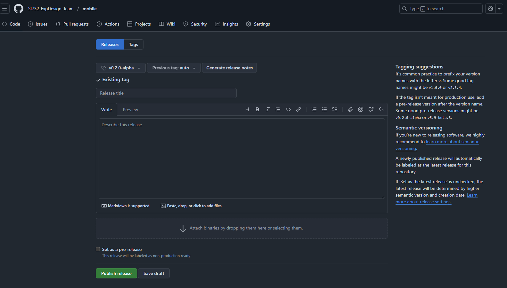

# Capítulo V: Product Implementation

## 5.1. Software Configuration Management

En este punto del informe se describe las decisiones y los principios que ayudarán al equipo a garantizar la coherencia durante el desarrollo de la solución.

### 5.1.1. Software Development Environment Configuration

En este apartado se proporcionan los enlaces a las aplicaciones y productos de software creados durante el ciclo del proyecto utilizando los programas correspondientes.

Con ese fin, se organizará en las siguientes secciones:

- Project Management
- Requirements Management
- Product UX/UI Design
- Software Development
- Software Testing
- Software Documentation

Asimismo, se clasificarán los elementos de estas secciones como rutas de referencia (para software basado en modelos Saas) o rutas de descarga (para productos que se ejecuten en las computadoras de los miembros del equipo) para cada uno de los productos de software.

**Project Management**

Esta disciplina se fundamenta en la administración de proyectos y busca principalmente la mejora de procesos y su entorno con el propósito de lograr los resultados esperados.

- Durante el ciclo digital del proyecto, se llevará a cabo la implementación de un producto de software basado en el modelo SaaS, el cual funcionará a través de un navegador web; no obstante, tambien se desarrollará una versión de la aplicación móvil correspondiente.

**Requirements Management:**

Este proceso se enfoca en asegurar que una organización documente, verifique y satisfaga las necesidades y expectativas de sus clientes, así como las de las partes interesadas internas o externas.

- Pivotal Tracker: Esta herramienta se describe como una plataforma que facilita la gestión de las historias de usuario, organizándolas en epopeyas y evaluando su importancia en el programa según su puntuación. Se utilizó debido a su capacidad para permitir que cada miembro del equipo comparta una vista en tiempo real de los avances en cada proyecto, contribuyendo con diferentes secciones o ajustando el flujo del proyecto.

**Product UX/UI Design**

Esta herramienta facilita la creación digital de modelos que se integran en la vida del consumidor. En este caso, estamos desarrollando un modelo de sitio web compatible tanto con computadoras como con dispositivos móviles.

Para lograrlo, utilizamos varias herramientas de diseño y colaboración, que incluyen:

1. Uxpressia: Uxpressia es una plataforma en línea especializada en el mapeo de la trayectoria del cliente. Nos ayuda a crear mapas de impacto y perfiles de usuario, como User Personas, Empathy Maps y Journey Maps. 

2. MIRO: MIRO es una pizarra digital colaborativa en línea que se adapta a diversas actividades colaborativas, como investigación, ideación, creación de lluvias de ideas y mapas mentales. Es una herramienta versátil que facilita el trabajo en equipo. 

3. Figma: Figma es una herramienta de prototipado web y un editor de gráficos vectoriales. A diferencia de otras herramientas, Figma se ejecuta en línea, lo que permite crear modelos que funcionan tanto en navegadores web como en navegadores móviles. 

4. Lucid Chart: Esta es una aplicación de diagramación en línea que permite a los usuarios colaborar y trabajar juntos en tiempo real para crear una variedad de diseños, incluidos diagramas UML, mapas mentales, prototipos de software y otros tipos de diagramas. 

5. Overflow: Overflow es una herramienta de diagramación que ofrece la posibilidad de colaborar en tiempo real. Utilizamos esta herramienta para crear diagramas de Userflows. 

**Software Development:**

El desarrollo de software es una metodología aplicada en la creación de productos de software. Esta metodología se utiliza para establecer un proceso que guía el desarrollo del software, y cada uno de sus pasos describe un enfoque específico para las distintas actividades que ocurren durante el proceso.

Aquí presentamos algunas herramientas y tecnologías clave que utilizaremos en el proyecto:

1. GitHub: GitHub es una plataforma de repositorio comunitario que se utiliza para almacenar y gestionar los avances de proyectos realizados por grupos de personas.

2. Webstorm: Webstorm es un entorno de desarrollo de JetBrains, una empresa especializada en software, orientado al desarrollo web en JavaScript. Esta herramienta proporciona facilidades para probar sitios web en navegadores como Google Chrome. En nuestro proyecto, utilizaremos webstorm para trabajar con lenguajes como HTML, CSS y JavaScript. 

3. HTML: HTML es un lenguaje de marcado que se utiliza en el desarrollo de sitios web para crear hipertextos y enlazar a otros documentos. Este lenguaje proporciona herramientas para diseñar sitios web y se puede combinar eficazmente con CSS y JavaScript. En nuestro proyecto, utilizaremos HTML para implementar la documentación de la página web. 

4. CSS: CSS es un lenguaje de diseño destinado al entorno web, que posibilita la mejora de la interfaz de usuario previamente diseñada al añadir elementos como colores y tamaños, entre otros. Además, es posible crear un estilo en CSS y compartirlo en el sitio web creado en HTML. Este lenguaje será empleado en la implementación del diseño de nuestra plataforma web.

5. JavaScript: Es un lenguaje de programación que es interpretado por otros programas. Funciona bajo el paradigma de programación orientada a objetos (POO), utilizando prototipos en lugar de clases para la implementación. Este lenguaje permite crear dinámicas para los usuarios a través de la lógica de programación y será utilizado en la creación de las interacciones dinámicas en la plataforma web. 

Estas herramientas y tecnologías desempeñarán un papel fundamental en la creación exitosa de nuestro producto de software.

**Software Testing:**

Se trata de la acción de evaluar los elementos y el funcionamiento del software sometido a prueba mediante procesos de validación y verificación.

Lenguaje Gherkin: Este lenguaje, conocido como DSL (Lenguaje Específico de Dominio), está diseñado específicamente para abordar problemas particulares. Además de poder ser interpretado en código, permite agregar historias de usuario del programa junto con sus componentes correspondientes, como Característica, Escenario, Ejemplo, Esquema de Escenario, Dado, Cuando, Entonces y Y.

**Software Documentation**

Se refiere a textos escritos o ilustraciones que acompañan al software de computadora o están integrados en su código fuente. Esta documentación tiene como objetivo explicar cómo funciona el software o cómo utilizarlo.

### 5.1.2. Source Code Management

A continuación se describe la gestión del código fuente, también conocida por las siglas SCM (Source Code Management). Su función principal es rastrear los cambios que realizará el equipo durante el desarrollo de su proyecto en el repositorio de código fuente. Se utilizará como un sistema de control de versiones que le permitirá realizar un seguimiento de los cambios realizados por miembros o desarrolladores individuales del proyecto. Además, es importante tener en cuenta que usaremos GitHub como nuestro sistema de control de versiones.

- URL de la organización: SI732-ExpDesign-Team  - https://github.com/SI732-ExpDesign-Team

- URL del repositorio de la Landing Page: landing-page - https://github.com/SI732-ExpDesign-Team/landing-page

- URL del repositorio del Front-End: frontend - https://github.com/SI732-ExpDesign-Team/frontend

- URL del repositorio del Back-End: backend - https://github.com/SI732-ExpDesign-Team/backend

- URL del repositorio de Mobile: mobile - https://github.com/SI732-ExpDesign-Team/mobile

**GitFlow**

GitFlow es un modelo alternativo para la creación de ramas en Git que se ha convertido en una herramienta esencial para muchos desarrolladores en los últimos años. Este flujo de trabajo de control de versiones, desarrollado y popularizado por Vicent Driessen, desempeña un papel crucial en la gestión de las versiones de un código, facilitando la creación ordenada de nuevas características (Features) y correcciones de problemas urgentes (Hotfixes).

 

Como se mencionó previamente, GitFlow opera con ramas o "branches". A continuación, se detallan las ramas que se utilizarán en el flujo de trabajo de nuestro proyecto.

**Main Branches:**

- Main: Esta es la rama principal desde la cual se ramifican todas las demás. Contendrá la versión más reciente junto con las versiones anteriores creadas por los desarrolladores. Aquí se mantendrá el historial oficial de las versiones publicadas.
- Develop: Esta rama puede ser creada a partir de la rama principal (Main) y contendrá todas las características (Features) estables. A través de esta rama, el equipo podrá integrar las funcionalidades de manera efectiva.

**Support Branches** 

A diferencia de las ramas principales, estas ramas secundarias tienen una vida útil limitada, ya que se eliminan al fusionarse con sus ramas primarias.

- Feature:
Se ramifica de: develop
Debe fusionarse de nuevo en: develop
Se utilizan para desarrollar las nuevas funciones que se integrarán en la próxima versión. Es importante destacar que esta rama existe únicamente mientras está en proceso de desarrollo. Sin embargo, una vez que el desarrollador haya completado esa función, se fusionará nuevamente con la rama "develop".

**Convenciones de Nomenclatura y Commits**

- **Feature Branch Naming:**
  - Formato: `feature/name`
  - Ejemplos:
    - `feature/welcome`
    - `feature/about`
    - `feature/myfeature`

- **Conventional Commits:**
  - **Estructura básica:**
    ```
    <type>[optional scope]: <description>
    [optional body]
    [optional footer(s)]
    ```
  
  - **Types:**
    1. `feat`: Cuando se agrega un nuevo feature
    2. `fix`: Cuando corriges un error
    3. `build`: Cuando afectan los componentes de compilación (herramienta de compilación, dependencias, versión)
    4. `chore`: Modificaciones privadas del código
    5. `docs`: Commits que afectan solo a la documentación
    6. `refactor`: Commits que reescriben o reestructuran el código sin cambiar comportamiento
    7. `perf`: Commits especiales que mejoran el rendimiento
    8. `style`: Commits que no afectan el programa (espacios, formato, puntos)
    9. `test`: Commits que agregan pruebas
  
  - **Scope:**
    - Ofrece información contextual adicional
    - Es opcional, pero beneficioso para proporcionar descripción más detallada
  
  - **Description:**
    - Parte obligatoria del formato
    - Usar lenguaje en modo imperativo
    - Evitar escribir en mayúsculas
  
  - **Body:**
    - Opcional
    - Explica la motivación detrás del cambio
    - Contrasta con el comportamiento anterior
    - Ideal para mencionar identificadores de problemas y relaciones
  
  - **Footer:**
    - Opcional
    - Incluye información sobre cambios significativos
    - Puede hacer referencia a problemas por ID
    - Cambios importantes precedidos por "BREAKING CHANGES:" y saltos de línea
  
  - **Ejemplos:**
    ```
    feat(welcome): add welcome section
    build(release): bump version to 1.0.0
    style: remove empty line
    feat(sign up): add the button to sign up
    feat!: email the customer when product is shipped
    feat: remove ticket list endpoint
    refers to JIRA-1337
    BREAKING CHANGES: ticket endpoints no longer supports list all entities.
    ```

### 5.1.3. Source Code Style Guide & Conventions

En esta sección, se presentarán las pautas, convenciones, estilos y principios que se aplicarán a cada uno de los lenguajes utilizados en la creación de nuestra aplicación. La observancia de este conjunto de directrices reviste una importancia fundamental, ya que tiene el propósito de mantener la calidad estructural del software, mejorar la legibilidad del código fuente y simplificar el mantenimiento del mismo.

Dado que en este proyecto se emplearán varios lenguajes, como HTML, CSS, JavaScript, Java y TypeScript para el desarrollo de la plataforma web, así como Gherkin para el proceso de pruebas del programa, a continuación, se detallarán y describirán las reglas y recomendaciones generales que se tendrán en cuenta al utilizarlos.

**Nomenclatura General**

Para los nombres de variables, objetos, elementos y funciones que se utilicen en el proyecto, se emplearán términos en inglés que estén relacionados con lo que representan. No se utilizarán mayúsculas en estos nombres, ya que, de acuerdo con W3Schools (sin fecha), la combinación de mayúsculas y minúsculas puede dificultar la legibilidad del código. En su lugar, se optará por utilizar exclusivamente letras minúsculas, lo que contribuirá a una mayor claridad en el código.

Ejemplos de nomenclatura estándar, siguiendo las recomendaciones de Google (s.f.):
```
.gallery {}
.video {}
.login {}
```

Estas pautas de nomenclatura ayudarán a mantener una coherencia en el código y facilitarán su comprensión.

**Sangría**

Cuando se trabaje con HTML, CSS y/o JavaScript, se aplicará un espaciado de dos espacios antes de cada línea que se encuentre dentro de un bloque. Según W3Schools (sin fecha), no se recomienda el uso de la tecla "Tabulación". A continuación, se muestra un ejemplo de la sangría estándar en HTML siguiendo las directrices de W3Schools (s.f.):

``` html
<!DOCTYPE html>
<html>
  <head>
    <title>Título del Documento</title>
  </head>
  <body>
    <h1>Encabezado Principal</h1>
    <p>Este es un párrafo dentro del cuerpo del documento.</p>
  </body>
</html>
```
Este estilo de sangría proporciona una estructura clara y organizada al código, lo que facilita su lectura y mantenimiento.

Ejemplo de formato estándar de sangría en CSS, conforme a las recomendaciones de W3Schools (s.f):

``` CSS
html {
  background: #fff; /* Fondo blanco */
  color: #404;     /* Color de texto gris */
}
```

Ejemplo de nomenclatura estándar de la sangría en JavaScript según W3School (s.f.):
``` JavaScript
function toCelsius(fahrenheit) {
  return (5 / 9) * (fahrenheit - 32);
}
```

**Especificaciones generales**

A continuación, detallaremos las reglas específicas necesarias para comprender el código de nuestra aplicación en cada lenguaje.

**HTML:**

HTML, acrónimo de HyperText Markup Language en inglés, es un lenguaje de marcado que se utiliza para definir la estructura de una página web. También incluye funcionalidades que permiten controlar el comportamiento de diferentes elementos del contenido de la página, como cambiar el tamaño del texto o aplicar formato cursiva, entre otros. En nuestro proyecto, emplearemos HTML5, y a continuación, se presentan las características y directrices que debemos seguir para utilizar este lenguaje de la siguiente manera:

- Declare Document Type La declaración del tipo de documento debe realizarse en la primera línea del código. Según las recomendaciones de Google (s.f.), se prefiere la sintaxis de HTML5 para todos los documentos HTML. Para declararla, simplemente copia lo siguiente:

``` html
<!DOCTYPE html>
```

- Blank Lines Cada vez que comiences un nuevo bloque, lista o tabla de gran longitud, es recomendable dejar una línea en blanco después del elemento anterior para mejorar la legibilidad y la presentación del código, de acuerdo con las pautas de W3Schools (s.f.):

``` html
<!DOCTYPE html>
<html>
<head>
<title>Animales Exóticos</title>
</head>
<body>
<h1>Lemur de Madagascar</h1>
<p>El lémur de Madagascar es un primate endémico de la isla de Madagascar en el Océano Índico.</p>

<h1>Pangolín</h1>
<p>El pangolín es un mamífero cubierto de escamas que se encuentra en regiones de África y Asia.</p>

<h1>Ocelote</h1>
<p>El ocelote es un felino salvaje que habita en América del Sur y Central, conocido por su pelaje moteado.</p>
</body>
</html>
```

Esta práctica de dejar una línea en blanco mejora la estructura y legibilidad del código HTML.

- Quote attribute Values Para los valores de los atributos, es común utilizar comillas dobles alrededor de ellos, aunque esta característica no sea obligatoria. Según W3Schools (sin fecha), esto mejora la legibilidad del código y es una práctica común entre los desarrolladores. Ejemplo:

``` html
<table class="striped">
```

Este enfoque de usar comillas dobles alrededor de los valores de los atributos es ampliamente aceptado y recomendado en la comunidad de desarrollo web.

* **Never Skip the \<title> Element**
El elemento `<title>` permite que las páginas aparezcan en la lista de resultados al realizar búsquedas en un navegador web. Además, este elemento es responsable de proporcionar el nombre de la página cuando se agrega a marcadores o favoritos. A continuación, se muestra un ejemplo de su uso:

``` html
<title>Guía de Estilo HTML y Convenciones de Codificación</title>
```

Este elemento es esencial para mejorar la identificación y accesibilidad de una página web.

* **HTML Line-Wrapping**
A pesar de que en un documento HTML no exista un límite estricto en la cantidad de palabras por línea, no se recomienda generar líneas de código excesivamente largas. De hecho, hacerlo dificulta la legibilidad del código. Para continuar en la siguiente línea, se deben utilizar al menos cuatro espacios para distinguir elementos secundarios. Aquí tienes un ejemplo basado en las recomendaciones de Google (sin fecha):

``` html
<button mat-icon-button color='primary' class="menu-button"
(click)="openMenu()">
<mat-icon>menu</mat-icon>
</button>
```

Este estilo de formateo ayuda a mantener un código más legible y facilita la identificación de los elementos y su jerarquía en la estructura del documento HTML.

**CSS:**

CSS, conocido por sus siglas en inglés, Cascading Style Sheets (Hojas de Estilo en Cascada), es un lenguaje que se enfoca en definir y mejorar la presentación de un documento basado en HTML. A continuación, se presentan las directrices que debemos seguir al utilizar CSS:

* **Shorthand Properties**
Se recomienda utilizar abreviaturas de propiedades y declarar los campos de los elementos en la menor cantidad de líneas posible, según las pautas de Google (sin fecha). Esto aumenta la eficiencia del código y lo hace más legible. Además, se debe evitar agregar unidades después del valor cero. Aquí tienes un ejemplo:

``` css
border-top: 0;
font: 100%/1.6 palatino, georgia, serif;
padding: 0 1em 0;
```

Siguiendo estas recomendaciones, se puede lograr un código CSS más conciso y fácil de entender.

* **Declaration Stops**
Es importante incluir un punto y coma al final de cada declaración en CSS, al igual que en la mayoría de los lenguajes de programación. Siguiendo las pautas de Google (sin fecha), esta práctica contribuye a mantener la coherencia en el código. A continuación, se muestra un ejemplo:

``` css
html {
  background: #fff;
  color: #404;
}
```

El uso consistente de puntos y comas al final de las declaraciones CSS ayuda a prevenir errores y mejora la claridad del código.

* **Property Name Stops**
Es necesario incluir un espacio entre los dos puntos que siguen al nombre de una propiedad y el valor correspondiente. Siempre se debe colocar un solo espacio después de los dos puntos, pero no antes. A continuación, se muestra un ejemplo siguiendo esta convención estándar de Google (s.f):

``` css
html {
  background: #fff;
  color: #404;
}
```

Mantener esta consistencia en la colocación de espacios ayuda a que el código CSS sea más legible y fácil de entender.

* **Declaration Block Separation**
Es esencial utilizar un espacio separador después del nombre de un selector de elemento y antes de la llave que inicia un bloque de declaración CSS. Además, la llave de apertura del bloque debe estar en la misma línea que el selector. Aquí tienes un ejemplo siguiendo esta convención estándar de Google (sin fecha):

``` css
html {
  background: #fff;
  color: #404;
}
```

El cumplimiento de estas directrices ayuda a mantener la consistencia y la legibilidad en el código CSS.

* **CSS quotation Marks**
No se deben utilizar comillas dobles (`"`) en el código CSS; en su lugar, se permiten y deben emplearse comillas simples (`'`) únicamente para selectores de atributos y valores de propiedades.
Ejemplo conforme a las pautas estándar de Google (sin fecha):

``` css
html {
  font-family: 'open sans', arial, sans-serif;
}
```

Este ejemplo demuestra el uso de comillas simples para encerrar el valor del atributo `font-family` en CSS, lo cual es una práctica común y aceptada.

**JavaScript**

JavaScript es un lenguaje de programación que permite especificar de manera precisa las acciones que debe realizar el navegador web, incluyendo el orden de ejecución de tareas y la frecuencia con la que se deben llevar a cabo. A continuación, se presentan las pautas para el uso de JavaScript en nuestro proyecto:

* **Spaces around operators**
Es importante añadir espacios alrededor de cada operador matemático y comas que se utilicen en el código JavaScript. A continuación, se muestra un ejemplo siguiendo la convención estándar de W3Schools (sin fecha):

``` javascript
let x = y + z;
const myArray = ['Volvo', 'Saab', 'Fiat'];
```

El uso consistente de espacios alrededor de operadores y comas mejora la legibilidad del código JavaScript.

* **Simple Statement's End**
Es fundamental que una instrucción simple finalice con un punto y coma, tal como es el caso en muchos otros lenguajes de programación. A continuación, se muestra un ejemplo que cumple con la convención estándar de W3Schools (sin fecha):

``` javascript
let x = v + 7;
const myArray = ['Volvo', 'Saab', 'Fiat'];
```

El uso de punto y coma al final de cada instrucción ayuda a garantizar la estructura correcta del código JavaScript y a evitar posibles errores.

* **Beginning and End of Function**
Un bloque de función debe incluir una llave al final de la primera línea, de modo que el cierre de la función esté en la última línea, sin necesidad de un punto y coma. Este mismo principio se aplica a las estructuras condicionales y los bucles. A continuación, se muestra un ejemplo que cumple con la convención estándar de W3Schools (sin fecha):

``` javascript
function toCelsius(fahrenheit) {
  return (5 / 9) * (fahrenheit - 32);
}
```

En este ejemplo, la función `toCelsius` está formateada de acuerdo con estas pautas, con la llave de apertura en la misma línea que la declaración de la función y la llave de cierre en la última línea. Esto ayuda a mantener la estructura y la legibilidad del código JavaScript.

* **Object Rules**
Para la creación de un objeto, al igual que en una función, se comienza con una llave al final de la primera línea. Sin embargo, en este caso, la llave de cierre debe ir seguida de un punto y coma. Para definir las propiedades del objeto, se utilizan dos puntos y un espacio para separar el nombre de la propiedad de su valor. Si el valor es un string, se debe encerrar entre comillas dobles. A continuación, se muestra un ejemplo siguiendo la convención estándar de W3Schools (sin fecha):

``` javascript
const person = {
  firstName: "John",
  lastName: "Doe",
  age: 50,
  eyeColor: "blue"
};
```

En este ejemplo, el objeto `person` está formateado de acuerdo con estas pautas, lo que mejora la legibilidad y la estructura del código JavaScript.

**Gherking:**

Gherkin es un Lenguaje Específico de Dominio (DSL por sus siglas en inglés) que se utiliza para resolver problemas específicos mediante la generación de casos de prueba que validan una característica en diversos escenarios. Gherkin incluye varios elementos, entre los cuales los más conocidos y utilizados son Feature, Scenario, Example, Given, When y Then. A continuación, se presentan las pautas que debemos seguir al utilizar Gherkin en nuestro código:

* **Discernible Given-When-Then Blocks**
Es importante aplicar sangría a los elementos que representan los pasos a seguir en un escenario. En el caso de "And", se debe aplicar una sangría adicional. Siguiendo la recomendación de Keiblinger (2021), este enfoque ayuda a identificar rápidamente las partes que componen un escenario. A continuación, se muestra un ejemplo:

``` gherkin
Scenario: Ingreso de requisitos con claridad
  Given que en el formulario de ingreso de oferta laboral
  When escribo claramente los requisitos
  Then se mostrará el mensaje
  And mi oferta solo aparecerá a quienes cumplan con estos
  And se habilita la opción
```

En este ejemplo, se ha aplicado la sangría de manera adecuada para resaltar los pasos del escenario, y se ha utilizado una sangría adicional para los pasos que comienzan con "And". Esto mejora la legibilidad y la comprensión de los escenarios escritos en Gherkin.

* **Step with Tables**
Conforme a la recomendación de Keiblinger (2021), cuando sea necesario introducir valores en partes del escenario, se debe emplear una tabla o crear un formulario que refleje esa parte del escenario. Antes de esta representación, se deben colocar dos puntos. Aquí tienes un ejemplo:

``` gherkin
Then se mostrará el mensaje:
  | Mensaje |
  | Se completaron los requisitos adecuadamente |
```

Este enfoque permite una representación clara y estructurada de los valores relacionados con una parte específica del escenario.

* **Reducing Noise**
Para evitar la acumulación de demasiadas líneas de código en un escenario, es recomendable incluir valores por defecto dentro de los pasos para campos que no sean muy relevantes para ese escenario en particular. Los valores "estándar" que se coloquen deben estar entre comillas simples. Siguiendo el consejo de Keiblinger (2021), esta práctica contribuye significativamente a la reducción del tamaño del código. A continuación, se muestra un ejemplo:

``` gherkin
When escribo claramente los requisitos 'dominio en C'
```

En este ejemplo, se ha incluido un valor por defecto ('dominio en C') entre comillas simples dentro del paso para representar un campo que no es esencial en ese escenario. Esto ayuda a mantener el escenario más conciso y legible.

* **Scenarios Separator**
Para separar dos escenarios, se debe insertar un salto de línea y, según la sugerencia de Keiblinger (2021), si es posible, agregar una línea de comentario para facilitar la visualización de estos. De esta manera, se identifica rápidamente el inicio y el fin de un escenario. A continuación, se presenta un ejemplo:

``` gherkin
Scenario: Ingreso de requisitos con claridad
Given que en el formulario de ingreso de oferta laboral
When escribo claramente los requisitos
Then se mostrará el mensaje
And mi oferta solo aparecerá a quienes cumplan con estos
And se habilita la opción

# --------------------------

Scenario: Otro escenario
Given que en otro contexto
When ocurre algo diferente
Then se muestra otro resultado
```

En este ejemplo, se ha agregado un salto de línea entre los dos escenarios y se ha incluido una línea de comentario como separador para mejorar la visualización y la identificación de cada escenario.

**Java:**

Java es una plataforma informática de lenguaje de programación que fue desarrollada por Sun Microsystems en 1995. A lo largo de los años, ha experimentado una evolución significativa y ha desempeñado un papel fundamental en la creación de numerosos servicios y aplicaciones que conforman gran parte del mundo digital actual. A continuación, se presentan las pautas para utilizar Java en nuestro proyecto:

* **Clases e interfaces en Java**
Los nombres de las clases deben ser sustantivos y seguir una convención de mayúsculas y minúsculas, con la primera letra de cada palabra interna en mayúscula. Del mismo modo, los nombres de las interfaces deben comenzar con una letra mayúscula, al igual que los nombres de las clases. Se debe utilizar palabras completas y evitar el uso de acrónimos y abreviaturas. Aquí tienes un ejemplo:

``` java
interface Bicycle
class MountainBike implements Bicycle
interface Sport
class Football implements Sport
```

En este ejemplo, se han seguido las pautas para nombrar clases e interfaces de manera clara y legible.

* **Métodos en Java**
Los métodos deben seguir una convención de nombres que utilice verbos y mantenga la combinación de mayúsculas y minúsculas, con la primera letra de cada palabra interna (a partir de la segunda) en mayúscula. A continuación, se presenta un ejemplo:

``` java
void changeGear(int newValue);
void speedUp(int increment);
void applyBrakes(int decrement);
```

En este ejemplo, los nombres de los métodos siguen la convención recomendada, lo que los hace descriptivos y legibles.

* **Variables en Java**
Los nombres de las variables deben ser concisos pero significativos, evitando comenzar con un guión bajo (\_) o caracteres especiales como el signo de dólar ($). Deben ser mnemotécnicos, es decir, diseñados de manera que indiquen claramente su propósito a un observador casual. Generalmente, se deben evitar los nombres de una sola letra para las variables, a menos que se utilicen como variables temporales. Los nombres comunes para variables temporales son: i, j, k, m y n para enteros, y c, d y e para caracteres. A continuación, se muestra un ejemplo:

``` java
// Variables para la clase MountainBike
int speed = 0;
int gear = 1;
```

En este ejemplo, se han utilizado nombres de variables significativos y legibles, lo que facilita la comprensión de su propósito en el contexto de la clase MountainBike.

* **Excepciones**
A menos que se justifique en un comentario, es extremadamente raro que sea apropiado no realizar ninguna acción en respuesta a una excepción detectada. En el caso en que no sea necesario realizar ninguna acción en un bloque catch, la razón debe explicarse de manera clara en un comentario. A continuación, se presenta un ejemplo:

``` java
try {
    int i = Integer.parseInt(response);
    return handleNumericResponse(i);
} catch (NumberFormatException ok) {
    // No es un valor numérico; eso está bien, simplemente continúa
    return handleTextResponse(response);
}
```

En este ejemplo, se ha incluido un comentario para explicar por qué no se realiza ninguna acción en el bloque catch cuando se detecta una excepción de formato numérico. Esto ayuda a comprender el motivo detrás de esta decisión en el código.
En el contexto de las pruebas, es aceptable ignorar una excepción detectada sin comentarios si su nombre es o comienza con "expected". Esto es un patrón común para verificar que el código bajo prueba arroje una excepción del tipo esperado, por lo que no se requiere un comentario adicional en este caso. A continuación, se muestra un ejemplo:

``` java
try {
    emptyStack.pop();
    fail();
} catch (NoSuchElementException expected) {
    // No es necesario comentar aquí, ya que esperábamos esta excepción
}
```

En este ejemplo, la excepción "expected" no requiere un comentario adicional, ya que el nombre mismo indica que es esperada como parte de la prueba.
La anotación `@Override` se utiliza para marcar un método cuando es legal hacerlo. Esto incluye un método de clase que anula un método de una superclase, un método de clase que implementa un método de una interfaz y un método de interfaz que vuelve a especificar un método de una superinterfaz.
Excepción: Se puede omitir la anotación `@Override` cuando el método principal está marcado como `@Deprecated`.

**Typescript**

JavaScript es uno de los lenguajes más populares y ha experimentado un rápido avance y mejora en los últimos años. A continuación, se presentan las pautas para utilizar JavaScript en nuestro proyecto:

En TypeScript, se recomienda que las variables se declaren en minúsculas y se especifique el tipo de dato utilizando dos puntos después del nombre de la variable. Aquí tienes ejemplos de cómo declarar y asignar valores a variables en TypeScript:

``` typescript
// Definición e inicialización separadas
let edad: number;
edad = 20;

// Definición e inicialización en la misma línea.
let edadAitor: number = 18;
```
Además, en TypeScript, se siguen las mismas convenciones que se utilizan en JavaScript.

### 5.1.4. Software Deployment Configuration

**Landing page**

Para desplegar la Landing Page desde GitHubPages hay que seguir los siguientes pasos: 

1. Ubicar el repositorio que tiene guardado el codigo fuente y dirigirse al apartado de configuración (settings)
2. Seleccionar la sección pages
3. Configurar la rama que será usada para hacer deploy

 

Landing page desplegada: https://si732-expdesign-team.github.io/landing-page/

**Web Services**


**Frontend Web Applications**


**Mobile Applications**

Para desplegar el mobile application desde GitHub Releases hay seguir los siguientes pasos: 

1. Ubicar el repositorio que tiene guardado el codigo fuente y dirigirse al apartado Releases
2. Seleccionar un tag (v0.2.0-alpha)
3. Agregar un title release y description
4. Publicar el release

Esto nos generará un archivo .apk que podremos instalar en nuestro dispositivo móvil. 

 
 
 

Native-Mobile Application desplegada: https://github.com/SI732-ExpDesign-Team/mobile/releases/download/v0.2.0-alpha/ReStyle.apk

## 5.2. Product Implementation & Deployment

### 5.2.1. Sprint Backlogs

Durante el desarrollo de este Sprint nos enfocamos en los despliegues de los entregable del Landing page, Web services, Frontend web application y mobile application:

<table>
  <tr>
    <td> <strong>Sprint #</strong></td>
    <td   colspan="7"> <strong>Sprint 1</strong> </td>
  </tr>

   <tr>
    <td   colspan="2"> <strong>User Story</strong></td>
    <td   colspan="6"> <strong>Work-item/Task</strong></td>
  </tr>
  <tr>
    <td  > <strong>ID</strong> </td>
    <td  > <strong>Title</strong></td>
    <td  > <strong>ID</strong> </td>
    <td  > <strong>Title</strong></td>
    <td  > <strong>Description</strong></td>
    <td  > <strong>Estimation (Hours)</strong></td>
    <td  > <strong>Assigned To</strong></td>
    <td  > <strong> Status (To-do/In-Process/To-Review/Done) </strong></td>
  </tr>
  <!---------------------------------------------------------------------- -->
  <tr>
    <!--rowspan="number of rows for the tasks" -->
    <td rowspan="3"> US-001</td>
    <td rowspan="3"> Implementacion y despliegue de Landing Page</td>
    <td  > UT-01</td>
    <td  > Crear repositorio de landing page y sus ramas correspondientes</td>
    <td  >Crear el repositorio dentro de la organización de Github para el control de versiones de la solución de software </td>
    <td  >1 </td>
    <td  > Alejandra Díaz </td>
    <td  > Done </td>
  </tr>
  <tr>
    <td  > UT-02</td>
    <td  > Implementación del Landing Page</td>
    <td  > Implementar el landing page actualizado con los datos del startup</td>
    <td  > 2</td>
    <td  > Alejandra Díaz</td>
    <td  > Done </td>
  </tr>
  <tr>
    <td  > UT-03</td>
    <td  > Despliegue del Landing Page</td>
    <td  > Desplegar el landing page mediante GitHub pages</td>
    <td > 1</td>
    <td  > Alejandra Díaz</td>
    <td  > Done </td>
  </tr>
  <tr>
    <!--rowspan="number of rows for the tasks" -->
    <td rowspan="3"> US-002</td>
    <td rowspan="3"> Implementacion y despliegue de Web Services</td>
    <td  > UT-01</td>
    <td  > Crear repositorio de web services y sus ramas correspondientes</td>
    <td  >Crear el repositorio dentro de la organización de Github para el control de versiones de la solución de software </td>
    <td  >1 </td>
    <td  > Alejandra Díaz </td>
    <td  > Done </td>
  </tr>
  <tr>
    <td  > UT-02</td>
    <td  > Implementación de Web Services</td>
    <td  > Implementar los web services con los endpoints necesarios para la solución de software</td>
    <td  > 2</td>
    <td  > Alejandra Díaz</td>
    <td  > Done </td>
  </tr>
  <tr>
    <td  > UT-03</td>
    <td  > Despliegue de Web Services</td>
    <td  > Desplegar los web services mediante un hosting service online</td>
    <td > 1</td>
    <td  > Alejandra Díaz</td>
    <td  > Done </td>
  </tr>
      <!--rowspan="number of rows for the tasks" -->
    <td rowspan="3"> US-003</td>
    <td rowspan="3"> Implementacion y despliegue de Frontend Web Application</td>
    <td  > UT-01</td>
    <td  > Crear repositorio de Frontend Web Application y sus ramas correspondientes</td>
    <td  >Crear el repositorio dentro de la organización de Github para el control de versiones de la solución de software </td>
    <td  >1 </td>
    <td  > Alejandra Díaz </td>
    <td  > Done </td>
  </tr>
  <tr>
    <td  > UT-02</td>
    <td  > Implementación del Frontend Web Application</td>
    <td  > Implementar el Frontend Web Application de la solución de software</td>
    <td  > 2</td>
    <td  > Alejandra Díaz</td>
    <td  > Done </td>
  </tr>
  <tr>
    <td  > UT-03</td>
    <td  > Despliegue del Frontend Web Application</td>
    <td  > Desplegar el Frontend Web Application mediante un hosting service online</td>
    <td > 1</td>
    <td  > Alejandra Díaz</td>
    <td  > Done </td>
  </tr>
        <!--rowspan="number of rows for the tasks" -->
    <td rowspan="3"> US-004</td>
    <td rowspan="3"> Implementacion y despliegue de Mobile application</td>
    <td  > UT-01</td>
    <td  > Crear repositorio de Mobile application y sus ramas correspondientes</td>
    <td  >Crear el repositorio dentro de la organización de Github para el control de versiones de la solución de software </td>
    <td  >1 </td>
    <td  > Alejandra Díaz </td>
    <td  > Done </td>
  </tr>
  <tr>
    <td  > UT-02</td>
    <td  > Implementación del Mobile application</td>
    <td  > Implementar el Mobile application de la solución de software</td>
    <td  > 2</td>
    <td  > Alejandra Díaz</td>
    <td  > Done </td>
  </tr>
  <tr>
    <td  > UT-03</td>
    <td  > Despliegue del Mobile application</td>
    <td  > Desplegar el Mobile application mediante GitHub releases</td>
    <td > 1</td>
    <td  > Alejandra Díaz</td>
    <td  > Done </td>
  </tr>
  </tr>
</table>

### 5.2.2. Implemented Landing Page Evidence

Landing page desplegada: https://si732-expdesign-team.github.io/landing-page/

 
 
 
 
 
 
 

### 5.2.3. Implemented Frontend-Web Application Evidence


### 5.2.4. Implemented Native-Mobile Application Evidence

Native-Mobile Application desplegada: https://github.com/SI732-ExpDesign-Team/mobile/releases/download/v0.2.0-alpha/ReStyle.apk

Demo: [Link de Stream](https://upcedupe-my.sharepoint.com/personal/u202118315_upc_edu_pe/_layouts/15/stream.aspx?id=%2Fpersonal%2Fu202118315%5Fupc%5Fedu%5Fpe%2FDocuments%2Fupc%2Dpre%2D202501%2D1asi0732%2D4430%2Destrellados%2Dmobile%2Ddemo%2Dsprint%2D1%2Emp4&referrer=StreamWebApp%2EWeb&referrerScenario=AddressBarCopied%2Eview%2E4ac5181d%2Da628%2D448e%2Db47e%2D6e75b9c14b40&isDarkMode=false)

 

### 5.2.5. Implemented RESTful API and/or Serverless Backend Evidence


### 5.2.6. RESTful API documentation

<table> 
  <tr> 
    <th>Endpoint</th> 
    <th>Acción</th> 
    <th>Verbo HTTP</th> 
    <th>Parámetros/Request Body</th> 
    <th>Ejemplo</th> 
  </tr> 
  <tr> 
    <td>/api/v1/users</td> 
    <td>Obtener todos los users</td> 
    <td>GET</td> 
    <td>null</td> 
    <td><pre>{ "data": [ { "id": 1, "email": "jperez@example.com", "username": "jperez", "firstName": "Juan", "paternalSurname": "Pérez", "maternalSurname": "López", "phone": "987654321" }, { "id": 2, "email": "mrodriguez@example.com", "username": "mrodriguez", "firstName": "María", "paternalSurname": "Rodriguez", "maternalSurname": "Gómez", "phone": "912345678" } ], "total": 2 }</pre></td>
  </tr> 
  <tr> 
    <td>/api/v1/users</td> 
    <td>Crear un user</td> 
    <td>POST</td> 
    <td> <pre>{ "email": "string", "password": "string", "username": "string", "firstName": "string", "paternalSurname": "string", "maternalSurname": "string", "image": "string", "phone": "string" }</pre> </td> 
    <td><pre>// Request { "email": "carlos@example.com", "password": "securePassword123", "username": "carlosg", "firstName": "Carlos", "paternalSurname": "García", "maternalSurname": "Martínez", "image": "https://example.com/profiles/carlos.jpg", "phone": "999888777" }
// Response { "id": 3, "email": "carlos@example.com", "username": "carlosg", "firstName": "Carlos", "paternalSurname": "García", "maternalSurname": "Martínez", "image": "https://example.com/profiles/carlos.jpg", "phone": "999888777", "created_at": "2024-06-15T14:30:45.123Z" }</pre></td> 
  </tr> 
  <tr> 
    <td>/api/v1/users/{userId}</td> 
    <td>Obtener un usuario por ID</td> 
    <td>GET</td> 
    <td>userId: Integer</td> 
    <td><pre>// GET /api/v1/users/1 { "id": 1, "email": "jperez@example.com", "username": "jperez", "firstName": "Juan", "paternalSurname": "Pérez", "maternalSurname": "López", "image": "https://example.com/profiles/juan.jpg", "phone": "987654321", "created_at": "2024-05-10T09:20:30.123Z", "updated_at": "2024-06-12T11:15:22.456Z", "role": "contractor" }</pre></td> 
  </tr> 
  <tr> 
    <td>/api/v1/reviews</td> 
    <td>Obtener todas las reseñas</td> 
    <td>GET</td> 
    <td>null</td> 
    <td><pre>{ "data": [ { "id": 1, "contractorId": 2, "projectId": 3, "duration": "3 semanas", "rating": 4, "comment": "Excelente trabajo, terminó antes de lo previsto", "image": "https://example.com/reviews/review1.jpg", "createdAt": "2024-05-15T14:30:00Z" }, { "id": 2, "contractorId": 1, "projectId": 5, "duration": "2 meses", "rating": 5, "comment": "Increíble atención al detalle", "image": "https://example.com/reviews/review2.jpg", "createdAt": "2024-05-20T10:15:30Z" } ], "total": 2 }</pre></td> 
  </tr> 
  <tr> 
    <td>/api/v1/reviews</td> 
    <td>Crear una reseña</td> 
    <td>POST</td> 
    <td> <pre>{ "contractorId": Integer, "projectId": Integer, "duration": "string", "rating": Integer, "comment": "string", "image": "string" }</pre> </td> 
    <td><pre>// Request { "contractorId": 3, "projectId": 7, "duration": "4 semanas", "rating": 5, "comment": "Trabajo perfecto, muy profesional", "image": "https://example.com/reviews/new_review.jpg" } // Response { "id": 3, "contractorId": 3, "projectId": 7, "duration": "4 semanas", "rating": 5, "comment": "Trabajo perfecto, muy profesional", "image": "https://example.com/reviews/new_review.jpg", "createdAt": "2024-06-15T16:45:30Z" }</pre></td> 
  </tr> 
  <tr> 
    <td>/api/v1/reviews/{reviewId}</td> 
    <td>Actualizar una reseña por ID</td> 
    <td>PUT</td> 
    <td> reviewId: Integer <pre>{ "duration": "string", "comment": "string", "image": "string" }</pre> </td> 
    <td><pre>// PUT /api/v1/reviews/3 // Request { "duration": "3 semanas y media", "comment": "Trabajo perfecto, muy profesional y puntual", "image": "https://example.com/reviews/updated_review.jpg" }

// Response { "id": 3, "contractorId": 3, "projectId": 7, "duration": "3 semanas y media", "rating": 5, "comment": "Trabajo perfecto, muy profesional y puntual", "image": "https://example.com/reviews/updated_review.jpg", "createdAt": "2024-06-15T16:45:30Z", "updatedAt": "2024-06-15T17:20:15Z" }</pre></td> 
  </tr> 
  <tr> 
    <td>/api/v1/reviews/{reviewId}</td> 
    <td>Eliminar una reseña por ID</td> 
    <td>DELETE</td> 
    <td>reviewId: Integer</td> 
    <td><pre>// DELETE /api/v1/reviews/3 // Response { "message": "Reseña eliminada correctamente", "deletedAt": "2024-06-15T17:45:22Z" }</pre></td> 
  </tr> 
  <tr> 
    <td>/api/v1/businesses</td> 
    <td>Obtener todas las empresas</td> 
    <td>GET</td> 
    <td>null</td> 
    <td><pre>{ "data": [ { "id": 1, "name": "Constructora Los Pinos", "description": "Especialistas en remodelaciones residenciales", "phone": "999777888", "email": "contacto@lospinos.com", "website": "www.lospinos.com", "address": "Av. Los Pinos 123, Lima", "rating": 4.5 }, { "id": 2, "name": "Decoraciones Modernas", "description": "Diseño de interiores y remodelaciones", "phone": "987654321", "email": "info@decoracionesmodernas.com", "website": "www.decoracionesmodernas.com", "address": "Jr. Modernidad 456, Lima", "rating": 4.2 } ], "total": 2 }</pre></td> 
  </tr> 
  <tr> 
    <td>/api/v1/businesses/{businessId}</td> 
    <td>Obtener una empresa por ID</td> 
    <td>GET</td> 
    <td>businessId: Integer</td> 
    <td><pre>// GET /api/v1/businesses/1 { "id": 1, "name": "Constructora Los Pinos", "description": "Especialistas en remodelaciones residenciales", "phone": "999777888", "email": "contacto@lospinos.com", "website": "www.lospinos.com", "address": "Av. Los Pinos 123, Lima", "rating": 4.5, "founded": "2010-03-15", "employees": 25, "projects": 120, "specialties": ["Cocinas", "Baños", "Terrazas"], "images": [ "https://example.com/businesses/lospinos1.jpg", "https://example.com/businesses/lospinos2.jpg" ] }</pre></td> 
  </tr> 
  <tr> 
    <td>/api/v1/projects</td> 
    <td>Crear un proyecto</td> 
    <td>POST</td> 
    <td> <pre>{ "name": "string", "description": "string", "businessId": 0, "contractorId": Integer, "startDate": "2024-06-07T06:10:32.596Z", "finishDate": "2024-06-07T06:10:32.596Z", "image": "string" }</pre> </td> 
    <td><pre>{ "name": "string", "description": "string", "businessId": 0, "contractorId": Integer, "startDate": "2024-06-07T06:10:32.596Z", "finishDate": "2024-06-07T06:10:32.596Z", "image": "string" }</pre></td> <td><pre>// Request { "name": "Remodelación de cocina", "description": "Remodelación completa con isla central y nuevos gabinetes", "businessId": 1, "contractorId": 3, "startDate": "2024-07-10T08:00:00.000Z", "finishDate": "2024-08-15T18:00:00.000Z", "image": "https://example.com/projects/kitchen_remodel.jpg" } // Response { "id": 8, "name": "Remodelación de cocina", "description": "Remodelación completa con isla central y nuevos gabinetes", "businessId": 1, "contractorId": 3, "startDate": "2024-07-10T08:00:00.000Z", "finishDate": "2024-08-15T18:00:00.000Z", "image": "https://example.com/projects/kitchen_remodel.jpg", "status": "scheduled", "createdAt": "2024-06-15T19:30:45.123Z" }</pre></td> 
  </tr> 
  <tr> 
    <td>/api/v1/project-requests</td> 
    <td>Crear un project request</td> 
    <td>POST</td> <td> <pre>{ "name": "string", "surname": "string", "email": "string", "phone": "string", "address": "string", "city": "string", "summary": "string", "businessId": Integer, "contractorId": Integer, "deadlineDate": "2024-06-07T06:18:52.812Z", "rooms": Integer, "budget": Integer }</pre> </td> 
    <td><pre>// Request { "name": "Ana", "surname": "Sánchez", "email": "ana.sanchez@example.com", "phone": "923456789", "address": "Calle Las Flores 456", "city": "Lima", "summary": "Necesito remodelar mi baño principal", "businessId": 2, "contractorId": 1, "deadlineDate": "2024-09-30T00:00:00.000Z", "rooms": 1, "budget": 15000 }

// Response { "id": 12, "name": "Ana", "surname": "Sánchez", "email": "ana.sanchez@example.com", "phone": "923456789", "address": "Calle Las Flores 456", "city": "Lima", "summary": "Necesito remodelar mi baño principal", "businessId": 2, "contractorId": 1, "deadlineDate": "2024-09-30T00:00:00.000Z", "rooms": 1, "budget": 15000, "status": "pending", "createdAt": "2024-06-15T20:15:30.456Z" }</pre></td> 
  </tr> 
  <tr> 
    <td>/api/v1/roles</td> 
    <td>Obtener todos los roles</td> 
    <td>GET</td> 
    <td>null</td> 
    <td><pre>{ "data": [ { "id": 1, "name": "client", "description": "Usuario que busca servicios de remodelación" }, { "id": 2, "name": "contractor", "description": "Profesional que ofrece servicios de remodelación" }, { "id": 3, "name": "admin", "description": "Administrador de la plataforma" } ], "total": 3 }</pre></td> 
  </tr> 
  <tr> 
    <td>/api/v1/authentication/sign-up</td> 
    <td>Registrar una cuenta</td> 
    <td>POST</td> 
    <td> <pre>{ "username": "string", "password": "string", "roles": ["string"] }</pre> </td> 
    <td><pre>// Request { "username": "laura.mendez", "password": "P@$$w0rd123", "roles": ["client"] } // Response { "id": 4, "username": "laura.mendez", "roles": ["client"], "token": "eyJhbGciOiJIUzI1NiIsInR5cCI6IkpXVCJ9...", "createdAt": "2024-06-15T21:10:25.789Z", "message": "Usuario registrado exitosamente" }</pre></td> 
  </tr> 
    <tr> 
    <td>/api/v1/authentication/sign-in</td> 
    <td>Ingresar a la cuenta</td> 
    <td>POST</td> 
    <td> <pre>{ "username": "string", "password": "string" }</pre> </td> 
    <td><pre>// Request { "username": "jperez", "password": "miContraseña123" } // Response { "id": 1, "username": "jperez", "firstName": "Juan", "paternalSurname": "Pérez", "email": "jperez@example.com", "roles": ["contractor"], "token": "eyJhbGciOiJIUzI1NiIsInR5cCI6IkpXVCJ9...", "expiresIn": 86400 }</pre></td> 
  </tr> 
</table>

### 5.2.7. Team Collaboration Insights


## 5.3. Video About-the-Product

En esta sección presentamos el video about the product. Este consolida una orientación promocional, resumiendo el modelo de nuestro negocio de ReStyle, las características y beneficios del producto, incluyendo algunas escenas deinteracción con el producto y una opinión por cada segmento objetivo, en nuestro caso segmento ojetivo de contratistas y remodeladores.

 

[Link de Youtube](https://www.youtube.com/embed/T2M434QKT4k)