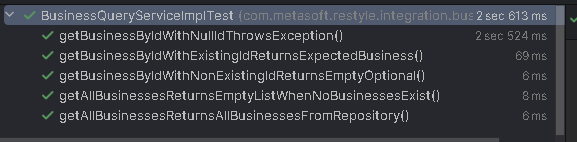
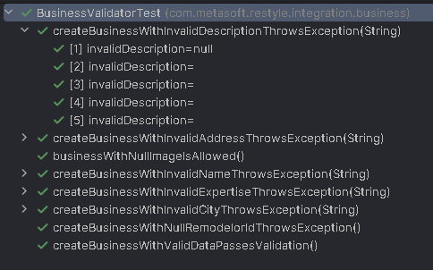
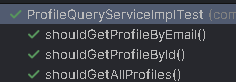
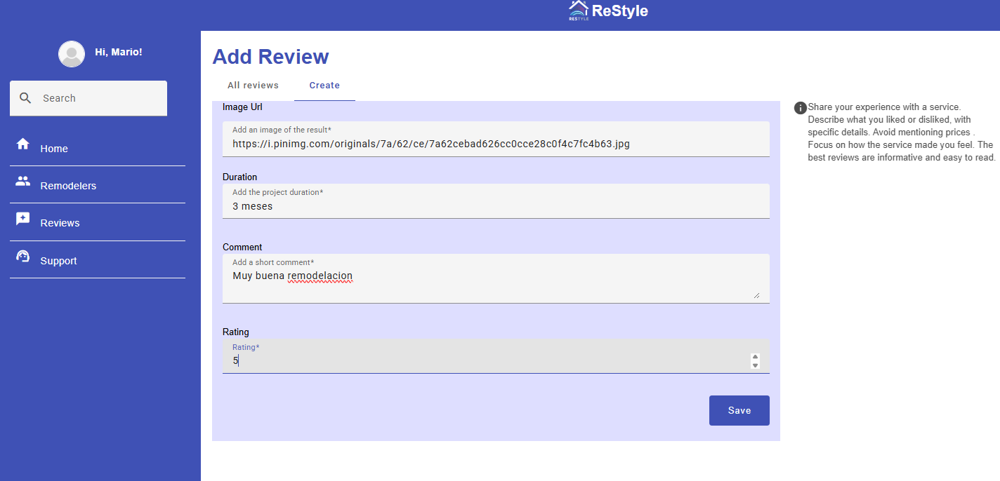
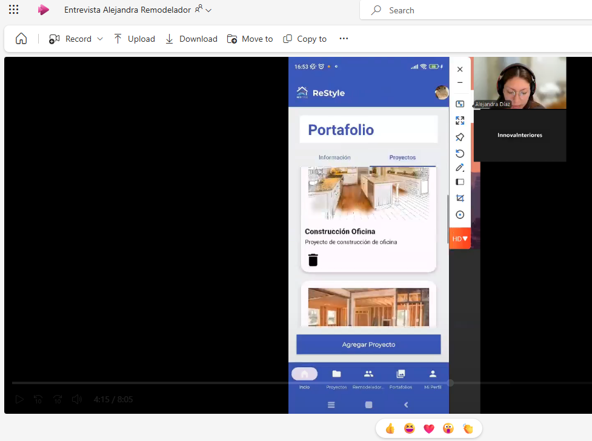

# Capítulo VI: Product Verification & Validation

## 6.1. Testing Suites & Validation

### 6.1.1. Core Entities Unit Tests

A continuación se detallan las pruebas unitarias e integrales realizadas por cada módulo del sistema:

#### 1. Módulo de Business

**Pruebas unitarias:**
- `BusinessCommandServiceImplTest`: Valida la creación de negocios.

- `BusinessQueryServiceImplTest`: Prueba consultas de negocios por ID, nombre y listado general.

- `BusinessValidatorTest`: Valida reglas de negocio en creación y actualización.

**Pruebas de integración:**
- `BusinessRepositoryIntegrationTest`: Verifica la persistencia de entidades Business.

- `BusinessesControllerIntegrationTest`: Evalúa el flujo completo desde la API REST hasta la base de datos.

#### 2. Módulo de IAM (Identity and Access Management)

**Pruebas unitarias:**
- `UserCommandServiceImplTest`: Valida el registro, actualización y gestión de usuarios.

- `UserQueryServiceImplTest`: Prueba búsquedas y consultas de usuarios.

- `RoleAssignmentServiceTest`: Verifica la asignación de roles (USER, CONTRACTOR, REMODELER).

- `PasswordEncoderServiceTest`: Comprueba la codificación segura de contraseñas.

**Pruebas de integración:**
- `AuthenticationControllerIntegrationTest`: Evalúa el flujo de registro e inicio de sesión.

- `UserRepositoryIntegrationTest`: Valida la persistencia de usuarios en la base de datos.

#### 3. Módulo de Project

**Pruebas unitarias:**
- `ProjectCommandServiceImplTest`: Prueba la creación y modificación de proyectos.

- `ProjectQueryServiceImplTest`: Evalúa consultas de proyectos.

- `ProjectValidatorTest`: Valida reglas de creación de proyectos.

- `ProjectStatusServiceTest`: Verifica las transiciones de estado (iniciado, en progreso, finalizado).

**Pruebas de integración:**
- `ProjectsControllerIntegrationTest`: Valida el flujo completo de la API de proyectos.

- `ProjectRepositoryIntegrationTest`: Verifica la persistencia de proyectos.

- `ProjectRemodelerIntegrationTest`: Evalúa la asignación de remodeladores a proyectos.

#### 4. Módulo de ProjectRequest

**Pruebas unitarias:**
- `ProjectRequestCommandServiceImplTest`: Valida la creación y modificación de solicitudes.

- `ProjectRequestQueryServiceImplTest`: Evalúa las consultas de solicitudes.

- `ProjectRequestValidatorTest`: Verifica la validez de los datos en las solicitudes.

- `RequestStatusServiceTest`: Prueba transiciones de estado (pendiente, aceptada, rechazada).

**Pruebas de integración:**
- `ProjectRequestsControllerIntegrationTest`: Verifica el flujo completo de solicitudes.

- `ProjectRequestRepositoryIntegrationTest`: Valida la persistencia de solicitudes.

- `ProjectRequestNotificationIntegrationTest`: Evalúa el envío de notificaciones relacionadas.

#### 5. Módulo de Reviews

**Pruebas unitarias:**
- `ReviewCommandServiceImplTest`: Prueba la creación y gestión de reseñas.

- `ReviewQueryServiceImplTest`: Evalúa la consulta de reseñas.

- `ReviewValidatorTest`: Valida los datos ingresados (calificación, contenido).

**Pruebas de integración:**
- `ReviewsControllerIntegrationTest`: Valida el flujo completo de evaluación.

- `ReviewRepositoryIntegrationTest`: Comprueba la persistencia de reseñas.

#### 6. Módulo de Profiles

**Pruebas unitarias:**
- `ProfileCommandServiceImplTest`: Prueba la creación y actualización de perfiles.

- `ProfileQueryServiceImplTest`: Evalúa la consulta de perfiles.

- `ProfileValidatorTest`: Valida la integridad de los datos de perfil.

**Pruebas de integración:**
- `ProfileRepositoryIntegrationTest`: Verifica la persistencia de perfiles de usuario.

#### 7. Módulo de Información

**Pruebas unitarias:**
- `InformationCommandServiceImplTest`: Gestiona la creación y actualización de información.

- `InformationQueryServiceImplTest`: Evalúa las consultas de información.

**Pruebas de integración:**
- `InformationControllerIntegrationTest`: Valida el flujo completo de gestión de información.

- `InformationRepositoryIntegrationTest`: Comprueba la persistencia de datos informativos.

---

### 6.1.2. Pruebas de Flujos de Negocio

Además de las pruebas por módulo, se implementaron pruebas de flujos completos que validan la interacción entre módulos en escenarios reales:

- **`ProjectRequestToProjectFlowTest`**: Verifica el flujo desde la solicitud hasta la creación del proyecto.

- **`UserRegistrationToRequestFlowTest`**: Evalúa el flujo desde el registro del usuario hasta la solicitud de un proyecto.

- **`ProjectAssignmentToCompletionFlowTest`**: Verifica el flujo desde la asignación del remodelador hasta la finalización del proyecto.

- **`ProjectCompletionToReviewFlowTest`**: Evalúa el flujo desde la finalización de un proyecto hasta la publicación de la reseña.

---

### Consideraciones para las Pruebas

- **Autenticación y Autorización:**
  - Todas las pruebas de controladores deben verificar que se apliquen los permisos adecuados.
  - Los endpoints protegidos deben ser validados mediante pruebas de integración.

- **Validación de Datos:**
  - Se deben probar casos límite como campos vacíos, valores máximos y mínimos.
  - Validar la correcta gestión de entradas inválidas.

- **Estados y Transiciones:**
  - Verificar todas las transiciones válidas e inválidas para solicitudes y proyectos.

- **Relaciones entre Entidades:**
  - Evaluar que se mantengan correctamente relaciones como Business-Project y User-Project.

- **Desempeño:**
  - Ejecutar pruebas de carga en endpoints críticos para garantizar la estabilidad.

---

### Cobertura de Historias de Usuario (HU)

Las pruebas cubren los siguientes requerimientos funcionales definidos como historias de usuario:

- **HU01**: Registro de remodelador  
- **HU02**: Registro de contratista  
- **HU03**: Gestión de perfiles  
- **HU04**: Creación y gestión de negocios  
- **HU05**: Búsqueda de remodeladores  
- **HU06**: Solicitud de proyectos  
- **HU07**: Gestión de proyectos  
- **HU08**: Evaluación y reseñas de proyectos  
- **HU09**: Comunicación entre usuarios  
- **HU10**: Notificaciones de eventos

### 6.1.3. Core Behavior-Driven Development
Durante esta fase se aplicó el enfoque **Behavior-Driven Development (BDD)**, centrado en describir el comportamiento esperado del sistema desde la perspectiva del usuario final. Este enfoque se basa en la colaboración entre desarrolladores, QA y stakeholders para definir funcionalidades claras, utilizando un lenguaje común y comprensible.

Para la implementación se empleó la herramienta **Jest-Cucumber**, que permite escribir pruebas automatizadas en formato **Gherkin**, facilitando la definición estructurada de escenarios mediante las palabras clave: `Given`, `When` y `Then`.

Este tipo de pruebas ayuda a validar que el sistema responde correctamente a casos reales de uso, alineándose con los requisitos funcionales definidos para el proyecto.
#### Escenario 1: Crear proyecto como remodelador

Este escenario valida que un remodelador registrado pueda crear un nuevo proyecto en su portafolio, incluyendo datos como el nombre del proyecto, descripción, imagen referencial, fechas de inicio y fin, y los IDs asociados al negocio y contratista. También se contemplan validaciones ante nombres duplicados o campos faltantes.

**Feature: Agregar críticas y opiniones sobre remodeladores**

Test ejecutado en Jest-Cucumber con datos reales:

#### Escenario 2: Agregar reseña como contratista

Este escenario valida que un contratista puede agregar una reseña sobre un remodelador, incluyendo título, descripción, calificación, nombre, correo electrónico, comentarios y archivo adjunto.

**Feature: Agregar críticas y opiniones sobre remodeladores**

Test ejecutado en Jest-Cucumber con datos reales:

### 6.1.4. Core System Tests

En esta etapa se llevaron a cabo pruebas de sistema con el propósito de validar el funcionamiento integral de la aplicación, tanto en su versión web como móvil. Estas pruebas simularon el comportamiento real del usuario final y verificaron la correcta integración entre los diferentes componentes del sistema: frontend, backend y base de datos.

Las pruebas se dividieron en los siguientes aspectos clave:

#### a) Pruebas Manuales (Web y Móvil)

Se ejecutaron pruebas manuales enfocadas en los flujos principales de usuario, tales como autenticación, navegación y gestión de datos, garantizando una experiencia fluida y libre de errores. Los escenarios evaluados incluyeron:

- Registro (sign up) y acceso (sign in) de usuarios.
- Creación, edición y eliminación de proyectos o negocios.
- Envío y visualización de reseñas (reviews).
- Asignación de contratistas a proyectos.
- Visualización de datos relevantes (proyectos finalizados, entre otros).
- Subida de imágenes.
- Navegación fluida entre pantallas o páginas.

Para estas pruebas se utilizaron datos reales tanto en la versión web como móvil, asegurando que el comportamiento de la aplicación reflejara situaciones reales de uso. A continuación, se muestran capturas correspondientes a algunos de los escenarios evaluados:

- **Registro de usuario contratista y remodelador (Web and Mobile)**
  
  

- **Prueba Inicio de sesión con credenciales incorrectos (Web)**
  
  

- **Prueba Inicio de sesión con credenciales correctos (Web)**
    
    

- **Creación de reseña por contratista (Mobile)**  
  
  

- **Creación de proyecto por usuario remodelador (Mobile)**  
  

#### b) Validación de APIs

Se validó el correcto funcionamiento de los endpoints del backend utilizando herramientas como Postman. Se verificó que las respuestas fueran correctas, coherentes y que los errores se gestionaran adecuadamente en distintos escenarios de prueba.

A continuación, se muestran ejemplos de las pruebas realizadas a distintos endpoints:

- **Registro de usuario contratista**  
  `POST /api/v1/auth/sign-up`
  
  

- **Registro de usuario remodelador**  
  `POST /api/v1/auth/sign-up`
  
  

- **Inicio de sesión (sign-in)**  
  `POST /api/v1/auth/sign-in`
  
  

- **Creación de empresa remodeladora (business)**  
  `POST /api/v1/businesses`
  
  

- **Creación de reseña por parte de un contratista**  
  `POST /api/v1/reviews`
  
  

- **Creación de proyecto para el portafolio del remodelador**  
  `POST /api/v1/projects`
  
  

#### c) Verificación de la Base de Datos

Se comprobó la persistencia, consistencia e integridad de los datos generados a través de la aplicación. Esta validación se realizó de forma local, observando las tablas creadas y su correcta actualización en función de las operaciones realizadas por los usuarios.

 

#### d) Compilación y Preparación para Despliegue

Finalmente, se garantizó que la aplicación compilara sin errores tanto en entorno web como móvil, confirmando su estabilidad y preparación para ser desplegada en un entorno productivo.

<figure>
  <figcaption>✅ Compilación del backend</figcaption>
  
</figure>
<figure>
  <figcaption>✅ Compilación del frontend</figcaption>
  
</figure>
<figure>
  <figcaption>✅ Compilación de la aplicación móvil</figcaption>
  
</figure>

## 6.2. Static testing & Verification

### 6.2.1. Static Code Analysis

#### 6.2.1.1. Coding standard & Code conventions

#### 6.2.1.2. Code Quality & Code Security

### 6.2.2. Reviews

## 6.3. Validation Interviews

### 6.3.1. Diseño de Entrevistas

### 6.3.2. Registro de Entrevistas

Entrevista a Contratistas

<table>
        <thead>
            <tr>
                <th>Entrevistado 1</th>
                <th>Jackeline Morey</th>
            </tr>
            <tr>
                <th>Entrevistador </th>
                <th>Alejandra Diaz</th>
            </tr>
        </thead>
        <tbody>
            <tr>
                <td>Edad</td>
                <td>26</td>
            </tr>
            <tr>
                <td>Distrito</td>
                <td>Lima</td>
            </tr>
            <tr>
                <td></td>
                <td><strong>Resumen:</strong> 
                  El usuario pudo completar todos los User Goals, esta contento con el estilo y funcionabilidad de tanto la aplicación como el landing page. Sin embargo, destaca algunos cambios que se pueden realizar en cuanto al diseño de algunas pages de la aplicación para que esta pueda ser más homogénea y se vea más profesional.
                </td>
            </tr>
            <tr>
                <td>Timing de la entrevista</td>
                <td></td>
            </tr>
            <tr>
                <td>URL de la entrevista</td>
                <td>https://upcedupe-my.sharepoint.com/:v:/g/personal/u202118315_upc_edu_pe/EXFVBPw31vhNm8JgK1kX7wcBDcj5nyBO_LXvUSXAGDtvgA?e=tKk9PO&nav=eyJyZWZlcnJhbEluZm8iOnsicmVmZXJyYWxBcHAiOiJTdHJlYW1XZWJBcHAiLCJyZWZlcnJhbFZpZXciOiJTaGFyZURpYWxvZy1MaW5rIiwicmVmZXJyYWxBcHBQbGF0Zm9ybSI6IldlYiIsInJlZmVycmFsTW9kZSI6InZpZXcifX0%3D</td>
            </tr>
            <tr>
                <th>Entrevistado 2</th>
                <th></th>
            <tr>
                <th>Entrevistador </th>
                <th></th>
            </tr>
            <tr>
                <td>Edad</td>
                <td></td>
            </tr>
            <tr>
                <td>Distrito</td>
                <td></td>
            </tr>
            <tr>
            <td></td>
                <td><strong>Resumen:</strong> </td>
            </tr>
            <tr>
                <td>Timing de la entrevista</td>
                <td></td>
            </tr>
            <tr>
                <td>URL de la entrevista</td>
                <td></td>
            </tr>
            <tr>
                <th>Entrevistado 3</th>
                <th></th>
            <tr>
                <th>Entrevistador </th>
                <th></th>
            </tr>
            <tr>
                <td>Edad</td>
                <td></td>
            </tr>
            <tr>
                <td>Distrito</td>
                <td></td>
            </tr>
            <tr>
            <td></td>
                <td><strong>Resumen:</strong> </td>
            </tr>
            <tr>
                <td>Timing de la entrevista</td>
                <td></td>
            </tr>
            <tr>
                <td>URL de la entrevista</td>
                <td></td>
            </tr>
        </tbody>
</table>

Entrevista a Remodeladores

<table>
        <thead>
            <tr>
                <th>Entrevistado 1</th>
                <th>Olga Samanez</th>
            <tr>
                <th>Entrevistador </th>
                <th>Alejandra Diaz</th>
            </tr>
        </thead>
        <tbody>
            <tr>
                <td>Edad</td>
                <td>52</td>
            </tr>
            <tr>
                <td>Distrito</td>
                <td>Pueblo Libre</td>
            </tr>
            <tr>
                <td></td>
                <td><strong>Resumen:</strong> La entrevistada logra completar todos los user goals, desde visualizar el landing page, encontrar el boton call to action, iniciar sesion en la aplicacion web, realizar busqueda de remodeladores y utilizar el project management. Finaliza solicitando un tutorial pequeño o flechas que indiquen como utilizar la aplicacion para los visitantes nuevos, tambien solicita colores más llamativos en el sidebar.</td>
            </tr>
            <tr>
                <td>Timing de la entrevista</td>
                <td></td>
            </tr>
            <tr>
                <td>URL de la entrevista</td>
                <td>https://upcedupe-my.sharepoint.com/:v:/g/personal/u202118315_upc_edu_pe/EWhw1hIvQPROrW67I7w5xtIB-Nc06JsHrfXsDsqGQt76Hg?e=Kvpjn5&nav=eyJyZWZlcnJhbEluZm8iOnsicmVmZXJyYWxBcHAiOiJTdHJlYW1XZWJBcHAiLCJyZWZlcnJhbFZpZXciOiJTaGFyZURpYWxvZy1MaW5rIiwicmVmZXJyYWxBcHBQbGF0Zm9ybSI6IldlYiIsInJlZmVycmFsTW9kZSI6InZpZXcifX0%3D</td>
            </tr>
            <tr>
                <th>Entrevistado 2</th>
                <th></th>
            <tr>
                <th>Entrevistador </th>
                <th></th>
            </tr>
            <tr>
                <td>Edad</td>
                <td></td>
            </tr>
            <tr>
                <td>Distrito</td>
                <td></td>
            </tr>
            <tr>
            <td></td>
                <td><strong>Resumen:</strong> </td>
            </tr>
            <tr>
                <td>Timing de la entrevista</td>
                <td></td>
            </tr>
            <tr>
                <td>URL de la entrevista</td>
                <td></td>
            </tr>
            <tr>
                <th>Entrevistado 3</th>
                <th></th>
            <tr>
                <th>Entrevistador </th>
                <th></th>
            </tr>
            <tr>
                <td>Edad</td>
                <td></td>
            </tr>
            <tr>
                <td>Distrito</td>
                <td></td>
            </tr>
            <tr>
            <td></td>
                <td><strong>Resumen:</strong> .</td>
            </tr>
            <tr>
                <td>Timing de la entrevista</td>
                <td></td>
            </tr>
            <tr>
                <td>URL de la entrevista</td>
                <td></td>
            </tr>
</table>

### 6.3.3. Evaluaciones según heurísticas

## 6.4. Auditoría de Experiencias de Usuario

### 6.4.1. Auditoría realizada

#### 6.4.1.1. Información del grupo auditado

#### 6.4.1.2. Cronograma de auditoría realizada

#### 6.4.1.3. Contenido de auditoría realizada

### 6.4.2. Auditoría recibida

#### 6.4.2.1. Información del grupo auditor

#### 6.4.2.2. Cronograma de auditoría recibida

#### 6.4.2.3. Contenido de auditoría recibida

#### 6.4.2.4. Resumen de modificaciones para subsanar hallazgos