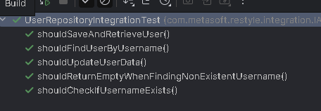
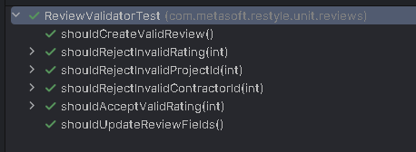
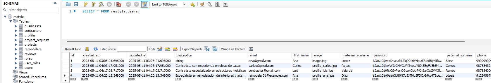

# Capítulo VI: Product Verification & Validation

## 6.1. Testing Suites & Validation

### 6.1.1. Core Entities Unit Tests

A continuación se detallan las pruebas unitarias e integrales realizadas por cada módulo del sistema:

#### 1. Módulo de Business

**Pruebas unitarias:**
- `BusinessCommandServiceImplTest`: Valida la creación de negocios.


- `BusinessQueryServiceImplTest`: Prueba consultas de negocios por ID, nombre y listado general.


- `BusinessValidatorTest`: Valida reglas de negocio en creación y actualización.


**Pruebas de integración:**
- `BusinessRepositoryIntegrationTest`: Verifica la persistencia de entidades Business.


- `BusinessesControllerIntegrationTest`: Evalúa el flujo completo desde la API REST hasta la base de datos.


#### 2. Módulo de IAM (Identity and Access Management)

**Pruebas unitarias:**
- `UserCommandServiceImplTest`: Valida el registro, actualización y gestión de usuarios.


- `UserQueryServiceImplTest`: Prueba búsquedas y consultas de usuarios.


- `RoleAssignmentServiceTest`: Verifica la asignación de roles (USER, CONTRACTOR, REMODELER).


- `PasswordEncoderServiceTest`: Comprueba la codificación segura de contraseñas.


**Pruebas de integración:**
- `AuthenticationControllerIntegrationTest`: Evalúa el flujo de registro e inicio de sesión.


- `UserRepositoryIntegrationTest`: Valida la persistencia de usuarios en la base de datos.



#### 3. Módulo de Project

**Pruebas unitarias:**
- `ProjectCommandServiceImplTest`: Prueba la creación y modificación de proyectos.


- `ProjectQueryServiceImplTest`: Evalúa consultas de proyectos.


- `ProjectValidatorTest`: Valida reglas de creación de proyectos.


- `ProjectStatusServiceTest`: Verifica las transiciones de estado (iniciado, en progreso, finalizado).


**Pruebas de integración:**
- `ProjectsControllerIntegrationTest`: Valida el flujo completo de la API de proyectos.


- `ProjectRepositoryIntegrationTest`: Verifica la persistencia de proyectos.


- `ProjectRemodelerIntegrationTest`: Evalúa la asignación de remodeladores a proyectos.


#### 4. Módulo de ProjectRequest

**Pruebas unitarias:**
- `ProjectRequestCommandServiceImplTest`: Valida la creación y modificación de solicitudes.


- `ProjectRequestQueryServiceImplTest`: Evalúa las consultas de solicitudes.


- `ProjectRequestValidatorTest`: Verifica la validez de los datos en las solicitudes.


- `RequestStatusServiceTest`: Prueba transiciones de estado (pendiente, aceptada, rechazada).


**Pruebas de integración:**
- `ProjectRequestsControllerIntegrationTest`: Verifica el flujo completo de solicitudes.


- `ProjectRequestRepositoryIntegrationTest`: Valida la persistencia de solicitudes.


- `ProjectRequestNotificationIntegrationTest`: Evalúa el envío de notificaciones relacionadas.


#### 5. Módulo de Reviews

**Pruebas unitarias:**
- `ReviewCommandServiceImplTest`: Prueba la creación y gestión de reseñas.


- `ReviewQueryServiceImplTest`: Evalúa la consulta de reseñas.


- `ReviewValidatorTest`: Valida los datos ingresados (calificación, contenido).



**Pruebas de integración:**
- `ReviewsControllerIntegrationTest`: Valida el flujo completo de evaluación.


- `ReviewRepositoryIntegrationTest`: Comprueba la persistencia de reseñas.


#### 6. Módulo de Profiles

**Pruebas unitarias:**
- `ProfileCommandServiceImplTest`: Prueba la creación y actualización de perfiles.


- `ProfileQueryServiceImplTest`: Evalúa la consulta de perfiles.


- `ProfileValidatorTest`: Valida la integridad de los datos de perfil.


**Pruebas de integración:**
- `ProfileRepositoryIntegrationTest`: Verifica la persistencia de perfiles de usuario.


#### 7. Módulo de Información

**Pruebas unitarias:**
- `InformationCommandServiceImplTest`: Gestiona la creación y actualización de información.


- `InformationQueryServiceImplTest`: Evalúa las consultas de información.


**Pruebas de integración:**
- `InformationControllerIntegrationTest`: Valida el flujo completo de gestión de información.


- `InformationRepositoryIntegrationTest`: Comprueba la persistencia de datos informativos.


---

### 6.1.2. Pruebas de Flujos de Negocio

Además de las pruebas por módulo, se implementaron pruebas de flujos completos que validan la interacción entre módulos en escenarios reales:

- **`ProjectRequestToProjectFlowTest`**: Verifica el flujo desde la solicitud hasta la creación del proyecto.


- **`UserRegistrationToRequestFlowTest`**: Evalúa el flujo desde el registro del usuario hasta la solicitud de un proyecto.


- **`ProjectAssignmentToCompletionFlowTest`**: Verifica el flujo desde la asignación del remodelador hasta la finalización del proyecto.


- **`ProjectCompletionToReviewFlowTest`**: Evalúa el flujo desde la finalización de un proyecto hasta la publicación de la reseña.


---

### Consideraciones para las Pruebas

- **Autenticación y Autorización:**
  - Todas las pruebas de controladores deben verificar que se apliquen los permisos adecuados.
  - Los endpoints protegidos deben ser validados mediante pruebas de integración.

- **Validación de Datos:**
  - Se deben probar casos límite como campos vacíos, valores máximos y mínimos.
  - Validar la correcta gestión de entradas inválidas.

- **Estados y Transiciones:**
  - Verificar todas las transiciones válidas e inválidas para solicitudes y proyectos.

- **Relaciones entre Entidades:**
  - Evaluar que se mantengan correctamente relaciones como Business-Project y User-Project.

- **Desempeño:**
  - Ejecutar pruebas de carga en endpoints críticos para garantizar la estabilidad.

---

### Cobertura de Historias de Usuario (HU)

Las pruebas cubren los siguientes requerimientos funcionales definidos como historias de usuario:

- **HU01**: Registro de remodelador  
- **HU02**: Registro de contratista  
- **HU03**: Gestión de perfiles  
- **HU04**: Creación y gestión de negocios  
- **HU05**: Búsqueda de remodeladores  
- **HU06**: Solicitud de proyectos  
- **HU07**: Gestión de proyectos  
- **HU08**: Evaluación y reseñas de proyectos  
- **HU09**: Comunicación entre usuarios  
- **HU10**: Notificaciones de eventos

### 6.1.3. Core Behavior-Driven Development
Durante esta fase se aplicó el enfoque **Behavior-Driven Development (BDD)**, centrado en describir el comportamiento esperado del sistema desde la perspectiva del usuario final. Este enfoque se basa en la colaboración entre desarrolladores, QA y stakeholders para definir funcionalidades claras, utilizando un lenguaje común y comprensible.

Para la implementación se empleó la herramienta **Jest-Cucumber**, que permite escribir pruebas automatizadas en formato **Gherkin**, facilitando la definición estructurada de escenarios mediante las palabras clave: `Given`, `When` y `Then`.

Este tipo de pruebas ayuda a validar que el sistema responde correctamente a casos reales de uso, alineándose con los requisitos funcionales definidos para el proyecto.
#### Escenario 1: Crear proyecto como remodelador

Este escenario valida que un remodelador registrado pueda crear un nuevo proyecto en su portafolio, incluyendo datos como el nombre del proyecto, descripción, imagen referencial, fechas de inicio y fin, y los IDs asociados al negocio y contratista. También se contemplan validaciones ante nombres duplicados o campos faltantes.

**Feature: Agregar críticas y opiniones sobre remodeladores**


Test ejecutado en Jest-Cucumber con datos reales:


#### Escenario 2: Agregar reseña como contratista

Este escenario valida que un contratista puede agregar una reseña sobre un remodelador, incluyendo título, descripción, calificación, nombre, correo electrónico, comentarios y archivo adjunto.

**Feature: Agregar críticas y opiniones sobre remodeladores**


Test ejecutado en Jest-Cucumber con datos reales:


### 6.1.4. Core System Tests

En esta etapa se llevaron a cabo pruebas de sistema con el propósito de validar el funcionamiento integral de la aplicación, tanto en su versión web como móvil. Estas pruebas simularon el comportamiento real del usuario final y verificaron la correcta integración entre los diferentes componentes del sistema: frontend, backend y base de datos.

Las pruebas se dividieron en los siguientes aspectos clave:

#### a) Pruebas Manuales (Web y Móvil)

Se ejecutaron pruebas manuales enfocadas en los flujos principales de usuario, tales como autenticación, navegación y gestión de datos, garantizando una experiencia fluida y libre de errores. Los escenarios evaluados incluyeron:

- Registro (sign up) y acceso (sign in) de usuarios.
- Creación, edición y eliminación de proyectos o negocios.
- Envío y visualización de reseñas (reviews).
- Asignación de contratistas a proyectos.
- Visualización de datos relevantes (proyectos finalizados, entre otros).
- Subida de imágenes.
- Navegación fluida entre pantallas o páginas.

Para estas pruebas se utilizaron datos reales tanto en la versión web como móvil, asegurando que el comportamiento de la aplicación reflejara situaciones reales de uso. A continuación, se muestran capturas correspondientes a algunos de los escenarios evaluados:

- **Registro de usuario contratista y remodelador (Web and Mobile)**
  
  

- **Prueba Inicio de sesión con credenciales incorrectos (Web)**
  
  

- **Prueba Inicio de sesión con credenciales correctos (Web)**
    
    


- **Creación de reseña por contratista (Mobile)**  
  
  

- **Creación de proyecto por usuario remodelador (Mobile)**  
  


#### b) Validación de APIs

Se validó el correcto funcionamiento de los endpoints del backend utilizando herramientas como Postman. Se verificó que las respuestas fueran correctas, coherentes y que los errores se gestionaran adecuadamente en distintos escenarios de prueba.

A continuación, se muestran ejemplos de las pruebas realizadas a distintos endpoints:

- **Registro de usuario contratista**  
  `POST /api/v1/auth/sign-up`
  
  

- **Registro de usuario remodelador**  
  `POST /api/v1/auth/sign-up`
  
  

- **Inicio de sesión (sign-in)**  
  `POST /api/v1/auth/sign-in`
  
  

- **Creación de empresa remodeladora (business)**  
  `POST /api/v1/businesses`
  
  

- **Creación de reseña por parte de un contratista**  
  `POST /api/v1/reviews`
  
  

- **Creación de proyecto para el portafolio del remodelador**  
  `POST /api/v1/projects`
  
  


#### c) Verificación de la Base de Datos

Se comprobó la persistencia, consistencia e integridad de los datos generados a través de la aplicación. Esta validación se realizó de forma local, observando las tablas creadas y su correcta actualización en función de las operaciones realizadas por los usuarios.

 

#### d) Compilación y Preparación para Despliegue

Finalmente, se garantizó que la aplicación compilara sin errores tanto en entorno web como móvil, confirmando su estabilidad y preparación para ser desplegada en un entorno productivo.

<figure>
  <figcaption>✅ Compilación del backend</figcaption>
  
</figure>
<figure>
  <figcaption>✅ Compilación del frontend</figcaption>
  
</figure>
<figure>
  <figcaption>✅ Compilación de la aplicación móvil</figcaption>
  
</figure>


## 6.2. Static testing & Verification

### 6.2.1. Static Code Analysis

<div align="justify">

El análisis estático de código es una práctica esencial para garantizar la calidad, seguridad y mantenibilidad del software. Permite detectar errores, vulnerabilidades y malas prácticas de forma temprana, antes de la ejecución, lo que reduce riesgos y costos asociados a fallos en producción. Por ello, se integró como parte fundamental del ciclo de desarrollo y entrega continua del proyecto.

</div>

El análisis estático de código para el proyecto actual se realizó utilizando las siguientes herramientas y servicios:

- **IntelliJ IDEA Ultimate 2024.1** (incluyendo su motor de inspección de código y análisis estático)
- **Qodana Community 2024.1** (integrado con IntelliJ para análisis avanzado)
- **Java JDK 17**
- **Spring Boot 3.2.x**
- **Maven 3.9.x** (para gestión de dependencias y ejecución de análisis)
- **Dependabot** (para la detección automática de vulnerabilidades en dependencias)

**Proceso:**

Se configuraron y ejecutaron los análisis estáticos tanto localmente (con IntelliJ y Qodana) como en el pipeline CI/CD, asegurando la revisión de todo el código fuente, dependencias y configuraciones relevantes.

**Resultados:**

El repositorio del proyecto fue sometido a exhaustivas pruebas de análisis estático:

- Se corrigieron todas las vulnerabilidades conocidas en dependencias (Spring, Logback, XMLUnit, etc.), manteniendo las versiones más recientes y seguras.
- Se eliminaron redundancias, código muerto, imports no utilizados y métodos innecesarios, siguiendo las mejores prácticas de Java y Lombok.
- Se documentaron y suprimieron advertencias irrelevantes o falsos positivos, especialmente en métodos requeridos por interfaces de Spring Security.
- Se implementaron anotaciones de nullabilidad y políticas de `@NonNullApi` en los paquetes de repositorios para mejorar la seguridad y claridad del código.

**Evidencias del análisis estático:**

**1. Resumen general del análisis**


**2. Detalle de métricas de calidad**


**3. Confirmación de análisis exitoso**


**4. Resumen final**


#### 6.2.1.1. Coding standard & Code conventions

**Convenciones y Estándares Básicos**

##### Naming Conventions (Convenciones de nombres):

- Los identificadores utilizan únicamente caracteres ASCII.
- Los nombres de clases y enums se escriben en **UpperCamelCase (PascalCase)**. Ejemplo:

  ```java
  UserDetailsImpl, ProjectRequest
  ```
- Las clases de prueba terminan en `Test`. Ejemplo:

  ```java
  UserServiceTest
  ```
- Los nombres de variables locales, parámetros y métodos se escriben en **camelCase**. Ejemplo:

  ```java
  projectName, getUserDetails()
  ```
- Los nombres de constantes se escriben en mayúsculas y con guiones bajos. Ejemplo:

  ```java
  MAX_ATTEMPTS
  ```
- Los nombres de interfaces no llevan prefijo especial, siguiendo la convención Java estándar. Ejemplo:

  ```java
  UserRepository
  ```
- Los nombres de archivos y directorios siguen el mismo formato que las clases que contienen, en PascalCase.
- Los paquetes se nombran en minúsculas y, de ser necesario, separados por puntos. Ejemplo:

  ```java
  com.empresa.proyecto.repository
  ```

##### Estilo de código

- Los modificadores de acceso siguen el orden: `public`, `protected`, `private`, seguido de otros modificadores como `static`, `final`, etc.
- Las declaraciones import van al inicio de cada archivo, ordenadas alfabéticamente, colocando primero las de Java estándar (`java.*`, `javax.*`).
- Se utiliza una sola instrucción por línea.
- La indentación es de 4 espacios por nivel, sin uso de tabs.
- Los corchetes de apertura `{` van al final de la línea de declaración.
- Se evita el uso de líneas de código innecesarias, comentarios redundantes y código muerto.
- Se emplea **Lombok** para reducir el boilerplate, evitando la duplicidad de getters/setters.
- Se aplican anotaciones de nullabilidad (`@NonNull`, `@Nullable`) y políticas de `@NonNullApi` en los paquetes de repositorios.

#### 6.2.1.2. Code Quality & Code Security

El código fue evaluado durante las revisiones y análisis estático considerando las siguientes métricas de calidad:

- **Seguridad:**
  - Se corrigieron todas las vulnerabilidades conocidas en dependencias y código fuente.
  - Se emplearon herramientas como Qodana, IntelliJ y Dependabot para la detección y remediación de riesgos.
- **Exactitud (Reliability):**
  - Se eliminaron redundancias, código muerto y se aseguraron implementaciones correctas de interfaces requeridas por Spring Security y otros frameworks.
- **Mantenibilidad:**
  - Se aplicaron las mejores prácticas de Java y Spring Boot, uso de Lombok para reducir código repetitivo, y se documentaron decisiones técnicas relevantes.
- **Consistencia:**
  - Se mantuvo un estilo de código uniforme en todo el proyecto, siguiendo las convenciones de nombres, estructura de carpetas y formato de código.

### 6.2.2. Reviews
Se realizó una revisión inicial del módulo de reseñas para evaluar el cumplimiento de estándares de código y calidad. A continuación, se presentan los principales hallazgos.

<table><tr><th colspan="4" valign="top"><b>Repositorio: ExpDesign-Team</b></th></tr>
<tr><td colspan="4" valign="top"><b>Detalles de Revisiòn:</b></td></tr>
<tr><td valign="top"><b>Fecha:</b> 10/06/2025</td><td valign="top"><b>Tipo de Revisiòn:</b> Code Review Inicial</td><td valign="top"><b>Autor:</b> Grupal</td><td valign="top"><b>Reviewer:</b> Mariana Chambi</td></tr>
<tr><td colspan="2" rowspan="2" valign="top"><p><b>Archivos:</b></p><p>Landing Page</p><p>Web Application</p><p>Mobile Application </p><p>Backend</p><p></p></td><td colspan="2" rowspan="2" valign="top"><p><b>Propósito:</b> </p><p>Asegurar que toda la implementación se adhiera a los estándares de código y cumpla con las métricas de calidad establecidas.</p><p></p></td></tr>
<tr></tr>
<tr><td colspan="4" valign="top"><b>Resumen de Revisiòn</b></td></tr>
<tr><td colspan="4" valign="top"><p><b>Estilo y Convenciones de Código:</b></p><p>El código presenta un buen cumplimiento de las guías de estilo establecidas. Aunque se identificaron algunos detalles menores, estos no afectan la claridad ni la estructura general del proyecto.</p></td></tr>
<tr><td colspan="4" valign="top"><b>Lógica y Consistencia Funcional:</b><br>La lógica implementada es coherente y se mantiene uniforme a lo largo de todos los componentes revisados. Las funcionalidades analizadas responden adecuadamente a los requisitos del sistema, sin desviaciones ni errores críticos.</td></tr>
<tr><td colspan="4" valign="top"><b>Documentación:</b><br>Se evidenció una cobertura limitada de comentarios y documentación en varias partes del código, e incluso su ausencia en algunos archivos. Esto podría dificultar futuras tareas de mantenimiento o incorporación de nuevos miembros al equipo. Se recomienda incorporar descripciones claras en funciones, clases y módulos clave.</td></tr>
</table>

## 6.3. Validation Interviews

### 6.3.1. Diseño de Entrevistas

- **User Goal: Navegar por la landing page**  

User persona → Remodeladores y contratistas  

Explicación del flujo → El usuario deberá ingresar a la landing page de la aplicación web. En esta, podrá desplazarse y visualizar información general sobre los servicios ofrecidos, así como los beneficios de utilizar la aplicación. Además, podrá cambiar el idioma a inglés o español a través de un botón. También, podrá descargar el aplicativo a través de un Call To Action situado en la vista principal de la landing page.  

- **User Goal: Iniciar sesión**  

User persona → Remodeladores y contratistas  

Explicación del flujo → Primero, el usuario deberá ingresar a la aplicación desplegada. A continuación, verá en la pantalla un formulario que le pedirá sus datos de inicio de sesión, específicamente su correo electrónico y contraseña. Una vez validadas las credenciales, el sistema le permitirá ingresar a la aplicación. En caso el usuario no tenga una cuenta, puede registrarse completando otro formulario con sus datos personales.  

- **User Goal: Ver perfil**  

User persona → Remodeladores y contratistas  

Explicación del flujo → El usuario tiene dos formas de acceder a su perfil. La primera opción es a través de un panel lateral ubicado a la izquierda de la aplicación; al hacer clic en el ícono de la persona, podrá acceder a su perfil, donde verá sus datos personales y detalles de la cuenta. La segunda opción es desde la barra de navegación en la parte superior de la aplicación; al hacer clic en "Mi perfil", accederá a la misma vista mencionada.  

- **User Goal: Buscar remodeladores**  

User persona → Contratistas  

Explicación del flujo → Primero el usuario puede acceder a la vista de busqueda de remodeladores desde el sidebar lateral, donde podrá buscar remodeladores por nombre, distrito, especialidad. Además, podrá filtrar los resultados de la búsqueda. Una vez seleccionado un remodelador, podrá ver su portafolio, reseñas y una vista para contactar con el remodelador seleccionado.  

- **User Goal: Creacion de proyecto**  

User persona → Remodeladores   

Explicación del flujo → En primer lugar, el usuario deberá acceder a la vista de portafolio. En esta, podrá ver la opción de creación de proyectos, donde podrá ingresar los datos necesarios para la creación de proyectos. 


### 6.3.2. Registro de Entrevistas

**Entrevistas a remodeladores:** 

|**Entrevistado 1** |**InnovaInteriores** |
| :-: | :-: |
|Edad |53 |
|Distrito |Pueblo Libre |
| |La entrevistada nos comenta que la landing page es clara y concisa, el diseño y paleta de colores son similares para la landing page y la aplicación móvil, lo cual habla de que se mantiene una imagen coherente de marca. La aplicación móvil desearía que se añada una descripción de la empresa en el HOME y que el botón de eliminar cuente con un mensaje de confirmación para verificar si se desea borrar un proyecto antes de borrarlo por error.  |
|Timing:0:00-8:05 |URL:[ ](https://upcedupe-my.sharepoint.com/:v:/g/personal/u202118315_upc_edu_pe/EWhw1hIvQPROrW67I7w5xtIB-Nc06JsHrfXsDsqGQt76Hg?nav=eyJyZWZlcnJhbEluZm8iOnsicmVmZXJyYWxBcHAiOiJPbmVEcml2ZUZvckJ1c2luZXNzIiwicmVmZXJyYWxBcHBQbGF0Zm9ybSI6IldlYiIsInJlZmVycmFsTW9kZSI6InZpZXciLCJyZWZlcnJhbFZpZXciOiJNeUZpbGVzTGlua0NvcHkifX0&e=jv8PrW)<https://upcedupe-my.sharepoint.com/:v:/g/personal/u202118315_upc_edu_pe/EWhw1hIvQPROrW67I7w5xtIB-Nc06JsHrfXsDsqGQt76Hg?nav=eyJyZWZlcnJhbEluZm8iOnsicmVmZXJyYWxBcHAiOiJPbmVEcml2ZUZvckJ1c2luZXNzIiwicmVmZXJyYWxBcHBQbGF0Zm9ybSI6IldlYiIsInJlZmVycmFsTW9kZSI6InZpZXciLCJyZWZlcnJhbFZpZXciOiJNeUZpbGVzTGlua0NvcHkifX0&e=jv8PrW> |
|**Entrevistado 2** |Carlos Mendez |
|Edad |60 |
|Distrito |Lima |
| |En la entrevista se comenta que los estilos están bien. Sin embargo en su dispositivo móvil la Landing Page se deforma un poco, comentando que eso se debería mejorar. Por parte del aplicativo móvil, no tuvo observaciones importantes, además de mejorar los colores. |
|Timing: 0:00-14:20 |URL:[ ](https://upcedupe-my.sharepoint.com/:v:/g/personal/u202118315_upc_edu_pe/EWG8dXHp4fdHjiUEy5zSTWcBO_xB8IU9W93xSuM7j90EJg?nav=eyJyZWZlcnJhbEluZm8iOnsicmVmZXJyYWxBcHAiOiJPbmVEcml2ZUZvckJ1c2luZXNzIiwicmVmZXJyYWxBcHBQbGF0Zm9ybSI6IldlYiIsInJlZmVycmFsTW9kZSI6InZpZXciLCJyZWZlcnJhbFZpZXciOiJNeUZpbGVzTGlua0NvcHkifX0&e=Wsf9S3)<https://upcedupe-my.sharepoint.com/:v:/g/personal/u202118315_upc_edu_pe/EWG8dXHp4fdHjiUEy5zSTWcBO_xB8IU9W93xSuM7j90EJg?nav=eyJyZWZlcnJhbEluZm8iOnsicmVmZXJyYWxBcHAiOiJPbmVEcml2ZUZvckJ1c2luZXNzIiwicmVmZXJyYWxBcHBQbGF0Zm9ybSI6IldlYiIsInJlZmVycmFsTW9kZSI6InZpZXciLCJyZWZlcnJhbFZpZXciOiJNeUZpbGVzTGlua0NvcHkifX0&e=Wsf9S3>  |
|**Entrevistado 3** ||
|Edad ||
|Distrito |Lima, Perú |
| |En la entrevista, |
|Timing: 0:00 – |URL:|


**Entrevistas a contratistas:** 

|**Entrevistado 1** |**Jakeline Morey** |
| :-: | :-: |
|Edad |50 |
|Distrito |Miraflores |
| |La entrevistada opina que la landing page es profesional y fácil de entender. Nos menciona que el botón call to action es llamativo y cumple su propósito. La aplicación móvil le parece profesional y entendible. También comenta que le gustaría ver otra paleta de colores para el fondo del home, también comenta que no encuentra mucho propósito en una aplicación móvil dedicada al rubro y que preferiría utilizar una aplicación web. |
|Timing:0:00 – 7:02 |URL: <https://upcedupe-my.sharepoint.com/:v:/g/personal/u202118315_upc_edu_pe/EXFVBPw31vhNm8JgK1kX7wcBDcj5nyBO_LXvUSXAGDtvgA?nav=eyJyZWZlcnJhbEluZm8iOnsicmVmZXJyYWxBcHAiOiJPbmVEcml2ZUZvckJ1c2luZXNzIiwicmVmZXJyYWxBcHBQbGF0Zm9ybSI6IldlYiIsInJlZmVycmFsTW9kZSI6InZpZXciLCJyZWZlcnJhbFZpZXciOiJNeUZpbGVzTGlua0NvcHkifX0&e=shMOut>  |
|**Entrevistado 2** ||
|Edad ||
|Distrito |Lima |
||La entrevistada nos |
|Timing: 0:00-5:36 |URL:|
|**Entrevistado 3** | Fabian Reyes|
|Edad |20|
|Distrito | San Martin de Porres|
||Fabián exploró las funcionalidades del sitio web: vio los remodeladores disponibles, interactuó con uno y solicitó una cotización para negociar. También usó la función de búsqueda para encontrar uno específico. Le pareció que la web es muy buena, aunque sugirió mejoras en el diseño.|
|Timing: 00:00 – 08:05 |URL:|


### 6.3.3. Evaluaciones según heurísticas

UX Heuristics & Principles Evaluation 

Usability – Inclusive Design – Information Architecture 

CARRERA : Ingeniería de Software 

CURSO : Diseño de Experimentos de Ingeniería de Software

SECCIÓN : 4430

PROFESOR : Juan Carlos Tinoco Licas

AUDITOR : Estrellados

CLIENTE(S) : Grupo 2

SITE o APP A EVALUAR: ReStyle 

TAREAS A EVALUAR: 

El alcance de esta evaluación incluye la revisión de la usabilidad de las siguientes tareas: 

**Landing Page** 

i. Responsividad de la Landing Page 

**Mobile Application** 

i. Ventana de Home 

ii. Eliminar Proyecto 

iii. Paleta de Colores 

iv. Foto en apartado editar perfil 

v. Funcionalidad de reseñas 

**Web Application**

i. Diseño responsive para toda la aplicación

ii. Selección de un proyecto

iii. Accesibilidad a la edición de datos personales

iv. Acceso a los proyectos del contratista

v. Diseño de los botones sign-in y sign-up

**ESCALA DE SEVERIDAD:** 

Los errores serán puntuados tomando en cuenta la siguiente escala de severidad 

|**Nivel** |**Descripción** |
| :-: | :-: |
|1 |Problema superficial: puede ser fácilmente superador por el usuario ó ocurre con muy poco frecuencia. No necesita ser arreglado a no ser que exista disponibilidad de tiempo. |
|2 |Problema menor: puede ocurrir un poco más frecuentemente o es un poco más difícil de superar para el usuario. Se le debería asignar una prioridad baja resolverlo de cara al siguiente release. |
|3 |Problema mayor: ocurre frecuentemente o los usuarios no son capaces de resolverlos. Es importante que sean corregidos y se les debe asignar una prioridad alta. |
|4 |Problema muy grave: un error de gran impacto que impide al usuario continuar con el uso de la herramienta. Es imperativo que sea corregido antes del lanzamiento. |


**TABLA DE RESUMEN - Landing Page** 

|**#**|**Problema**|**Escala de severidad**|**Heurística/PrincipIo violado**|
| :-: | :-: | :-: | :-: |
|<p>1</p><p></p>|La responsividad de ciertas partes    el Landing Page no es buena|3|Inclusive Design: Estética y diseño minimalista.|

**DESCRIPCIÓN DE PROBLEMAS:** 

PROBLEMA #1: 

La responsividad de ciertas partes del Landing Page no es buena 

Severidad: 

3 

Heurística violada: 

Inclusive Design: Estética y diseño minimalista 

Problema: 

Hay algunas partes del Landing Page que son en parte responsivas pero cuando se cambia de tamaño a una cierto tamaño, los elementos se desordenan. 

 

 

Recomendación: 

Para mejorar la experiencia del usuario, se recomienda revisar el código base de los estilos del Landing Page y así mejorar o corregir los media querys. 


**TABLA DE RESUMEN – Mobile Application** 

|**#** |**Problema** |**Escala de severidad** |**Heurística/Principio violado** |
| :-: | :-: | :-: | :-: |
|1 |Se necesita una descripción para cada empresa de la pestaña Home |2 |Visibilidad del estado del sistema |
|2 |Se necesita un mensaje de confirmación al momento de querer borrar un proyecto. |3 |Prevención de errores y Control del usuario |
|3 |Se necesita una mejora de de la paleta de colores. |1 |Estética y diseño minimalista y Consistencia y estándares |
|4 |Se sugiere mejorar la foto de perfil que hay cuando se edita el perfil mismo. |2 |Estética y diseño minimalista, Consistencia y estándares |
|5 |Es necesario añadir la funcionalidad de reseñar y tambien poder visualizar reseñas de otros. |4 |Retroalimentación del usuario y Flexibilidad y eficiencia de uso |


**DESCRIPCIÓN DE PROBLEMAS:** 

PROBLEMA #1: 

Se necesita una descripción para cada empresa de la pestaña Home   

Severidad: 

2 

Heurística violada: 

Visibilidad del estado del sistema   

Problema: 

La pestaña Home carece de una descripción para cada empresa, lo que dificulta a los usuarios entender rápidamente la información disponible sobre cada una. 

 

Recomendación: 

Agregar una descripción breve y destacada en cada empresa para facilitar el reconocimiento de su identidad y servicios principales sin necesidad de navegar a otra pantalla. 

PROBLEMA #2: 

Se necesita un mensaje de confirmación al momento de querer borrar un proyecto.   

Severidad: 

3 

Heurística violada: 

Prevención de errores y Control del usuario   

Problema: 

La aplicación no muestra un mensaje de confirmación al intentar borrar un proyecto, lo que puede llevar a eliminar información por error sin opción de deshacer. 

 

Recomendación: 

Implementar un cuadro de diálogo de confirmación antes de borrar un proyecto, con opciones de "Cancelar" y "Confirmar" para reducir el riesgo de errores. 

PROBLEMA #3: 

Se necesita una mejora de de la paleta de colores.   

Severidad: 

1 

Heurística violada: 

Estética y diseño minimalista y Consistencia y estándares   

Problema: 

La paleta de colores actual no es armoniosa ni facilita la navegación visual, afectando la experiencia y percepción del usuario. 

 

Recomendación: 

Revisar y unificar la paleta de colores para que sea más agradable a la vista y consistente en toda la aplicación, priorizando colores suaves y contrastes adecuados para mejorar la usabilidad. 

PROBLEMA #4: 

Se sugiere mejorar la foto de perfil que hay cuando se edita el perfil mismo.    

Severidad: 

2 

Heurística violada: 

Estética y diseño minimalista y Consistencia y estándares   

Problema: 

La foto de perfil en la sección de edición de perfil no tiene la calidad ni la presentación adecuada, lo cual afecta la estética y profesionalismo de la interfaz, además de no estar alineada visualmente con el resto de la aplicación. 

 

Recomendación: 

Mejorar la resolución de la foto de perfil y asegurar una visualización nítida. Añadir opciones para ajustar el tamaño o aplicar filtros básicos al editar la foto, ofreciendo una experiencia de personalización visualmente agradable y consistente con el estilo de la aplicación. 

PROBLEMA #5: 

Es necesario añadir la funcionalidad de reseñar y tambien poder visualizar reseñas de otros.      

Severidad: 

4 

Heurística violada: 

Retroalimentación del usuario y Flexibilidad y eficiencia de uso   

Problema: 

La aplicación no permite a los usuarios dejar reseñas ni visualizar las de otros usuarios, lo cual limita la confianza y la transparencia al momento de elegir una empresa de remodelación. Los usuarios no pueden basarse en experiencias previas de otros para tomar decisiones informadas. 

 

Recomendación: 

Añadir una funcionalidad que permita a los usuarios escribir y visualizar reseñas de las empresas. Esto debe incluir un sistema de calificación y un espacio para comentarios, asegurando que los usuarios puedan evaluar la calidad de cada empresa de manera confiable antes de contratar. 

` `**TABLA DE RESUMEN - Web Application** 

|**#**|**Problema**|**Escala de severidad**|**Heurística/PrincipIo violado**|
| :-: | :-: | :-: | :-: |
|1|Diseño no es responsive para toda la aplicación|3|<p>Inclusive Design: Adaptabilidad y</p><p>Flexibilidad</p>|
|2|No se pueden seleccionar proyectos para el segmento objetivo de remodelador|4|Usability: Control y libertad del usuario|
|3|<p>No se puede acceder a proyectos para el segmento objetivo de</p><p>contratista</p>|4|Usability: Control y libertad del usuario|
|4|Botones no dinamicos para el sign-in y sign-up en la vista home|1|<p>Inclusive Design: Estética y diseño</p><p>minimalista</p>|
|5|Falta de contenido personalizado|1|Usability: Flexibilidad y eficiencia de uso|

**DESCRIPCIÓN DE PROBLEMAS:**

PROBLEMA #1: Diseño no es responsive para toda la aplicación

Severidad: 3

Heurística violada: Inclusive Design: Adaptabilidad y Flexibilidad

Problema:

La aplicación web no es responsive en todas sus pages. Solo el toolbar y sidebar son responsive para todas las pages y la sección "Remodeladores".

Esto no permite que los usuarios utilicen correctamente la aplicación y evita acceder a secciones claves de la plataforma. Esta problemática tiene un nivel de severidad 3, ya que impide el uso de la aplicación en todo su potencial


Recomendación:

Para solucionar el problema se deben agregar atributos responsive a la aplicacion mediante CSS.

PROBLEMA #2: No se pueden seleccionar proyectos para el segmento objetivo de remodelador

Severidad: 4

Heurística violada: Usability: Control y libertad del usuario

Problema:

La aplicación web no les permite a los usuarios remodeladores escoger el proyecto que desean manejar. Solo se muestra un proyecto en la seccion "Mis

Proyectos".

Esto no permite que los usuarios utilicen correctamente la aplicacion y les evita acceder a secciones claves de la plataforma. Esta problematica

tiene un nivel de severidad 4, ya que impide el uso de la aplicacion en todo su potencial.


Recomendación:

Para solucionar el problema se debe agregar una page que permita escoger los proyectos que se desean manejar.

PROBLEMA #3: No se puede acceder a proyectos para el segmento objetivo de contratista

Severidad: 4

Heurística violada: Usability: Control y libertad del usuario

Problema:

La aplicación web no les permite a los usuarios contratistas acceder a la sección "Mis Proyectos".

Esto no permite que los usuarios utilicen correctamente la aplicación y evitaA acceder a secciones claves de la plataforma. Esta problemática tiene un nivel de severidad 4, ya que impide el uso de la aplicación en todo su potencial.


Recomendación:

Para solucionar el problema se debe agregar una page que permita acceder a los proyectos para el segmento de contratistas.

PROBLEMA #4: Botones no dinamicos para el sign-in y sign-up en la vista home

Severidad: 1

Heurística violada: Inclusive Design: Estética y diseño minimalista

Problema:

Los botones de "Ingresar" y "Registrarse" no son dinámicos en la sección "Home". Sin embargo, los botones en otras secciones si lo son.

Esto rompe con el diseño de la aplicación y el estilo de la misma. Esta problemática tiene un nivel de severidad 1, ya que no impide el uso de la aplicación en todo su potencial, pero quiebra el diseño coherente de la misma.


Recomendación:

Para solucionar el problema se deben agregar atributos que simulen interaccion con los botones en CSS.

PROBLEMA #5:

Severidad: 1

Heurística violada: Usability: Flexibilidad y eficiencia de uso

\*\*Problema:\*\*La aplicacion tiene queries simples y utilitarios que cumples su funcionalidad pero no existe personalización de contenidos para el usuario como no sugerir proyectos de jardín si es que han establecido como vivienda un departamento por lo que el usuario debera examinar opciones poco pertinentes antes de encontrar un proyecto apropiado en caso no utilize el buscador.


Recomendación:

Implementar personalización de perfil para negocios y usuarios particulares e mostrar los tags automáticamente según preferencia

## 6.4. Auditoría de Experiencias de Usuario

### 6.4.1. Auditoría realizada

#### 6.4.1.1. Información del grupo auditado

#### 6.4.1.2. Cronograma de auditoría realizada

#### 6.4.1.3. Contenido de auditoría realizada

### 6.4.2. Auditoría recibida

#### 6.4.2.1. Información del grupo auditor

#### 6.4.2.2. Cronograma de auditoría recibida

#### 6.4.2.3. Contenido de auditoría recibida

#### 6.4.2.4. Resumen de modificaciones para subsanar hallazgos