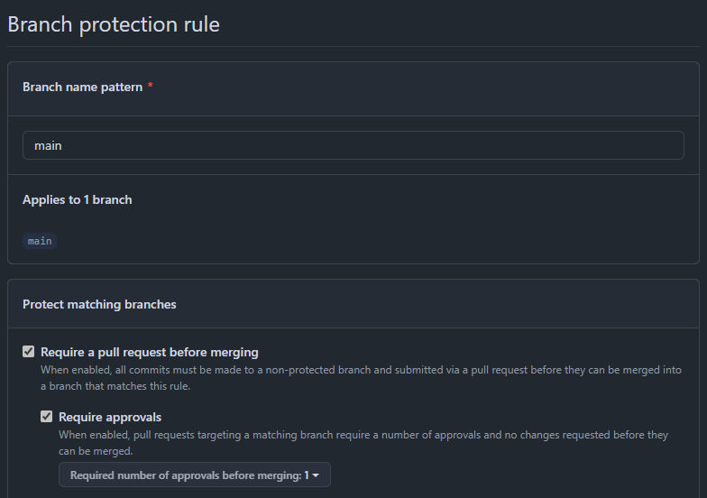

# Capítulo VII: DevOps Practices

## 7.1. Continuous Integration

### 7.1.1. Tools and Practices
**Sistema de Control de Versiones**
- GitHub: Utilizamos GitHub como nuestro sistema centralizado de control de versiones para gestionar todos los repositorios de código de los componentes de nuestro proyecto.
    - URL de la Organización: https://github.com/SI732-ExpDesign-Team
    - Repositorios: Mantenemos repositorios separados para Backend, Frontend, aplicación Móvil y Landing Page para mantener una clara separación de responsabilidades y permitir ciclos de desarrollo independientes.

**Estrategia de Ramificación**

Implementamos un modelo de ramificación basado en características inspirado en GitFlow:

- Rama `main`:
    - Contiene únicamente código listo para producción
    - Protegida contra commits directos
    - Requiere aprobaciones de pull requests antes de fusionar
    - Siempre desplegable en entornos de producción

- Rama `develop`:
    - Rama de integración para desarrollo continuo
    - Utilizada para probar características en conjunto
    - Periódicamente fusionada en main cuando está estable

- Ramas `feature/*`:
    - Creadas para cada nueva funcionalidad o historia de usuario
    - Ramificadas desde develop
    - Utilizadas para desarrollo aislado de funcionalidades
    - Fusionadas de vuelta a develop mediante pull request al completarse
    - Se eliminan luego de un pull request exitoso

**Estándares de Revisión de Código**

- Todos los PRs deben ser revisados por al menos un miembro del equipo
- Flujos de trabajo automáticos que se activan con push a ramas main o develop
- La pipeline de CI incluye la compilación/construcción del código, ejecución de pruebas unitarias y escaneo de seguridad

**Reglas de Protección de Ramas**

Implementamos reglas de protección estrictas para las ramas críticas:

- Protecciones de la rama main:
    - Requerir revisiones de pull request antes de hacer un merge
    - Requerir que las comprobaciones de estado pasen antes de hacer un merge
    - Prohibir los pushes forzados
    - No se permite la eliminación de la rama

- Protecciones de la rama develop:
    - Requerir que las comprobaciones de estado pasen antes de hacer un merge
    - No se permiten commits directos

A continuación se muestra una captura de la estructura de ramas para nuestros repositorios y las reglas de protección:

**Repositorio de Backend**


**Repositorio de Frontend**


**Repositorio de Mobile**


**Repositorio de Landing Page**


**Reglas de protección para la rama main**



Escenario cuando se crea un pull request a la rama main:


### 7.1.2. Build & Test Suite Pipeline Components

**Backend:**

- Pipeline de compilación con Maven


A continuación, se muestra el archivo de configuración .yml de GitHub Actions utilizado para compilar y ejecutar pruebas en el backend utilizando Maven:

```yaml
name: CI - Backend

on:
  push:
    branches: [main, develop]
  pull_request:
    branches: [main, develop]

jobs:
  build:
    runs-on: ubuntu-latest

    steps:
      - name: Checkout code
        uses: actions/checkout@v3

      - name: Set up JDK 21
        uses: actions/setup-java@v3
        with:
          java-version: '21'
          distribution: 'temurin'

      - name: Cache Maven packages
        uses: actions/cache@v3
        with:
          path: ~/.m2
          key: ${{ runner.os }}-maven-${{ hashFiles('**/pom.xml') }}
          restore-keys: |
            ${{ runner.os }}-maven-

      - name: Build and test with Maven
        run: mvn -B clean verify
```

Este workflow garantiza que en cada push o pull request a las ramas main o develop, el código se compila correctamente y se ejecutan las pruebas unitarias antes de permitir un merge.

**Frontend:**

- Pipeline de compilación con Node

Compilando archivo yaml


Ruleset cuando requiere aprobación de un reviewer para aprobar el merge


Compilación exitosa y permite hacer merge


A continuación, se muestra el archivo de configuración .yml de GitHub Actions utilizado para compilar y ejecutar pruebas en el frontend utilizando Node:

```yaml
name: CI - Frontend

on:
  push:
    branches: [main, develop]
  pull_request:
    branches: [main, develop]

jobs:
  build:
    runs-on: ubuntu-latest

    steps:
      - uses: actions/checkout@v3

      - name: Setup Node.js
        uses: actions/setup-node@v3
        with:
          node-version: '18'

      - name: Install dependencies
        run: npm ci

      - name: Build Angular app
        run: npm run build -- --configuration=production
```

Este workflow garantiza que en cada push o pull request a las ramas main o develop, el código se compila correctamente y se ejecutan las pruebas unitarias antes de permitir un merge.

## 7.2. Continuous Delivery

### 7.2.1. Tools and Practices

**Backend**

- Herramientas:

    - Azure App Service para el despliegue continuo desde nuestro repositorio Git
    - GitHub: Configurado como repositorio de origen para el App Service.

- Prácticas:
    - Despliegue automático a Azure App Service cuando se hace un commit a la rama main o develop.
    - Generación del *.jar en cada build y sincronización con Azure.
    - Variables de entorno configuradas en Azure para conectar con la base de datos en Aiven.

Centro de Implementación de Azure App Service: 

Utilizamos como origen el repositorio de Github, rama main. Para la compilación usamos la pila de entorno de Java y versión 21. 


**Frontend**

- Herramientas:

    - Netlify para el despliegue continuo desde nuestro repositorio Git
    - GitHub: Configurado como repositorio de origen para el despliegue.

- Prácticas:
    - Despliegue automático a Netlify cuando se hace un pull request a la rama main o develop.

Centro de Implementación de Netlify: 

Utilizamos como origen el repositorio de Github, rama main. Para la compilación usamos Node.js y versión 18. 


### 7.2.2. Stages Deployment Pipeline Components

**Backend**

1. Build:
    - El Servicio de compilación de App Service (Kudu) reconoce nuestro proyecto de backend con Maven y ejecuta el comando `mvn clean package` para generar el archivo .jar.
    - Busca un archivo .jar generado y lo despliega en nuestro app service.

2. Deployment:
    - Azure App Service captura el build y despliega automáticamente.  

Diagrama de flujo del deployment del backend:


**Frontend**

1. Build:
    - El Servicio de compilación de Netlify reconoce automáticamente nuestro proyecto de frontend con Angular y ejecuta el comando `npm ci` para instalar las dependencias de Node y el comando `npm run build` para compilar el código fuente.

2. Deployment:
    - Netlify captura el build y despliega automáticamente.  

Diagrama de flujo del deployment del frontend:


## 7.3. Continuous deployment

### 7.3.1. Tools and Practices

**Backend**

- Herramientas utilizadas:
    - GitHub: Repositorio del código fuente del backend.
    - GitHub Actions: Ejecuta el pipeline de CI (build, test, análisis de código).
    - Azure App Service: Plataforma como servicio (PaaS) para desplegar la aplicación de Spring Boot.
    - App Service Deployment Center: Permite conectar el repositorio GitHub (modo Git externo) para sincronizar cambios y hacer el despliegue.

- Buenas prácticas aplicadas:
    - Separación entre ramas de desarrollo (develop) y producción (main).
    - Revisión de código mediante pull requests antes de hacer merge a main.
    - Generación del .jar con Maven en cada commit validado.
    - Despliegue controlado manualmente a producción desde Azure.
    - Uso de una pila compatible de versiones (Java 21, Spring Boot 3.x).

**Frontend**

- Herramientas utilizadas:
    - GitHub: Repositorio del código fuente del backend.
    - GitHub Actions: Ejecuta el pipeline de CI (build, test, análisis de código).
    - Netlify: Plataforma como servicio (PaaS) para desplegar la aplicación de Angular.

- Buenas prácticas aplicadas:
    - Separación entre ramas de desarrollo (develop) y producción (main).
    - Revisión de código mediante pull requests antes de hacer merge a main.
    - Compilación del código fuente con Angular en cada commit validado.
    - Despliegue controlado automáticamente a producción desde Netlify.

### 7.3.2. Production Deployment Pipeline Components

**Backend**

Flujo del pipeline de despliegue a producción:

- Hacemos un merge a la rama main.
- GitHub detecta el push y GitHub Actions ejecuta el CI:

    - Checkout del código
    - Setup de JDK 21
    - Build con Maven (mvn clean package)
    - Tests automáticos

- En el centro de implementación de Azure App Service:
    - Se detecta que hubo un nuevo commit en main
    - Se clona el repo y se genera nuevamente el .jar
    - Se despliega el .jar a producción en el contenedor Java de Azure App Service

Evidencia de un deployment en el app service de Azure luego de un push a main:


Link de la REST API desplegada: https://restyle-web-services-cyf0axfvakcxaehd.brazilsouth-01.azurewebsites.net/swagger-ui/index.html#/

**Frontend**

Flujo del pipeline de despliegue a producción:

- Hacemos un merge a la rama main.
- GitHub detecta el push y GitHub Actions ejecuta el CI:

    - Checkout del código
    - Descargar dependencias con `npm ci`
    - Build con Node `npm run build`
    - Tests automáticos

- En el centro de implementación de Netlify:
    - Se detecta que hubo un nuevo commit en main
    - Se despliega el código a producción

Evidencia de un deployment en la interfaz de Netlify luego de un push a main:


Link del frontend desplegado: https://restyle-frontend.netlify.app/

## 7.4. Continuous Monitoring

### 7.4.1. Tools and Practices

### 7.4.2. Monitoring Pipeline Components

### 7.4.3. Alerting Pipeline Components

### 7.4.4. Notification Pipeline Components