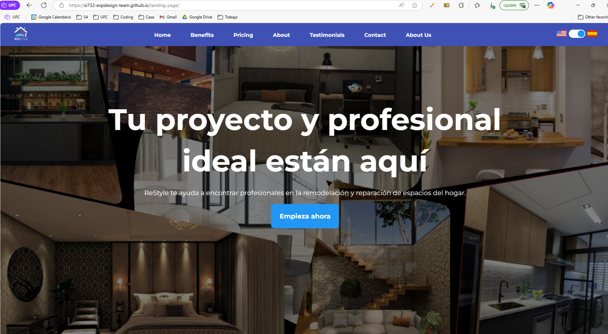
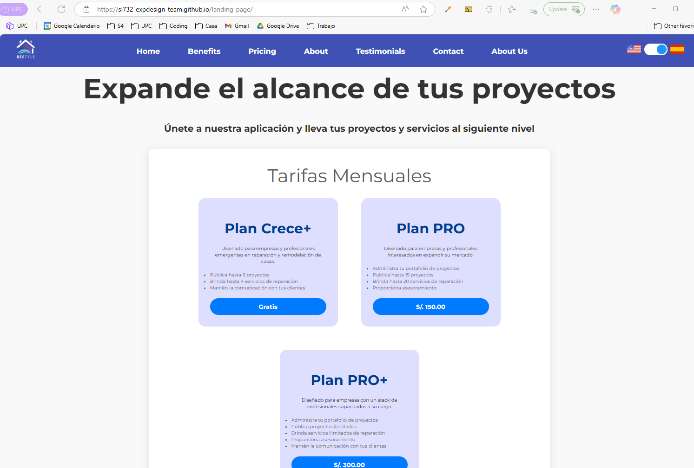
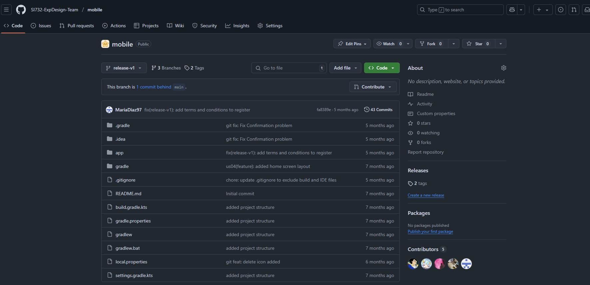
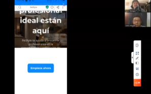
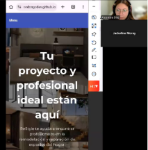
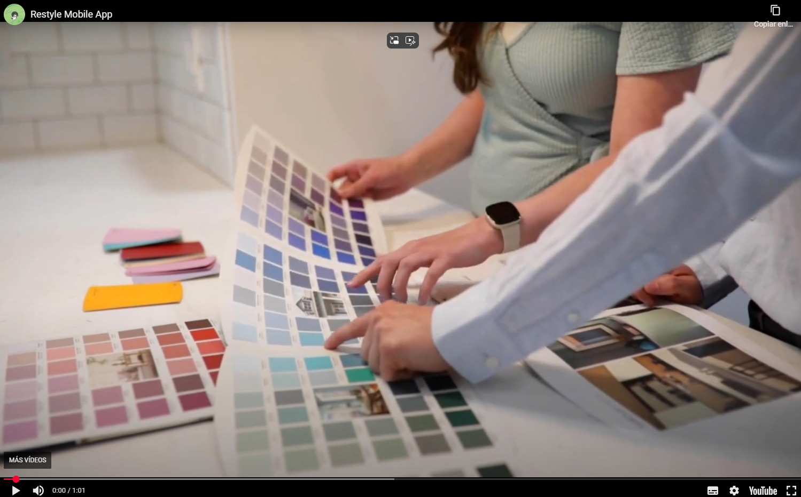

# Capítulo VIII: Experiment-Driven Development

## 8.1. Experiment Planning

La planificación de experimentos es crucial para definir una visión clara de lo que se busca aprender y cómo se logrará.

### 8.1.1. As-Is Summary

Esta evaluación describe el funcionamiento operativo de la aplicación en su forma actual,
centrándose en las experiencias tanto de los arrendadores como de los estudiantes.

Actualmente, la plataforma ReStyle está diseñada para optimizar la experiencia de remodelación del hogar, actuando como un puente entre usuarios y empresas especializadas. La aplicación permite a los clientes contratar servicios de remodelación de manera directa y gestionar todo el proceso desde una sola herramienta, incluyendo funcionalidades como el seguimiento del avance de los proyectos, administración de tareas.

**Funcionalidades Actuales de ReStyle:**

*   **Gestión de Cuentas y Roles:**
    *   Capacidad de crear una cuenta como contratista para acceder al mercado que provee la plataforma.
    *   Capacidad de crear una cuenta como remodelador para promocionar sus servicios.
    *   Visualización del home de la plataforma con opciones disponibles según el rol del usuario.
    *   Visualización de páginas no encontradas.

*   **Gestión de Portafolio para Remodeladores:**
    *   Herramienta para subir contenido multimedia al portafolio y promocionar servicios y proyectos pasados a posibles clientes.
    *   Capacidad de buscar proyectos hechos por remodeladores en sus portafolios.
*   **Búsqueda y Contratación de Servicios de Remodelación**:
    *   Funcionalidad para buscar empresas remodeladoras por ubicación o expertise para obtener resultados personalizados.
    *   Posibilidad de revisar críticas y opiniones de otros clientes para conocer la calidad del trabajo del remodelador.
    *   Opción para agregar críticas y opiniones sobre el remodelador con quien se realizó un proyecto.
    *   Funcionalidad para programar una consulta con un remodelador para discutir necesidades y obtener recomendaciones.
    
*   **Gestión y Seguimiento de Proyectos:**
    *   Herramienta para que el remodelador vea los hitos del seguimiento de su proyecto y sepa en qué estado y etapa se encuentra.

**Problemas Identificados:**

*   **Dificultades en la Búsqueda y Toma de Decisiones para Usuarios:** Los usuarios deben realizar búsquedas manuales para encontrar empresas confiables, y muchas de estas carecen de un portafolio actualizado, lo que complica la toma de decisiones informadas.
*   **Problemas de Visibilidad para Profesionales:** Las empresas de remodelación deben promocionar sus servicios sin garantías de visibilidad ante potenciales clientes.
*   **Digitalización Ineficiente del Sector:** Existe una escasa oferta de soluciones tecnológicas específicas para el rubro de remodelación y construcción, impidiendo una digitalización eficiente del sector.

**Oportunidades de Mejora:**

*   **Optimizar Búsqueda y Comparación de Remodeladores:** Mejorar el proceso de búsqueda y comparación para elevar la tasa de recurrencia de usuarios contratistas.
*   **Diseño Sencillo y Accesible:** Implementar un diseño de plataforma que sea fácil de usar y accesible para atraer una base de usuarios más amplia y reducir las consultas al soporte.
*   **Sistema Robusto de Evaluaciones y Comentarios:** Incorporar un sistema que genere confianza y refleje de manera efectiva la reputación de los remodeladores.
*   **Planes de Suscripción Premium:** Ofrecer planes de suscripción (mensuales y anuales) para remodeladores, estableciendo una fuente de ingresos recurrente y permitiendo el desarrollo de herramientas avanzadas.

### 8.1.2. Raw Material: Assumptions, Knowledge Gaps, Ideas, Claims

Esta sección detalla los elementos base que nutren la planificación de los experimentos:

### • Assumptions (Supuestos)

- Los usuarios (contratistas y remodeladores) necesitan una plataforma digital que les permita contactar empresas, gestionar proyectos, acceder a un marketplace de materiales y ampliar su cartera de clientes.
- Existe una creciente demanda en el mercado de remodelación de viviendas, que representa una valiosa oportunidad para la plataforma.
- ReStyle puede diferenciarse de los competidores al ofrecer una plataforma digital que optimiza la experiencia para usuarios y profesionales.
- Los clientes valorarán la facilidad, transparencia y calidad del servicio ofrecido por ReStyle.

### • Knowledge Gaps (Brechas de Conocimiento)

- La efectividad real de las optimizaciones en la búsqueda y comparación de remodeladores para aumentar la recurrencia de usuarios.
- La curva de aprendizaje real de la plataforma y su efecto en la reducción de consultas al soporte.
- El porcentaje exacto de aumento en la contratación de profesionales con mejores valoraciones tras implementar un sistema de evaluaciones.
- La tasa de conversión efectiva de remodeladores a planes premium durante el primer año de lanzamiento.

### • Ideas (Ideas)

- Optimizar el proceso de búsqueda y comparación de remodeladores para mejorar la experiencia del contratista.
- Diseñar una plataforma sencilla y accesible para atraer a una amplia base de usuarios.
- Incorporar un sistema robusto de evaluaciones y comentarios para generar confianza y reflejar la reputación de los remodeladores.
- Ofrecer planes de suscripción premium (mensuales y anuales) a los remodeladores para establecer una fuente de ingresos recurrente y financiar herramientas avanzadas.

### • Claims (Afirmaciones)

- Se proyecta un aumento del 20% en la tasa de recurrencia de usuarios contratistas en los primeros seis meses, con un incremento del 25% en los contratos recurrentes.
- Se espera un incremento del 20% en la satisfacción del cliente y un 15% en la permanencia de los remodeladores en el servicio.
- Se prevé un aumento del 30% en la contratación de profesionales con mejores valoraciones.
- Se busca que al menos el 30% de los remodeladores se suscriban a planes premium durante el primer año.

### 8.1.3. Experiment-Ready Questions

## Preguntas clave para el diseño de experimentos

Basado en las brechas de conocimiento y las ideas, las preguntas clave para el diseño de experimentos son:

- ¿Cómo podemos optimizar el proceso de búsqueda y comparación de remodeladores para incrementar la recurrencia de usuarios en un 20% en los primeros seis meses?
- ¿De qué manera un diseño de plataforma sencillo y accesible atraerá a más visitantes interesados en remodelaciones y profesionales, reduciendo las consultas de soporte en un 30%?
- ¿La incorporación de un sistema de evaluaciones y comentarios dentro de la plataforma aumentará la contratación de profesionales con mejores valoraciones en un 30%?
- ¿La oferta de planes de suscripción premium (mensuales y anuales) para remodeladores resultará en que al menos el 30% de los visitantes de este segmento se suscriban durante el primer año de lanzamiento?

### 8.1.4. Question Backlog

A continuación, se presenta el **Backlog de Preguntas** para ReStyle:

| Pregunta | Prioridad | Objetivo |
|---|---|---|
| ¿Cómo podemos optimizar el proceso de búsqueda y comparación de remodeladores para incrementar la recurrencia de usuarios en un 20% en los primeros seis meses? | Alta | Incrementar la recurrencia de usuarios contratistas en un 20% en los primeros seis meses. |
| ¿De qué manera un diseño de plataforma sencillo y accesible atraerá a más visitantes interesados en remodelaciones y profesionales, reduciendo las consultas de soporte en un 30%? | Media | Atraer a más visitantes interesados en remodelaciones y profesionales, y reducir las consultas de soporte en un 30%. |
| ¿La incorporación de un sistema de evaluaciones y comentarios dentro de la plataforma aumentará la contratación de profesionales con mejores valoraciones en un 30%? | Media | Aumentar la contratación de profesionales con mejores valoraciones en un 30%. |
| ¿La oferta de planes de suscripción premium (mensuales y anuales) para remodeladores resultará en que al menos el 30% de los visitantes de este segmento se suscriban durante el primer año de lanzamiento? | Alta | Lograr que al menos el 30% de los visitantes del segmento remodelador se suscriban a los planes premium durante el primer año de lanzamiento. |

### 8.1.5. Experiment Cards

A continuación, se presentan las Tarjetas de Experimento (Experiment Cards) para ReStyle

### **8.1.5. Experiment Cards**

| Elemento | Descripción |
|---|---|
| **Experiment Card 1 – Optimización de búsqueda** | |
| **Question** | ¿Cómo podemos **optimizar el proceso de búsqueda y comparación de remodeladores** para incrementar la recurrencia de usuarios en un 20% en los primeros seis meses? |
| **Why** | Mejorar la experiencia de búsqueda puede fomentar el uso repetido de la plataforma. |
| **What** | Se habilitará una nueva versión del buscador a un grupo de usuarios A (50%) y se comparará con el grupo B (con versión antigua). Ambos grupos deben tener perfiles similares en antigüedad y nivel de actividad. Se medirán los datos de uso para validar la hipótesis. |
| **Hipótesis** | Si optimizamos el proceso de búsqueda y comparación de remodeladores, entonces la tasa de recurrencia de los contratistas aumentará en un 20% durante los primeros seis meses. |

 

| Elemento | Descripción |
|---|---|
| **Experiment Card 2 – Interfaz sencilla y accesible** | |
| **Question** | ¿De qué manera un **diseño de plataforma sencillo y accesible** atraerá a más visitantes interesados en remodelaciones y profesionales, reduciendo las consultas de soporte en un 30%? |
| **Why** | Una interfaz clara puede reducir fricciones y dudas al usar el sistema. |
| **What** | Se realizará un rediseño parcial (wireframes de baja carga cognitiva) que se mostrará a nuevos usuarios y se comparará con la versión anterior. Se controlará la fuente del tráfico (redes sociales, Google Ads, tráfico orgánico) para reducir sesgos. Se medirá la reducción de tickets o mensajes al soporte. |
| **Hipótesis** | Si el diseño de la plataforma es sencillo, claro y accesible, entonces se reducirá el número de consultas al soporte en al menos un 30% en los primeros tres meses tras el rediseño. |

 

| Elemento | Descripción |
|---|---|
| **Experiment Card 3 – Sistema de evaluaciones** | |
| **Question** | ¿La incorporación de un **sistema de evaluaciones y comentarios** dentro de la plataforma aumentará la contratación de profesionales con mejores valoraciones en un 30%? |
| **Why** | Los usuarios tienden a confiar más en profesionales con buena reputación visible. |
| **What** | Se activará el sistema de valoraciones solo en ciertos tipos de servicios o categorías durante el primer test (ej: cocina y baño). Se incentivará a los usuarios a dejar una evaluación tras completar un proyecto. Se medirá el porcentaje de contrataciones en perfiles con alta calificación. |
| **Hipótesis** | Si se incorpora un sistema de evaluaciones y comentarios para remodeladores, entonces la contratación de profesionales con altas valoraciones aumentará en un 30%. |

 

| Elemento | Descripción |
|---|---|
| **Experiment Card 4 – Planes premium** | |
| **Question** | ¿La oferta de **planes de suscripción premium (mensuales y anuales)** para remodeladores resultará en que al menos el 30% de los visitantes de este segmento se suscriban durante el primer año de lanzamiento? |
| **Why** | Profesionales que desean destacar y captar más clientes estarán dispuestos a pagar por visibilidad y beneficios adicionales. |
| **What** | Se ofrecerá la opción premium a remodeladores registrados con más de 2 contratos exitosos. Se usará una landing especial para mostrar beneficios exclusivos a este grupo y comparar con remodeladores sin exposición a esta oferta. Se medirá el porcentaje de remodeladores con cuenta premium vs. el total de remodeladores activos. |
| **Hipótesis** | Si se ofrece un plan de suscripción premium con herramientas avanzadas, al menos el 30% de los remodeladores activos en la plataforma se suscribirá en el primer año|

## 8.2. Experiment Design
En esta sección se formulan hipótesis claras, medibles y orientadas a validar los elementos clave del modelo de negocio de reStyle. Estas hipótesis surgen a partir de los supuestos, brechas de conocimiento e ideas definidos en el punto 8.1.2, y se vinculan directamente con las preguntas del backlog priorizado (8.1.4).
### 8.2.1. Hypotheses

#### Hipótesis 1:
  Si optimizamos el proceso de búsqueda y comparación de remodeladores, entonces la tasa de recurrencia de los contratistas aumentará en un 20% durante los primeros seis meses.

- Motivación: Mejorar la experiencia de búsqueda puede fomentar el uso repetido de la plataforma.

- Validación: Un aumento sostenido en el número de sesiones por usuario contratista y contrataciones recurrentes.

#### Hipótesis 2:
Si el diseño de la plataforma es sencillo, claro y accesible, entonces se reducirá el número de consultas al soporte en al menos un 30% en los primeros tres meses tras el rediseño.

- Motivación: Una interfaz clara puede reducir fricciones y dudas al usar el sistema.

- Validación: Reducción del volumen de tickets o mensajes al equipo de soporte, especialmente en categorías de navegación y usabilidad.

#### Hipótesis 3:
Si se incorpora un sistema de evaluaciones y comentarios para remodeladores, entonces la contratación de profesionales con altas valoraciones aumentará en un 30%.

- Motivación: Los usuarios tienden a confiar más en profesionales con buena reputación visible.

- Validación: Mayor porcentaje de contrataciones concentrado en perfiles con calificación ≥ 4 estrellas.

#### Hipótesis 4:
Si se ofrece un plan de suscripción premium con herramientas avanzadas, al menos el 30% de los remodeladores activos en la plataforma se suscribirá en el primer año.

- Motivación: Profesionales que desean destacar y captar más clientes estarán dispuestos a pagar por visibilidad y beneficios adicionales.

- Validación: Porcentaje de remodeladores con cuenta premium vs. total de remodeladores activos.

### 8.2.1.1 Hypotheses (Null & Alternative Hypotheses Statements)

#### Hipótesis 1: Mejora de recurrencia de usuarios contratistas

- H₀ (Hipótesis Nula): La implementación del sistema de búsqueda y comparación de remodeladores no genera un aumento significativo en la tasa de recurrencia de usuarios contratistas en los primeros seis meses.

- H₁ (Hipótesis Alternativa): La implementación del sistema de búsqueda y comparación de remodeladores genera un aumento ≥ 20% en la tasa de recurrencia de usuarios contratistas en los primeros seis meses.

#### Hipótesis 2: Reducción de consultas de soporte
- H₀ (Hipótesis Nula): Un diseño de plataforma sencilla y accesible no reduce el número de consultas de soporte.

- H₁ (Hipótesis Alternativa): Un diseño de plataforma sencilla y accesible reduce en al menos 30% el número de consultas de soporte en los tres primeros meses.

#### Hipótesis 3: Impacto del sistema de evaluaciones

- H₀ (Hipótesis Nula): La incorporación del sistema de evaluaciones y comentarios no impacta significativamente en la contratación de remodeladores con mejores valoraciones.

- H₁ (Hipótesis Alternativa): La incorporación del sistema de evaluaciones y comentarios incrementa al menos en 30% la contratación de remodeladores con mejores valoraciones.

#### Hipótesis 4: Adopción de planes premium
- H₀ (Hipótesis Nula): La oferta de planes premium no logra que al menos 30% de los remodeladores se suscriban durante el primer año.

- H₁ (Hipótesis Alternativa): La oferta de planes premium logra que al menos 30% de los remodeladores se suscriban durante el primer año.

### 8.2.2. Measures
Esta sección define qué se va a medir para evaluar si las hipótesis formuladas en el punto 8.2.1 son validadas o no. Las métricas seleccionadas deben ser cuantificables, relevantes para el negocio y directamente vinculadas con los cambios esperados.

#### Medidas para la Hipótesis 1 (Optimización de búsqueda → +20% recurrencia de usuarios):
- Tasa de recurrencia de contratistas
(Usuarios que vuelven a contratar dentro de los primeros 6 meses después de su primera contratación).

- Frecuencia de uso de la funcionalidad de búsqueda avanzada
(Número de veces que se utiliza la herramienta de filtrado o comparación).

- Tiempo promedio de búsqueda
(Reducción del tiempo necesario entre el inicio de una búsqueda y la contratación de un remodelador).

#### Medidas para la Hipótesis 2 (Diseño accesible → -30% consultas de soporte):
- Cantidad de tickets o mensajes recibidos por soporte técnico
(Especialmente en las categorías relacionadas con navegación, registro, búsqueda o contratación).

- Tiempo de permanencia en páginas clave
(Mayor claridad se asocia con menor permanencia innecesaria o rebotes).

- Tasa de rebote por sección de la interfaz
(Altas tasas pueden indicar confusión o mal diseño).

#### Medidas para la Hipótesis 3 (Sistema de evaluaciones → +30% contratación de los mejor valorados):
- Porcentaje de contrataciones hechas a remodeladores con 4 estrellas o más

- Número total de evaluaciones publicadas por usuarios
(Para validar si el sistema se está utilizando activamente).

- Tasa de conversión de perfiles mejor valorados frente a los de baja calificación
(Para ver si efectivamente los mejor calificados tienen mayor contratación).

#### Medidas para la Hipótesis 4 (Planes premium → 30% suscripción remodeladores):
- Porcentaje de remodeladores activos que adquieren el plan premium

- Retención de remodeladores premium vs. estándar
(¿Se quedan más tiempo los usuarios de pago?).

- Número de funciones premium utilizadas por remodeladores suscritos
(Para validar el uso real del valor agregado ofrecido).
### 8.2.3. Conditions
Esta sección establece las condiciones bajo las cuales se llevarán a cabo los experimentos para asegurar que los resultados sean válidos, confiables y estén alineados con los objetivos de negocio. Las condiciones incluyen el entorno del experimento, la segmentación de usuarios, las variables a controlar y los plazos estimados.

#### Condiciones generales para todos los experimentos
- Entorno controlado: Los experimentos se realizarán en la plataforma web y app de ReStyle, asegurando un entorno digital estable y funcional.

- Usuarios reales: Los datos se recopilarán de usuarios reales (contratistas y remodeladores) dentro de un entorno de producción o en pruebas A/B.

- Segmentación geográfica: Los primeros experimentos estarán enfocados en una región piloto (por ejemplo, Lima Metropolitana) antes de expandirse.

- Período de prueba: Cada experimento se ejecutará inicialmente durante 8 semanas, para observar tanto efectos inmediatos como tendencias sostenidas.

### Condiciones específicas por hipótesis
  #### Hipótesis 1 – Optimización del buscador
  - Se habilitará una nueva versión del buscador a un grupo de usuarios A (50%) y se comparará con el grupo B (con versión antigua).
  - Ambos grupos deben tener perfiles similares en antigüedad y nivel de actividad.

#### Hipótesis 2 – Interfaz sencilla y accesible
- Se realizará un rediseño parcial (wireframes de baja carga cognitiva) que se mostrará a nuevos usuarios y se comparará con la versión anterior.
- Se controlará la fuente del tráfico (redes sociales, Google Ads, tráfico orgánico) para reducir sesgos.

#### Hipótesis 3 – Sistema de evaluaciones
- Se activará el sistema de valoraciones solo en ciertos tipos de servicios o categorías durante el primer test (ej: cocina y baño).
- Se incentivará a los usuarios a dejar una evaluación tras completar un proyecto.

#### Hipótesis 4 – Planes premium
- Se ofrecerá la opción premium a remodeladores registrados con más de 2 contratos exitosos.
- Se usará una landing especial para mostrar beneficios exclusivos a este grupo y comparar con remodeladores sin exposición a esta oferta.

### 8.2.4. Scale Calculations and Decisions
Esta sección define el tamaño mínimo de muestra requerido para validar estadísticamente las hipótesis planteadas y las decisiones clave sobre cómo escalar cada experimento a mayor número de usuarios si se observan resultados positivos.

### Tamaño mínimo de muestra (Sample Size)
Para que los resultados de los experimentos sean estadísticamente significativos, necesitamos calcular cuántos usuarios deben participar en cada grupo (control y experimental). Utilizaremos las siguientes condiciones estándar para pruebas A/B:

- Nivel de confianza (Confidence level): 95%

  Esto significa que hay un 95% de probabilidad de que los resultados reflejen una diferencia real y no un error aleatorio.

- Poder estadístico (Statistical power): 80%

  Esto indica que si realmente existe un efecto (por ejemplo, una mejora en contrataciones), hay un 80% de probabilidad de detectarlo.

- Tasa de conversión base esperada (Baseline conversion rate): 10%

  Por ejemplo, si actualmente el 10% de los visitantes contratan un servicio, este será nuestro punto de comparación.

- Diferencia mínima detectable (Minimum Detectable Effect, MDE): 10%

  Esperamos ver al menos un 10% de mejora (por ejemplo, pasar de 10% a 11%).

Utilizando una calculadora estadística estándar (por ejemplo, Evan Miller’s Sample Size Calculator), se obtiene lo siguiente:

- Para detectar una diferencia del 10% con 95% de confianza y 80% de poder estadístico, partiendo de una tasa base del 10%:

  Resultado: Se requieren aproximadamente 385 usuarios por grupo, es decir:

  770 usuarios en total por experimento A/B.

### Escalamiento por hipótesis
Hipótesis 1 – Optimización del proceso de búsqueda y comparación.

- Tamaño de muestra inicial: 770 usuarios (385 grupo A y 385 grupo B)

- Criterio de éxito: aumento significativo ≥10% en la tasa de recurrencia.

- Escalamiento: Si se valida, se aplicará la mejora a todos los usuarios activos.

Hipótesis 2 – Diseño sencillo y accesible.

- Tamaño de muestra inicial: 600 usuarios (300 por grupo), nuevos visitantes.

- Criterio de éxito: reducción ≥30% en consultas a soporte y mayor retención en primera semana.

- Escalamiento: Publicación completa del diseño tras dos ciclos exitosos.

Hipótesis 3 – Evaluaciones y comentarios.

- Tamaño de muestra inicial: 500 usuarios (centrados en proyectos de cocina/baño)

- Criterio de éxito: incremento ≥25-30% en contratación de profesionales con alta puntuación.

- Escalamiento: Activación del sistema de reseñas en toda la plataforma.

Hipótesis 4 – Planes de suscripción premium.

- Tamaño de muestra inicial: 400 remodeladores activos

- Criterio de éxito: ≥30% de suscripciones en el primer mes.

- Escalamiento: Lanzamiento completo de los planes premium y nuevas funcionalidades asociadas.

### Decisiones clave sobre escalamiento

- El escalamiento nacional (fuera de Lima) solo ocurrirá si se valida primero con éxito en la región piloto (Lima Metropolitana).

- Se utilizarán experimentos iterativos (por ejemplo, cada 2 semanas) para ajustes rápidos y detección de mejoras marginales.

- Los grupos de control se mantendrán en producción para comparar resultados a largo plazo (especialmente en métricas de retención y satisfacción).

- En caso de baja significancia estadística o efecto nulo, se replanteará la hipótesis o se ajustará el diseño de la solución.

### 8.2.5. Methods Selection
En esta sección se detallan los métodos a utilizar para validar las hipótesis planteadas, considerando el tipo de datos necesarios, el nivel de fidelidad requerido y la etapa de desarrollo del producto.

### Métodos Cuantitativos

Estos métodos permitirán validar hipótesis relacionadas con comportamiento, métricas de conversión y patrones de uso a mayor escala.

| Método                                   | Justificación                                                                                                                                                                                                                                                                 |
| ---------------------------------------- | ----------------------------------------------------------------------------------------------------------------------------------------------------------------------------------------------------------------------------------------------------------------------------- |
| **A/B Testing**                          | Ideal para comparar variantes de funcionalidades como el buscador optimizado, presentación de remodeladores, o la incorporación de filtros. Permite medir con precisión el impacto de un cambio en métricas clave como tasa de conversión o tiempo promedio en la plataforma. |
| **Análisis de Cohortes**                 | Útil para analizar el comportamiento de grupos de usuarios (p. ej., contratistas nuevos vs. recurrentes) a lo largo del tiempo, validando hipótesis sobre retención y recurrencia.                                                                                            |
| **Funnel Analysis**                      | Ayuda a identificar en qué etapa del flujo de uso (registro, búsqueda, contratación, contacto) se producen los mayores abandonos, y así validar hipótesis sobre mejoras UX o accesibilidad.                                                                                   |
| **Encuestas con escala Likert (en app)** | Cuantifica la percepción del usuario sobre facilidad de uso, confianza en los evaluadores y satisfacción general.                                                                                                                                                             |
| **Segmentación por comportamiento**      | Permite analizar si ciertos segmentos (p. ej., usuarios frecuentes vs. esporádicos) reaccionan de manera diferente a las mejoras, especialmente útil para el sistema de suscripciones.                                                                                        |
### Métodos Cualitativos
Complementan los datos cuantitativos para entender los "porqués" detrás del comportamiento del usuario.

| Método                                  | Justificación                                                                                                                                                                              |
| --------------------------------------- | ------------------------------------------------------------------------------------------------------------------------------------------------------------------------------------------ |
| **Entrevistas en profundidad**          | Ideal en etapas tempranas para validar supuestos y detectar insights sobre cómo los usuarios perciben la plataforma, qué barreras tienen, o qué funcionalidades valoran más.               |
| **Pruebas de usabilidad (think aloud)** | Esenciales para identificar problemas en el diseño y navegación del sistema antes o durante los experimentos. Permiten mejorar la experiencia sin esperar datos a gran escala.             |
| **Diarios de usuario (User Diaries)**   | Sirven para recolectar experiencias más ricas y contextuales durante periodos prolongados de uso de la plataforma. Especialmente útiles para evaluar la percepción del valor en el tiempo. |

### Selección basada en la hipótesis
| Hipótesis clave                              | Métodos sugeridos                                          |
| -------------------------------------------- | ---------------------------------------------------------- |
| Optimización de búsqueda mejora recurrencia  | A/B testing + análisis de cohorte + entrevistas            |
| Diseño sencillo reduce consultas de soporte  | Pruebas de usabilidad + funnel analysis + encuestas        |
| Sistema de evaluaciones aumenta contratación | A/B testing + segmentación de comportamiento + entrevistas |
| Planes premium generan suscripciones         | Funnel analysis + encuestas + entrevistas a remodeladores  |

### 8.2.6. Data Analytics: Goals, KPIs and Metrics Selection

El objetivo de esta sección es definir con claridad qué se va a medir, por qué se mide y cómo se utilizarán esos datos para evaluar el éxito de los experimentos y tomar decisiones informadas.

### Goals (Objetivos Analíticos)
- Incrementar la recurrencia de usuarios contratistas. 
  Validar si las mejoras en la búsqueda y experiencia de usuario logran que los contratistas regresen y contraten más de una vez.

- Reducir la fricción de uso y dependencia del soporte. 
  Verificar si el diseño intuitivo disminuye el número de consultas, tickets o errores reportados.

- Incrementar la contratación de remodeladores con mejores valoraciones. 
  Medir si el sistema de evaluaciones incide directamente en decisiones de contratación.

- Validar viabilidad del modelo de monetización mediante suscripciones premium. 
  Medir la aceptación, conversión y retención de remodeladores en planes pagos.

### KPIs (Indicadores Clave de Rendimiento)

| Objetivo                                | KPI Principal                                 | Fórmula / Descripción                                                                  |
| --------------------------------------- | --------------------------------------------- | -------------------------------------------------------------------------------------- |
| Recurrencia de usuarios                 | **Tasa de Retención**                         | % de usuarios que regresan y contratan en un período definido (ej. dentro de 30 días). |
| Facilidad de uso                        | **Número de tickets de soporte**              | Total de consultas o incidencias reportadas durante el uso de la plataforma.           |
| Efectividad del sistema de evaluaciones | **Tasa de contratación de top remodeladores** | % de contrataciones que se hacen a remodeladores con calificación ≥ 4.5/5.             |
| Viabilidad del plan premium             | **Tasa de conversión a plan premium**         | % de remodeladores activos que se suscriben a un plan pago.                            |

### Otras Métricas Complementarias
| Métrica                                 | Descripción                                                                                                                          |
| --------------------------------------- | ------------------------------------------------------------------------------------------------------------------------------------ |
| **Tiempo medio en búsqueda**            | Tiempo promedio que toma a un contratista filtrar, explorar y contactar a un remodelador. Idealmente debe disminuir con las mejoras. |
| **Net Promoter Score (NPS)**            | Evalúa la satisfacción general y probabilidad de recomendación. Se obtiene a través de encuestas.                                    |
| **Customer Satisfaction (CSAT)**        | Calificación del usuario luego de una contratación o interacción, típicamente medida en escala 1–5.                                  |
| **Tasa de rebote**                      | % de usuarios que abandonan sin interactuar con el sistema de búsqueda. Un indicador de experiencia poco atractiva o confusa.        |
| **Churn Rate de remodeladores premium** | % de remodeladores premium que cancelan su suscripción. Ayuda a evaluar sostenibilidad del modelo de ingresos.                       |

### 8.2.7. Web and Mobile Tracking Plan

Este plan define qué se debe rastrear en las plataformas web y móvil para asegurar que se capturen correctamente los datos necesarios para evaluar las hipótesis y KPIs definidos en los experimentos.

### Objetivo del Plan de Tracking
Implementar un sistema robusto de monitoreo que permita:

- Registrar la interacción de usuarios (contratistas y remodeladores) con la plataforma.

- Medir el rendimiento de funcionalidades clave (búsqueda, contacto, evaluaciones, suscripciones).

- Identificar cuellos de botella o puntos de abandono.

- Asegurar trazabilidad desde el primer contacto hasta la conversión o abandono.

### Eventos de Tracking Clave por Plataforma
- Contratistas (Web/Móvil)

  | Evento                      |   Descripción                                 | Plataforma |
  | --------------------------- |   ------------------------------------------- | ---------- |
  | `search_performed`          | Usuario realiza una búsqueda de   remodelador | Web + App  |
  | `remodeler_profile_viewed`  | Usuario entra al perfil de un   remodelador   | Web + App  |
  | `contact_remodeler_clicked` | Usuario hace clic en  "Contactar"            | Web + App  |
  | `project_created`           | Usuario inicia un nuevo   proyecto            | Web + App  |
  | `project_completed`         | Proyecto marcado como   finalizado            | Web + App  |
  | `review_submitted`          | Usuario deja una  evaluación                 | Web + App  |
  | `session_duration`          | Tiempo de permanencia por   sesión            | Web + App  |

- Remodeladores (Web/Móvil)
  
  | Evento                   |  Descripción                            | Plataforma |
  | ------------------------ |  -------------------------------------- | ---------- |
  | `profile_completed`      | Completa todos los campos de su  perfil | Web + App  |
  | `subscription_clicked`   | Clic en información sobre plan   premium | Web + App  |
  | `subscription_purchased` | Remodelador se suscribe a un   plan      | Web + App  |
  | `message_received`       | Recibe contacto de un  contratista      | Web + App  |
  | `review_received`        | Recibe una   evaluación                  | Web + App  |
  

## 8.3. Experimentation

### 8.3.1. To-Be User Stories

En esta sección, se identifican y refinan las historias de usuario clave del proyecto **Restyle**, enfocadas en facilitar la interacción entre contratistas y empresas remodeladoras. Estas historias han sido analizadas y ajustadas respecto a versiones anteriores, incorporando mejoras de usabilidad y funcionalidades técnicas necesarias para lograr una experiencia más eficiente, confiable y satisfactoria para los usuarios.

---
#### **US007 - Búsqueda de empresas remodeladoras**

- **Historia de Usuario:**  
  *Como visitante del segmento contratista, quiero poder buscar remodeladoras por ubicación o expertise para obtener un resultado más personalizado.*

- **Estado Inicial:**  
  La búsqueda arrojaba resultados genéricos sin posibilidad de filtrado específico por tipo de servicio o zona geográfica.

- **Cambios:**  
  Se implementaron filtros por especialidad, puntuación y ubicación, permitiendo a los usuarios encontrar empresas más alineadas con sus necesidades concretas.

- **Estado Final:**  
  La búsqueda se ha vuelto más precisa y eficiente, permitiendo una mejor experiencia de descubrimiento y comparación entre proveedores de servicios.

---

#### **US009 - Agregar críticas y opiniones**

- **Historia de Usuario:**  
  *Como visitante del segmento contratista, quiero agregar un review para poder compartir mi experiencia con otros usuarios sobre el remodelador con el que realicé un proyecto.*

- **Estado Inicial:**  
  La funcionalidad no estaba disponible en etapas tempranas de desarrollo, lo que limitaba el feedback colaborativo en la plataforma.

- **Cambios:**  
  Se desarrolló un módulo para registrar comentarios, calificaciones con estrellas y retroalimentación textual, vinculado al perfil del remodelador.

- **Estado Final:**  
  Ahora, los usuarios pueden compartir sus experiencias, ayudando a otros a tomar decisiones informadas y fomentando la confianza en el ecosistema de la aplicación.

---
#### **US016 - Programar consulta con un remodelador**

- **Historia de Usuario:**  
  *Como propietario de vivienda interesado en remodelar, quiero poder programar una consulta con un remodelador a través de la plataforma para discutir mis necesidades y obtener recomendaciones.*

- **Estado Inicial:**  
  No existía una forma clara para coordinar citas o reuniones con los remodeladores desde la aplicación.

- **Cambios:**  
  Se añadió una funcionalidad de agendamiento, incluyendo un formulario con calendario, opciones de horarios disponibles y confirmación por correo electrónico.

- **Estado Final:**  
  Los usuarios ahora pueden gestionar consultas directamente con los profesionales, facilitando el inicio del proceso de remodelación y generando una interacción más fluida.

### 8.3.2. To-Be Product Backlog

A continuación, se presenta el Product Backlog actualizado del proyecto **Restyle**. Estas historias representan funcionalidades clave para brindar una experiencia personalizada y eficiente a los usuarios interesados en servicios de remodelación.

| N°  | ID     | Título                                     | Descripción                                                                                                                                    | Story Points |
|-----|--------|--------------------------------------------|------------------------------------------------------------------------------------------------------------------------------------------------|--------------|
| 7   | US007  | Búsqueda de empresas remodeladoras         | Como visitante del segmento contratista, quiero poder buscar remodeladoras por ubicación o expertise para obtener un resultado más personalizado. | 4            |
| 9   | US009  | Agregar críticas y opiniones               | Como visitante del segmento contratista, quiero agregar un review para poder compartir mi experiencia con otros usuarios sobre el remodelador con el que realicé un proyecto. | 3            |
| 16  | US016  | Programar consulta con un remodelador      | Como propietario de vivienda interesado en remodelar, quiero poder programar una consulta con un remodelador a través de la plataforma para discutir mis necesidades y obtener recomendaciones. | 5            |

### 8.3.3. Pipeline-supported, Experiment-Driven To-Be Software Platform Lifecycle

#### 8.3.3.1. To-Be Sprint Backlogs
A continuación, la estructura de la tabla para el Sprint Backlog :

| User Story Id | User Story Title                      | Work-Item / Task Id | Work-Item / Task Title               | Description                                                                                          | Estimation (Hours) | Assigned To        | Status      |
|---------------|----------------------------------------|----------------------|-------------------------------------|------------------------------------------------------------------------------------------------------|--------------------|--------------------|-------------|
| US007         | Búsqueda de empresas remodeladoras     | T01                 | Diseñar interfaz de búsqueda         | Diseñar la vista para permitir buscar remodeladoras por ubicación o especialidad en la web.          | 4                  | Mariana Chambi     | Done |
| US007         | Búsqueda de empresas remodeladoras     | T02                 | Desarrollar lógica de filtrado       | Implementar la lógica backend que filtre los resultados por parámetros seleccionados.                | 5                  | Ely Cortez       | Done       |
| US007         | Búsqueda de empresas remodeladoras     | T03                 | Integración con base de datos        | Conectar el sistema de búsqueda con la base de datos de empresas remodeladoras.                      | 4                  | Alejandra Díaz     | Done       |
| US009         | Agregar críticas y opiniones           | T04                 | Diseñar formulario de review         | Diseñar interfaz donde los usuarios puedan dejar su opinión y calificación de remodeladores.         | 3                  | Paolo Parraga      | Done |
| US009         | Agregar críticas y opiniones           | T05                 | Implementar backend para reviews     | Crear endpoints y lógica de servidor para guardar críticas y opiniones en la base de datos.          | 4                  | Alejandra Díaz     | Done       |
| US009         | Agregar críticas y opiniones           | T06                 | Visualización de opiniones           | Crear componente que muestre las opiniones y calificaciones dejadas por otros usuarios.              | 3                  | Stefano Valenzuela | Done       |
| US016         | Programar consulta con un remodelador  | T07                 | Diseñar formulario de agendamiento   | Diseñar la interfaz donde los propietarios pueden programar una consulta con un remodelador.         | 4                  | Stefano Valenzuela | Done |
| US016         | Programar consulta con un remodelador  | T08                 | Crear lógica de horarios disponibles | Desarrollar lógica para verificar y mostrar disponibilidad en base al calendario del remodelador.    | 5                  |Ely Cortez      | Done       |
| US016         | Programar consulta con un remodelador  | T09                 | Notificación de confirmación         | Implementar notificación automática tras agendar una consulta vía correo o mensaje dentro de la app. | 4                  | Paolo Parraga      | Done       |

#### 8.3.3.2. Implemented To-Be Landing Page Evidence
Para desplegar la Landing Page desde GitHubPages hay que seguir los siguientes pasos: 

 

Landing Page desplegado: https://si732-expdesign-team.github.io/landing-page/

#### 8.3.3.3. Implemented To-Be Frontend-Web Application Evidence

**Frontend Web Applications**

PHemos realizado el despliegue del frontend web applications desde Netlify:

 

Frontend web applications desplegado: https://restyle-frontend.netlify.app/home
#### 8.3.3.4. Implemented To-Be Native-Mobile Application Evidence
Hemos realizado el despliegue mobile application desde GitHub Releases: 

Esto nos generará un archivo .apk que podremos instalar en nuestro dispositivo móvil. 

 
 

Native-Mobile Application desplegada: https://github.com/SI732-ExpDesign-Team/mobile/releases/download/v0.2.0-alpha/ReStyle.apk

#### 8.3.3.5. Implemented To-Be RESTful API and/or Serverless Backend Evidence
Hemos realizado el despliegue del web service desde Azure App Services:

 
 

Web services desplegados: https://restyle-web-services-cyf0axfvakcxaehd.brazilsouth-01.azurewebsites.net/swagger-ui/index.html

#### 8.3.3.6. Team Collaboration Insights
Para el desarrollo de la app web todos los repositorios se realizaron en GitHub. A continuación, se mostrará el gráfico de commits de las diferentes repositorios:

 

### 8.3.4. To-Be Validation Interviews

#### 8.3.4.1. Diseño de Entrevistas
#### **Segmento Objetivo 1: Contratistas en búsqueda de servicios de remodelación**

**Propósito de la entrevista:**  
Recolectar la opinión directa de contratistas o propietarios que desean contratar servicios de remodelación a través de la plataforma. Se busca conocer sus expectativas, problemas actuales en la búsqueda y contratación de remodeladores, así como validar si la solución de Restyle facilita una experiencia más eficiente, confiable y personalizada.

**Preguntas demográficas:**
1. ¿Cuál es su nombre completo?
2. ¿Cuál es su edad?
3. ¿En qué distrito reside?
4. ¿Cuál es su ocupación actual?
5. ¿Con qué frecuencia requiere servicios de remodelación?

**Interacción con la aplicación web:**  
Se invitará al entrevistado a utilizar la funcionalidad de búsqueda personalizada por ubicación y tipo de servicio, explorar perfiles de remodeladores, leer reseñas y simular una programación de consulta. Se observará su navegación y reacciones frente a cada función.

**Preguntas sobre la experiencia con la web:**
- ¿Le resultó intuitivo buscar remodeladores según su necesidad?
- ¿Considera útil poder filtrar por especialidades o ubicación?
- ¿Le parecieron útiles las opiniones y calificaciones de otros usuarios?
- ¿Programaría una consulta desde la plataforma en una situación real?
- ¿Qué elementos o funcionalidades cree que mejorarían la experiencia?

---

### **Segmento Objetivo 2: Remodeladores registrados en la plataforma**

**Propósito de la entrevista:**  
Comprender la experiencia del remodelador al utilizar la plataforma Restyle para ofrecer sus servicios. Se evaluará la facilidad para crear un perfil profesional, recibir solicitudes de consulta, gestionar opiniones de clientes y la percepción general del sistema como canal de captación de clientes.

**Preguntas demográficas:**
1. ¿Cuál es su nombre completo?
2. ¿Qué tipo de servicios de remodelación ofrece?
3. ¿En qué distritos trabaja actualmente?
4. ¿Cuántos años de experiencia tiene en el rubro?
5. ¿Trabaja de forma independiente o con una empresa?

**Interacción con la aplicación web:**  
Se invitará al remodelador a crear un perfil de servicio, revisar cómo se muestran sus datos al público, visualizar críticas de usuarios y probar la función de gestión de consultas programadas.

**Preguntas sobre la experiencia con la web:**
- ¿Fue sencillo crear y personalizar su perfil como remodelador?
- ¿Considera adecuada la forma en que los clientes pueden contactarlo?
- ¿Cree que las reseñas y valoraciones afectan positivamente su visibilidad?
- ¿Recibir solicitudes desde la plataforma le resulta útil para captar clientes?
- ¿Qué mejoras o funcionalidades adicionales le gustaría ver como profesional?

#### 8.3.4.2. Registro de Entrevistas

**Entrevistas a remodeladores:** 

|**Entrevistado 1** |**InnovaInteriores** |
| :-: | :-: |
|Edad |53 |
|Distrito |Pueblo Libre |
| |La entrevistada nos comenta que la landing page es clara y concisa, el diseño y paleta de colores son similares para la landing page y la aplicación móvil, lo cual habla de que se mantiene una imagen coherente de marca. La aplicación móvil desearía que se añada una descripción de la empresa en el HOME y que el botón de eliminar cuente con un mensaje de confirmación para verificar si se desea borrar un proyecto antes de borrarlo por error.  |
|Timing:0:00-8:05 |URL:<https://upcedupe-my.sharepoint.com/:v:/g/personal/u202118315_upc_edu_pe/EWhw1hIvQPROrW67I7w5xtIB-Nc06JsHrfXsDsqGQt76Hg?nav=eyJyZWZlcnJhbEluZm8iOnsicmVmZXJyYWxBcHAiOiJPbmVEcml2ZUZvckJ1c2luZXNzIiwicmVmZXJyYWxBcHBQbGF0Zm9ybSI6IldlYiIsInJlZmVycmFsTW9kZSI6InZpZXciLCJyZWZlcnJhbFZpZXciOiJNeUZpbGVzTGlua0NvcHkifX0&e=jv8PrW> |
|**Entrevistado 2** |Carlos Mendez |
|Edad |60 |
|Distrito |Lima |
| |En la entrevista se comenta que los estilos están bien. Sin embargo en su dispositivo móvil la Landing Page se deforma un poco, comentando que eso se debería mejorar. Por parte del aplicativo móvil, no tuvo observaciones importantes, además de mejorar los colores. |
|Timing: 0:00-14:20 |URL:<https://upcedupe-my.sharepoint.com/:v:/g/personal/u202118315_upc_edu_pe/EWG8dXHp4fdHjiUEy5zSTWcBO_xB8IU9W93xSuM7j90EJg?nav=eyJyZWZlcnJhbEluZm8iOnsicmVmZXJyYWxBcHAiOiJPbmVEcml2ZUZvckJ1c2luZXNzIiwicmVmZXJyYWxBcHBQbGF0Zm9ybSI6IldlYiIsInJlZmVycmFsTW9kZSI6InZpZXciLCJyZWZlcnJhbFZpZXciOiJNeUZpbGVzTGlua0NvcHkifX0&e=Wsf9S3>  |
|**Entrevistado 3** |Diego Bastidas |
|Edad |24 |
|Distrito |Lince |
| |Durante la entrevista, Diego resaltó que la estructura general de la landing page es funcional, pero mencionó que el tamaño de las imágenes podría optimizarse para una carga más rápida. En cuanto a la aplicación móvil, sugirió que sería útil contar con un buscador para filtrar proyectos por nombre o cliente, y que los botones deberían tener mayor contraste para mejorar la accesibilidad visual. Consideró positivo que ambos productos mantengan una identidad visual coherente. |
|Timing: 0:00 – 7:15 |URL: |

**Entrevistas a contratistas:** 

|**Entrevistado 1** |**Jakeline Morey** |
| :-: | :-: |
|Edad |50 |
|Distrito |Miraflores |
| |La entrevistada opina que la landing page es profesional y fácil de entender. Nos menciona que el botón call to action es llamativo y cumple su propósito. La aplicación móvil le parece profesional y entendible. También comenta que le gustaría ver otra paleta de colores para el fondo del home, también comenta que no encuentra mucho propósito en una aplicación móvil dedicada al rubro y que preferiría utilizar una aplicación web. |
|Timing:0:00 – 7:02 |URL: <https://upcedupe-my.sharepoint.com/:v:/g/personal/u202118315_upc_edu_pe/EXFVBPw31vhNm8JgK1kX7wcBDcj5nyBO_LXvUSXAGDtvgA?nav=eyJyZWZlcnJhbEluZm8iOnsicmVmZXJyYWxBcHAiOiJPbmVEcml2ZUZvckJ1c2luZXNzIiwicmVmZXJyYWxBcHBQbGF0Zm9ybSI6IldlYiIsInJlZmVycmFsTW9kZSI6InZpZXciLCJyZWZlcnJhbFZpZXciOiJNeUZpbGVzTGlua0NvcHkifX0&e=shMOut>  |
|**Entrevistado 2** | **Leonardo Moreno**|
|Edad |25|
|Distrito |Pueblo Libre |
||El entrevistado opina que tanto la página web como la landing page presentan un diseño minimalista y profesional. Destacó la paleta de colores seleccionada y la buena distribución de la información, lo que facilita la navegación para los usuarios. Además, señaló que la página muestra claramente sus funcionalidades y ofrece un acceso sencillo tanto para personas familiarizadas con la tecnología como para aquellas con poca experiencia en su uso. | 
|Timing: 0:00-5:36 |URL: <https://drive.google.com/drive/folders/165Am15Cz-OB2JEjjMgpaPgiS8IG0_B6a?usp=sharing> |
|**Entrevistado 3** | **Fabian Reyes**|
|Edad |20|
|Distrito | San Martin de Porres|
||Fabián exploró las funcionalidades del sitio web: vio los remodeladores disponibles, interactuó con uno y solicitó una cotización para negociar. También usó la función de búsqueda para encontrar uno específico. Le pareció que la web es muy buena, aunque sugirió mejoras en el diseño.|
|Timing: 00:00 – 08:05 |URL: <https://drive.google.com/drive/folders/165Am15Cz-OB2JEjjMgpaPgiS8IG0_B6a?usp=sharing> |

## 8.4. Experiment Aftermath & Analysis

### 8.4.1. Analysis and Interpretation of Results

A continuación, se presentan los resultados de cada prueba realizada para validar las hipótesis:

Captura: 

Link de encuesta: [https://forms.gle/Yp4qdQpuJB2egJH56](https://forms.gle/Yp4qdQpuJB2egJH56)

#### Pregunta 1:

1. ¿Qué tan fácil te resulta buscar y comparar remodeladores en la plataforma?

- Objetivo: Optimizar el proceso de búsqueda y comparación para elevar la recurrencia (+20 %).
- Hipótesis: Si la media de la calificación ≥ 4 / 5, la experiencia actual es percibida como “fácil” y podremos optimizarla para aumentar la recurrencia un 20 % en 6 meses.
- Método: Encuesta 

Resultados: 

2. ¿Qué tan probable es que vuelvas a usar la plataforma para tu próxima remodelación?

- Objetivo: Medir la recurrencia de usuarios contratistas.
- Hipótesis: Al menos 60 % de los usuarios escogerán 4-5 en la escala, lo que indica intención de recurrencia y sustenta la meta de +20 %.
- Método: Encuesta 

Resultados: 

3. 	¿Cuánto te interesaría un plan de suscripción Premium (mensual o anual) que ofrezca más visibilidad y herramientas adicionales?

- Objetivo: Validar la adopción esperada del 30 % en planes premium.
- Hipótesis: ≥ 30 % marcarán 4-5, sugiriendo que un tercio de los remodeladores se suscribirían en el primer año.
- Método: Encuesta 

Resultados: 

4. 	El diseño actual te parece claro y fácil de usar (es decir, rara vez necesitas ayuda del soporte)?

- Objetivo: Correlacionar simplicidad de la interfaz con menos consultas al soporte (−30 %).
- Hipótesis: Si la media ≥ 4, la interfaz ya es lo bastante intuitiva como para aspirar a reducir tickets en un 30 %.
- Método: Encuesta 

Resultados: 

5. 	Para decidir a quién contratar, ¿qué tan importante te resultan las evaluaciones y comentarios de otros usuarios dentro de la plataforma?

- Objetivo: Estimar el impacto del sistema de valoraciones en la contratación de profesionales mejor puntuados (+30 %).
- Hipótesis: ≥ 50 % seleccionarán 4-5, indicando que las valoraciones impulsarán un +30 % de contratos a profesionales mejor puntuados.
- Método: Encuesta 

Resultados: 

6. 	¿Qué funcionalidad o mejora agregarías?

- Objetivo: Recoger ideas cualitativas que den contexto a las respuestas numéricas.
- Hipótesis: Al menos el 40 % de las respuestas mencionarán alguna de las cuatro áreas clave: búsqueda/filtrado, planes Premium, diseño-UX o sistema de valoraciones, confirmando la alineación con las hipótesis anteriores.
- Método: Encuesta 

Resultados: 

### 8.4.2. Re-scored and Re-prioritized Question Backlog
En esta sección se presenta el backlog de preguntas actualizado para ReStyle, reordenado según su prioridad estratégica. 

| Pregunta | Prioridad | Objetivo |
|---|---|---|
| ¿Cómo podemos optimizar el proceso de búsqueda y comparación de remodeladores para incrementar la recurrencia de usuarios en un 20% en los primeros seis meses? | Alta | Incrementar la recurrencia de usuarios contratistas en un 20% en los primeros seis meses. |
| ¿La oferta de planes de suscripción premium (mensuales y anuales) para remodeladores resultará en que al menos el 30% de los visitantes de este segmento se suscriban durante el primer año de lanzamiento? | Alta | Lograr que al menos el 30% de los visitantes del segmento remodelador se suscriban a los planes premium durante el primer año de lanzamiento. |
| ¿De qué manera un diseño de plataforma sencillo y accesible atraerá a más visitantes interesados en remodelaciones y profesionales, reduciendo las consultas de soporte en un 30%? | Media | Atraer a más visitantes interesados en remodelaciones y profesionales, y reducir las consultas de soporte en un 30%. |
| ¿La incorporación de un sistema de evaluaciones y comentarios dentro de la plataforma aumentará la contratación de profesionales con mejores valoraciones en un 30%? | Media | Aumentar la contratación de profesionales con mejores valoraciones en un 30%. |

## 8.5. Continuous Learning

### 8.5.1. Shareback Session Artifacts: Learning Workflow

Para el proyecto ReStyle, la implementación y el desarrollo se apoyaron en un stack tecnológico robusto y un conjunto de herramientas cuidadosamente seleccionadas para garantizar eficiencia, calidad y colaboración. Este flujo de aprendizaje se centra en la elección de software y las prácticas asociadas a cada fase del ciclo de vida del desarrollo.

### Stack Principal

El proyecto ReStyle utiliza una combinación de tecnologías que incluyen **Java** (para el Backend), **Angular** (para el Frontend web), y herramientas de desarrollo web y móvil como HTML, CSS y JavaScript/TypeScript. La base de datos es **MySQL**.

### Gestión de Requisitos y Planificación de Proyectos

**Software Empleado:** Pivotal Tracker, Uxpressia, MIRO, Lucid Chart y Overflow.

**Propósito:** Pivotal Tracker se utilizó para gestionar historias de usuario, organizarlas en épicas y evaluar su importancia, permitiendo una vista en tiempo real del progreso. Herramientas como Uxpressia, MIRO, Lucid Chart y Overflow fueron fundamentales para el mapeo de la trayectoria del cliente, ideación, creación de diagramas (incluyendo UML y flujos de usuario) y prototipos, facilitando la colaboración en el diseño UX/UI.

### Diseño de Experiencia e Interfaz de Usuario (UX/UI)

**Software Empleado:** Figma.

**Propósito:** Figma se empleó para la creación digital de modelos y prototipos del sitio web, tanto para versiones de escritorio como móviles, dada su capacidad de ejecución en línea y compatibilidad con navegadores web y móviles. El diseño buscó una estética uniforme, simplicidad, legibilidad, y reflejar la identidad de marca a través de tipografías (Montserrat), paletas de colores (azules y morados) y un espaciado consistente.

### Desarrollo Frontend

**Software Empleado:** Angular, Webstorm, HTML5, CSS, y JavaScript/TypeScript.

**Propósito:** Angular fue el framework principal para el desarrollo de la aplicación web, aprovechando su robustez. Webstorm se utilizó como IDE para el desarrollo web en JavaScript, HTML y CSS. HTML estructuró la página web, CSS definió y mejoró la presentación visual, y JavaScript/TypeScript se usó para crear interacciones dinámicas y lógica de programación.

### Desarrollo Backend

**Software Empleado:** Java, Spring Boot.

**Propósito:** Java y Spring Boot se utilizaron para construir los servicios web (API RESTful), permitiendo el acceso seguro a los datos del sistema y la gestión de la lógica de negocio. Las pruebas unitarias e integrales se realizaron extensivamente para módulos como Business, IAM, Project, ProjectRequest, Reviews y Profiles.

### Base de Datos

**Software Empleado:** MySQL.

**Propósito:** MySQL, junto con MySQL Workbench, fue seleccionado como motor de base de datos relacional para almacenar y gestionar los datos del proyecto, basándose en el conocimiento del equipo y las características necesarias para la amplitud del proyecto.

### Sistema para el Registro y Control de Versiones

**Software Empleado:** Git y GitHub.

**Propósito:** GitHub sirvió como el sistema centralizado de control de versiones, almacenando y gestionando todos los repositorios (Backend, Frontend, aplicación Móvil y Landing Page). Se implementó un modelo de ramificación GitFlow (ramas main, develop, y feature/*) para una gestión ordenada de las versiones y nuevas funcionalidades. Las convenciones de Conventional Commits se aplicaron para mensajes de commit claros.

### Pruebas y Verificación (Testing & Verification)

**Herramientas y Prácticas:** Jest-Cucumber (para BDD), Postman (para validación de APIs), IntelliJ IDEA Ultimate, Qodana Community, Dependabot.

**Propósito:** Las pruebas se realizaron en varias capas: pruebas unitarias para entidades clave (Post, Reservation, User en el estudio de referencia, o Business, IAM, Project, Reviews, Profiles en ReStyle), pruebas de integración para flujos completos, y Behavior-Driven Development (BDD) usando Jest-Cucumber para describir el comportamiento del sistema desde la perspectiva del usuario. Las pruebas de sistema se enfocaron en el funcionamiento integral de la aplicación web y móvil. El análisis estático de código con IntelliJ IDEA y Qodana, junto con Dependabot, se utilizó para detectar errores, vulnerabilidades y mantener la calidad del código.

### Despliegues (Deployments) y Entrega Continua (Continuous Delivery)

**Software Empleado:** GitHub Pages (para Landing Page), Azure App Service (para Backend/Web Services), Netlify (para Frontend Web Applications), GitHub Releases (para Mobile Applications).

**Propósito:** GitHub Pages facilitó el despliegue automático de la Landing Page. Azure App Service y Netlify se utilizaron para el despliegue continuo del Backend y Frontend, respectivamente, permitiendo la automatización de la compilación y el despliegue de los cambios en las ramas main y develop. GitHub Releases se empleó para la distribución de la aplicación móvil.

### Integración Continua (Continuous Integration)

**Herramientas y Prácticas:** GitHub Actions, Maven (para Backend), Node (para Frontend).

**Propósito:** GitHub Actions configuró pipelines de CI para compilar y ejecutar pruebas en el backend (con Maven) y el frontend (con Node) en cada push o pull request a las ramas main o develop, asegurando que el código se compile correctamente y las pruebas unitarias pasen antes de permitir un merge. Se implementaron reglas de protección de ramas para mantener la calidad del código.

### Monitoreo Continuo (Continuous Monitoring)

**Herramientas y Prácticas:** Azure Monitor, Application Insights, Azure Log Analytics, Sentry, LogRocket, Netlify Analytics.

**Propósito:** Para el backend, Azure Monitor, Application Insights y Azure Log Analytics recopilaron métricas de rendimiento y logs, facilitando el diagnóstico de incidencias.

## 8.6. To-Be Software Platform Pre-launch

### 8.6.1. About-the-Product Intro Video

Captura: 

Link: [https://shorturl.at/2CK4c](https://shorturl.at/2CK4c)

# Capítulo IX: Conclusiones 

## 9.1. Conclusiones y recomendaciones

- La plataforma ReStyle surge como respuesta a una necesidad real en el mercado peruano, respaldada por datos estadísticos del INEI e IPSOS que muestran un crecimiento tanto en el sector de remodelación (7% de personas con planes para remodelar su vivienda) como en la adopción tecnológica por parte de las PYMES (94% han invertido en tecnología recientemente).

- La aplicación de metodologías Lean UX y Design Thinking permitió una comprensión profunda de los segmentos objetivos (contratistas y remodeladores), evidenciada en las entrevistas realizadas y en el desarrollo de User Personas, User Journey Mapping y Empathy Mapping, que revelan puntos de dolor específicos como la falta de transparencia y dificultad para encontrar profesionales confiables.

- El análisis competitivo identificó ventajas claras frente a competidores como ARAM, Remodela tu casa y Timbrit, centrándose en la conexión directa entre clientes y profesionales, la transparencia en el seguimiento de proyectos y un modelo de monetización basado en suscripciones premium para remodeladores.

- La definición de guías de estilo de código, convenciones de nomenclatura y el uso de GitFlow como sistema de control de versiones demuestran un enfoque profesional que facilita la colaboración entre los miembros del equipo y asegura la calidad del producto final.

- El proyecto no solo se centra en el desarrollo técnico, sino que contempla todos los aspectos del ciclo de vida del producto, desde la investigación inicial y definición de requerimientos hasta la implementación, despliegue y promoción, evidenciado en la landing page funcional y el video promocional del producto.

## 9.2. Video About-the-Team

# Capítulo X: Bibliografía 

Instituto Nacional de Estadística e Informática. (2018). En el país existen más de diez millones de viviendas particulares censadas. https://m.inei.gob.pe/prensa/noticias/en-el-pais-existen-mas-de-diez-millones-de-viviendas-particulares-censadas-10893/

Instituto Nacional de Estadística e Informática. (2018). Informe Técnico N° 02: Demografía empresarial - I Trimestre 2018. https://www.inei.gob.pe/media/MenuRecursivo/boletines/02-informe-tecnico-n-02-demografia-empresarial-i-trim2018_may2018.pdf

Interaction Design Foundation. (s.f.). A simple introduction to Lean UX. https://www.interaction-design.org/literature/article/a-simple-introduction-to-lean-ux

Ipsos. (2019). Planes para la vivienda y el mejoramiento del hogar 2019. https://www.ipsos.com/es-pe/planes-para-la-vivienda-y-el-mejoramiento-del-hogar-2019

Microsoft. (2022). Aceleración digital: Más del 94% de las pymes peruanas invirtió en tecnología en el último año [Comunicado de prensa]. https://news.microsoft.com/es-xl/aceleracion-digital-mas-del-94-de-las-pymes-peruanas-invirtio-en-tecnologia-en-el-ultimo-ano/

Terrel, E. (2023). Cinco razones por las que los peruanos eligen remodelar su vivienda. Peru Construye. https://peruconstruye.net/2023/08/03/cinco-razones-eligen-remodelar-vivienda/

# Capítulo XI: Anexos 

<table>
  <tr>
    <th>Sección</th>
    <th>Características del video</th>
    <th>Sobre el contenido</th>
    <th>Integración y entrega</th>
  </tr>
  <!--PRIMERA FILA-->
  <tr>
    <td>Entrevistas</td>
    <td>
      Cantidad de videos: 1 
      Nomenclatura: upc-pre-202501-1asi0732-4430-estrellados-needfinding-sprint-1 
      Formato: .mp4 
      Duración: 28:27 min
    </td>
    <td>Consolida todas las entrevistas realizadas, incluyendo en cada entrevista títulos con información del entrevistado, el segmento objetivo y la fecha de la entrevista.</td>
    <td>Enlace: <a href="https://upcedupe-my.sharepoint.com/:v:/g/personal/u202118315_upc_edu_pe/ET1QS27QI8FIp31HoL_PQVoB4ZOZMMzHz00ElPWsFPpE1Q?e=t2hWIb&nav=eyJyZWZlcnJhbEluZm8iOnsicmVmZXJyYWxBcHAiOiJTdHJlYW1XZWJBcHAiLCJyZWZlcnJhbFZpZXciOiJTaGFyZURpYWxvZy1MaW5rIiwicmVmZXJyYWxBcHBQbGF0Zm9ybSI6IldlYiIsInJlZmVycmFsTW9kZSI6InZpZXcifX0%3D">https://upcedupe-my.sharepoint.com/:v:/g/personal/u202118315_upc_edu_pe/ET1QS27QI8FIp31HoL_PQVoB4ZOZMMzHz00ElPWsFPpE1Q?e=t2hWIb&nav=eyJyZWZlcnJhbEluZm8iOnsicmVmZXJyYWxBcHAiOiJTdHJlYW1XZWJBcHAiLCJyZWZlcnJhbFZpZXciOiJTaGFyZURpYWxvZy1MaW5rIiwicmVmZXJyYWxBcHBQbGF0Zm9ybSI6IldlYiIsInJlZmVycmFsTW9kZSI6InZpZXcifX0%3D</a>
     Captura:  </td>
  </tr>
  <!--SEGUNDA FILA-->
  <tr>
    <td>About the Product</td>
    <td>      
      Cantidad de videos: 1 
      Nomenclatura: upc-pre-202501-1asi0732-4430-estrellados-about-the-product-sprint-1 
      Formato: .mp4 
      Duración: 1:00 min</td>
    <td>
    Orientación promocional, resumiendo el modelo de negocio, las características y beneficios del producto, incluyendo algunas escenas de interacción con el producto y al menos una opinión por cada segmento objetivo.</td>
    <td>Enlace: <a href="https://www.youtube.com/embed/T2M434QKT4k">https://www.youtube.com/embed/T2M434QKT4k</a>
     Captura:  </td>
  </tr>
  <!--TERCERA FILA-->
  <tr>
    <td>To-Be Software Platform Pre-launch</td>
    <td>Cantidad de videos: 1 
      Nomenclatura: To-Be Software Platform Pre-launch 
      Formato: .mp4 
      Duración: 6:30 min</td>
    <td>Consolida el video To-Be Software Platform Pre-launch para el apartado About the product Intro video</td>
    <td>Enlace: <a href="https://shorturl.at/2CK4c">https://shorturl.at/2CK4c</a>
     Captura:  </td>
  </tr>
</table>
